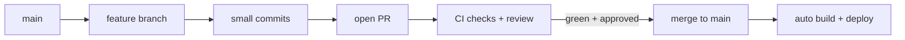
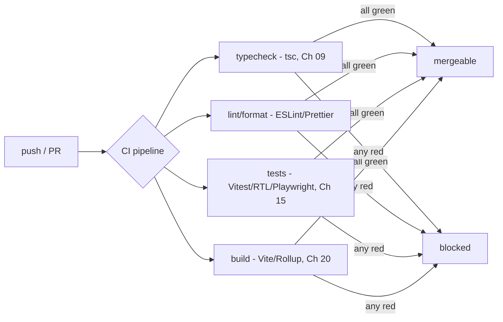
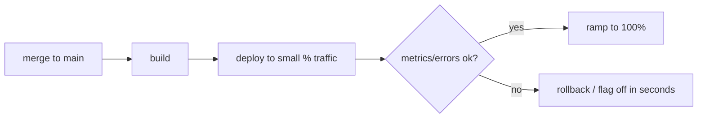

## The Problem That Hooks You

You write code. You push it. It works on your machine. It breaks in production. You don't know why. The review took three days because the PR was 2,000 lines. The merge conflicted with three other branches. The deploy failed and nobody noticed until users complained. Rolling back took 30 minutes of scrambling.

Shipping software is risky. Every change can break something. The bigger the change, the bigger the risk.

## Why It Happens

The old way: work on a branch for weeks. Merge a giant PR. Run tests locally (maybe). Deploy by clicking a button in a web UI. If something breaks, debug on production while users suffer.

This fails because:
- Long-lived branches drift from main. Merging them is a conflict nightmare.
- Large PRs are hard to review. Reviewers skim or give up. Bugs slip through.
- Local testing doesn't catch integration issues.
- Manual deploys mean different environments. "Works on my machine" is real.
- No rollback plan means every bad release is a fire drill.

The fix is to replace manual risk with automated confidence.

## The One Insight

**Shipping is a pipeline.** Every change flows through the same stages: commit → branch → PR → review + automated checks → merge → build → deploy. The whole point is that machines verify quality on every change. Humans review intent and design. Machines verify types, lint, tests, and build.

Think of it like a factory assembly line. Every product goes through the same quality gates. You don't skip the metal detector because you're in a hurry. The pipeline catches problems before they reach customers.

Pipeline stages:
- **Git**: small branches, small commits, clear history.
- **CI**: automated quality gates that run on every PR.
- **CD**: automated build and deploy with safety mechanisms.
- **Incident response**: mitigate before diagnose. Rollback or feature flag off.

The deployment strategy shrinks blast radius. Preview deployments test changes before merge. Gradual rollout exposes few users to a bad release. Instant rollback reverses the release in seconds. Feature flags decouple deploy from release.

## Visualization







## The Pipeline in Action

Let's trace a typical change.

Step 1: create a feature branch from main. Make small commits with clear messages: `feat: add user avatar component`, `fix: handle missing avatar fallback`. Each commit is a logical unit. If the build breaks, the last commit is the likely cause.

Step 2: open a PR. The CI pipeline starts automatically. It runs typecheck, lint, tests, and build in parallel. In about 2 minutes, all checks pass. The PR shows green. The reviewer gets a preview URL where the avatar component is deployed in isolation.

Step 3: review. The reviewer checks code logic, component API, and test coverage. They see the preview and confirm the avatar renders correctly. They approve.

Step 4: merge to main. The merge triggers the production pipeline. It builds the application.

Step 5: deploy. The deployment system routes 5% of traffic to the new version. It monitors error rates and response times. After 10 minutes with no increase in errors, it routes 25%, then 50%, then 100%.

Step 6: disaster. An error in the avatar component causes images to fail for 5% of users. The monitoring system detects the spike. An engineer rolls back by promoting the previous build. The rollback takes 15 seconds.

## How CI/CD Actually Works

CI systems (GitHub Actions, GitLab CI, CircleCI) run jobs in isolated containers. Each job is a sequence of steps. The pipeline definition file specifies the trigger, the jobs, and the steps.

When a PR is opened, the CI service receives a webhook. It clones the repository, checks out the PR branch, and runs the jobs. Each job runs in a fresh container. For typechecking, it runs `tsc --noEmit`. For linting, `eslint`. For tests, `vitest run`. For build, `vite build`. Each step that exits with a non-zero code fails the job.

Preview deployments build the app for the PR branch and deploy to a unique URL. The platform creates a subdomain based on the PR number, runs the build, uploads to a CDN, and returns the URL as a PR comment.

Gradual rollout works through the load balancer. The platform maintains multiple versions and shifts traffic by adjusting weights. An engineer sets the new version to 5% and old to 95%. The load balancer routes proportionally.

Rollback works by reverting routing weights or promoting a previous build. No rebuild needed — build artifacts already exist.

Feature flags work through a configuration service. The application checks the flag value before showing code. When toggled off, the service sends a real-time update. The feature turns off without a deploy.

## Real World: Checkout Flow

Your team ships a new checkout flow. The PR is 400 lines across 8 files. CI runs in 3 minutes. All pass. Preview deployment shows the checkout on a staging URL. Product team tests it and finds a bug. You fix it. Tests pass again. PR merges.

The production deploy routes 5% of traffic. Error rate normal. After 15 minutes, 50%. After 30 minutes, 100%.

Three days later, a new promotion causes a cart calculation bug. The feature flag for the promotion is turned off. Users see the old calculation. The bug is fixed at the next deploy.

If there was no feature flag, the rollback would undo the checkout flow too. Feature flags isolate the risky change.

## Tradeoffs

**Merge vs rebase.** Merge preserves true history with a merge commit. Rebase creates linear history. Rule: rebase local branches to stay current. Merge when integrating shared work. Never rebase pushed or shared branches.

**CI vs pre-commit hooks.** CI catches issues after push. Pre-commit hooks catch them before commit. Use both. Pre-commit for immediate feedback. CI for thorough verification.

**Gradual rollout vs big bang deploy.** Gradual rollout limits blast radius. A bad release affects 5% of users instead of 100%. Big bang is simple but risky. Use gradual rollout for critical changes.

**Feature flags vs branches.** Feature flags control behavior at runtime. Branches control code at merge time. Flags let you ship incomplete code without exposing it. But flags accumulate — remove them after the feature stabilizes.

## Common Mistakes

- Create huge, long-lived branches. They drift and create painful merges.
- Rely on humans to run checks instead of CI gates.
- Skip preview or staging environments.
- Debug a bad release before rolling back. Users keep getting errors.
- Rebase shared or pushed history.
- Couple deploy and release. A feature flag would let you ship dark.
- Accumulate feature flags. Remove them after the feature is stable.
- Skip monitoring on gradual rollouts.

## SDE-2 Interview Answer

**Mid-level variant.** "I work on small branches. I open small PRs with clear commits. CI checks typecheck, lint, tests, and build before merge. If something breaks in production, I look at Sentry, reproduce the bug, and fix it. Tests cover the fix so it doesn't happen again."

**Senior variant.** "Shipping is a pipeline that trades manual risk for automated confidence. I create small, short-lived branches. CI gates every PR. Preview deployments let product verify the real UI. Production uses gradual rollout with monitoring and one-click rollback. Feature flags decouple deploy from release. On a bad release, my first move is rollback or flag off. Mitigate before diagnose."

**Engineering Lead variant.** "I design the pipeline and teach the team to use it. Our CI runs the same checks on every PR. We enforce small PRs and meaningful commits. We use preview deployments for every branch. Production uses gradual rollout with error monitoring. Feature flags are standard for changes that need a kill switch. After every incident, we write tests and a postmortem. The pipeline removes fear from shipping."

## Follow-up Questions

**Q1: Two PRs modify the same import. PR A merges first. PR B has a merge conflict. How do you resolve it safely?**
Pull the latest `main` into PR B's branch (`git pull origin main`). Git will show the conflict markers in the file. Open the file and choose the correct version — usually you want both PRs' additions. If PR A added a new import and PR B modified an existing one, keep both. After resolving, run the full test suite (`vitest run`, `tsc --noEmit`, `eslint`). The conflict is about syntax, but the real risk is semantic: ensure both functions exist in their respective modules and are used correctly in the resolved file. Push the resolution. If the conflict involves a renamed export, check that all references across the codebase are updated.

```bash
git pull origin main
# resolve conflicts in editor
npm test && npm run typecheck && npm run lint
git add . && git commit -m "resolve merge conflict with PR A"
```

**Q2: A test passes locally but fails in CI. What are the possible causes?**
Common causes: (1) **Timezone or locale** — the test depends on `Date.now()` or locale formatting, and CI runs in UTC. (2) **Missing environment variables** — CI doesn't have `.env` values that exist locally. (3) **Database state** — tests share a database and a previous run left dirty data. (4) **Flaky test** — async timing, race conditions, or non-deterministic ordering. (5) **Different Node version** — local uses v20, CI uses v18, and an API behaves differently. (6) **Missing `--ci` flag** — some test frameworks change behavior (e.g., React Testing Library disables `document.querySelector` warnings in CI mode). (7) **File system differences** — case-sensitive paths on Linux CI vs case-insensitive macOS.

**Q3: You need to ship a security fix urgently. Your CI pipeline takes 15 minutes. Do you wait?**
Follow the **emergency process**: (1) Get explicit approval from a tech lead or security team member. (2) Create a branch from `main` with the minimal fix. (3) If the CI pipeline can't be skipped, use a dedicated fast-track pipeline that runs only critical checks (typecheck + tests for the affected module). (4) Deploy with immediate 100% rollout — no gradual ramp for security fixes. (5) Monitor Sentry and error rates aggressively for 30 minutes. (6) Write a postmortem within 24 hours documenting why the emergency process was needed and what CI gap allowed the vulnerability. (7) Add the missing test or check to CI so this path is never needed again.

**Q4: A gradual rollout shows error rate increase but only on mobile Safari. What's your process?**
Immediate action: **turn off the feature flag** for the affected users — this stops the error spike without a full rollback. Then diagnose: (1) Check Sentry for the specific error stack trace on mobile Safari. (2) Compare the error against baseline — is this a new error from your change, or pre-existing? (3) If new, identify the API or CSS feature your code uses that Safari doesn't support (e.g., `structuredClone`, `Array.at()`, certain CSS `gap` behavior in flex). (4) Fix with a polyfill, feature detection, or fallback. (5) Test the fix on BrowserStack or a real device. (6) Re-enable the feature flag at 5%. (7) Monitor for 30 minutes before ramping further.

**Q5: Multiple PRs are merged per hour. How do you prevent conflicts and regressions?**
Enforce discipline on four dimensions: (1) **Small PRs** — cap at 200 lines. Smaller changes merge faster with fewer conflicts. (2) **Fast CI** — keep the pipeline under 5 minutes. Long pipelines cause PRs to pile up. (3) **Fast review** — review within the hour. Use async review tools, code owners, and automated approvals for trivial changes. (4) **Feature flags** — gate risky changes behind flags so they can be merged without exposing users. If a PR breaks main, the author drops everything to fix it — the "fix it forward" policy. Add a `main` branch protection rule requiring CI to pass and one approval before merge. Use `git rebase` (not merge commits) to keep a linear history that's easier to bisect.

## Mental Trigger

Ship small, verify automatically, rollback instantly.

## One Page Revision

- Git: branch per change, small commits, small PRs, meaningful commit messages.
- Merge preserves true history. Rebase creates linear history. Never rebase shared branches.
- CI runs typecheck, lint, tests, build on every PR. All must pass before merge.
- Preview deployments give every PR a unique URL for testing.
- Gradual rollout: route 5%, monitor, ramp to 100%.
- Instant rollback: promote previous build. No rebuild needed.
- Feature flags decouple deploy from release. Ship dark, toggle on.
- On bad release: mitigate first (rollback or flag off), then diagnose.
- Remove feature flags after feature stabilizes.
- Trunk-based development: small PRs merged per hour, feature flags for risk.
