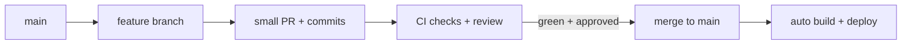
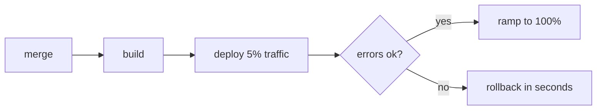

## The Problem That Hooks You

You write code. You push it. It works on your machine. It breaks in production. The PR was 2,000 lines. The review took three days. The deploy failed and nobody noticed until users complained. Rolling back took 30 minutes of scrambling.

Shipping software is risky. Every change can break something. The bigger the change, the bigger the risk.

## The One Insight

**Shipping is a pipeline.** Every change flows through the same stages: commit → branch → PR → review + automated checks → merge → build → deploy. Machines verify quality. Humans review intent. Think of it like a factory assembly line — every product goes through the same quality gates.

## The Pipeline in Action

1. **Create a feature branch.** Small commits: `feat: add user avatar`, `fix: handle missing fallback`. Each commit is a logical unit.
2. **Open a PR.** CI runs automatically: typecheck, lint, tests, build. ~2 minutes. All green.
3. **Review.** Reviewer checks logic, API, and test coverage. Preview URL shows the change in isolation.
4. **Merge.** Triggers production pipeline. Builds the app.
5. **Deploy.** Routes 5% of traffic. Monitors error rates. After 10 minutes, ramps to 25%, 50%, 100%.
6. **Disaster?** An error spikes. Rollback by promoting the previous build. Takes 15 seconds.

## How CI/CD Works

CI systems (GitHub Actions, GitLab CI) run jobs in isolated containers. Each job is a sequence of steps. When a PR opens, the CI service clones the repo, checks out the branch, and runs jobs.

Preview deployments build the app for the PR branch and deploy to a unique URL (e.g., `pr-42.myapp.com`). The platform creates a subdomain, runs the build, uploads to CDN, and posts the URL as a PR comment.

Gradual rollout shifts traffic via load balancer weights. 5% new, 95% old. The load balancer routes proportionally. Rollback reverts weights or promotes a previous build — no rebuild needed.

Feature flags decouple deploy from release. The app checks the flag before showing code. Toggle off → feature turns off without a deploy.

## Tradeoffs

**Merge vs rebase.** Merge preserves true history. Rebase creates linear history. Rule: rebase local branches to stay current. Merge when integrating shared work. Never rebase pushed branches.

**Gradual rollout vs big bang.** Gradual limits blast radius — 5% affected instead of 100%. Big bang is simple but risky.

**Feature flags vs branches.** Flags control behavior at runtime. Branches control code at merge time. Flags let you ship incomplete code. Remove them after the feature stabilizes.

## Common Mistakes

- Creating huge, long-lived branches — they drift and create painful merges.
- Relying on humans to run checks instead of CI gates.
- Debugging a bad release before rolling back — users keep getting errors.
- Accumulating feature flags — remove them after the feature is stable.
- Coupling deploy and release — a feature flag would let you ship dark.

## Follow-up Questions

**Q1: Two PRs modify the same import. PR A merges first. PR B has a merge conflict. How do you resolve it?**
Pull latest `main` into PR B. Choose the correct version (usually both additions). Run the full test suite (`vitest run`, `tsc --noEmit`, `eslint`). The real risk is semantic: ensure both functions exist and are used correctly. Push the resolution.

**Q2: A test passes locally but fails in CI. What are the possible causes?**
Timezone/locale differences, missing environment variables, database state from a previous run, flaky async timing, different Node version, missing `--ci` flag, or case-sensitive file paths on Linux vs macOS.

**Q3: A gradual rollout shows error increase but only on mobile Safari. What's your process?**
Turn off the feature flag immediately. Check Sentry for the error on Safari. Identify the unsupported API (e.g., `structuredClone`, certain CSS `gap` behavior). Fix with a polyfill or fallback. Test on BrowserStack. Re-enable at 5%. Monitor 30 minutes before ramping.

## Mental Trigger

Ship small, verify automatically, rollback instantly.

## One Page Revision

- Git: branch per change, small commits, small PRs, clear messages.
- CI runs typecheck, lint, tests, build on every PR. All must pass.
- Preview deployments give every PR a unique URL for testing.
- Gradual rollout: 5% → 25% → 50% → 100%. Monitor error rates.
- Instant rollback: promote previous build. No rebuild needed.
- Feature flags decouple deploy from release. Ship dark, toggle on.
- On bad release: mitigate first (rollback or flag off), then diagnose.
- Remove feature flags after feature stabilizes.
