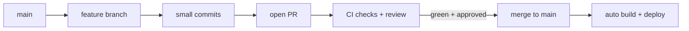
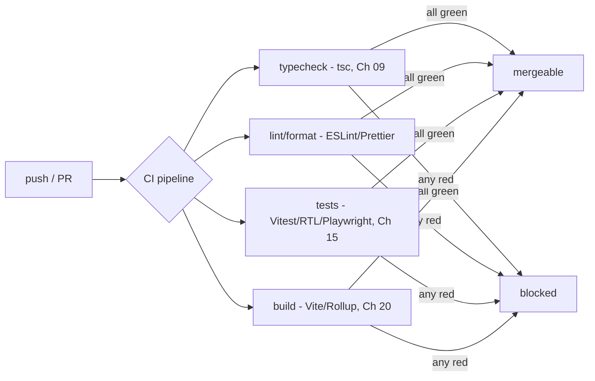
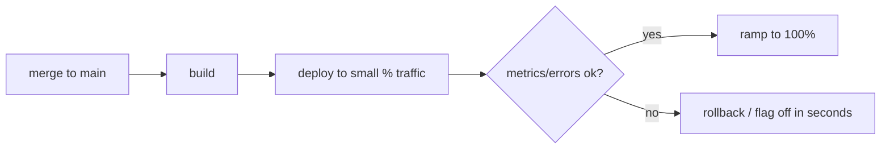

## Problem

You write code. You push it. It works on your machine. It breaks in production. You do not know why. The review took three days because the PR was 2000 lines. The merge conflicted with three other branches. The deploy failed and nobody noticed until users complained. Rolling back took 30 minutes of scrambling.

Shipping software is risky. Every change can break something. The bigger the change, the bigger the risk. Without a system, quality depends on humans remembering to run checks. Without automation, deploys are manual and error-prone. Without rollback, a bad release affects every user until someone fixes it.

## Why Existing Solution Failed

The old way: work on a branch for weeks. Merge a giant PR. Run tests locally (maybe). Deploy by clicking a button in a web UI. If something breaks, debug on production while users suffer.

This fails because:
- Long-lived branches drift from main. Merging them is a conflict nightmare.
- Large PRs are hard to review. Reviewers skim or give up. Bugs slip through.
- Local testing does not catch integration issues, type errors across modules, or build failures.
- Manual deploys mean different environments. "Works on my machine" is real.
- No rollback plan means every bad release is a fire drill.

The fix is to replace manual risk with automated confidence. A pipeline that runs the same checks on every change. A deployment system that makes releases boring and reversible.

## Mental Model

Shipping is a pipeline. Every change flows through the same stages: commit to branch to PR, then review plus automated checks, then merge to main, then build, then deploy. The whole point is that machines verify quality on every change. Humans review intent and design. Machines verify types, lint, tests, and build.

Pipeline stages:
- Git: small branches, small commits, clear history.
- CI: automated quality gates that run on every PR.
- CD: automated build and deploy with safety mechanisms.
- Incident response: mitigate before diagnose. Rollback or feature flag off.

The deployment strategy shrinks blast radius. Preview deployments test changes before merge. Gradual rollout exposes few users to a bad release. Instant rollback reverses the release in seconds. Feature flags decouple deploy from release, so you can ship code dark and turn it on when ready.

## Visualization

## Engine Simulation

Run the pipeline with a typical change.

Step 1: create a feature branch from main. Make small commits with clear messages: `feat: add user avatar component`, `fix: handle missing avatar fallback`. Each commit is a logical unit. If the build breaks, the last commit is the likely cause.

Step 2: open a PR. The CI pipeline starts automatically. It runs typecheck, lint, tests, and build in parallel. In about 2 minutes, all checks pass. The PR shows green. The reviewer gets a preview URL where the avatar component is deployed in isolation.

Step 3: review. The reviewer checks the code logic, the component API, and the test coverage. They see the preview and confirm the avatar renders correctly. They approve.

Step 4: merge to main. The merge triggers the production pipeline. It builds the application. The build output is stored. A new version is created.

Step 5: deploy. The deployment system routes 5% of traffic to the new version. It monitors error rates and response times. After 10 minutes with no increase in errors, it routes 25%, then 50%, then 100%.

Step 6: disaster. An error in the avatar component causes images to fail for 5% of users. The monitoring system detects the error spike. An engineer rolls back by promoting the previous build. The rollback takes 15 seconds. The engineer investigates after users are safe.

## Internal Implementation

CI systems (GitHub Actions, GitLab CI, CircleCI) work by running jobs in isolated containers. Each job is a sequence of steps. The pipeline definition file (`.github/workflows/ci.yml`) specifies the trigger (push to branch, PR opened), the jobs, and the steps.

When a PR is opened, the CI service receives a webhook from the Git provider. It clones the repository, checks out the PR branch, and runs the jobs. Each job runs in a fresh container with the specified environment. For typechecking, the job runs `tsc --noEmit`. For linting, it runs `eslint`. For tests, it runs `vitest run`. For build, it runs `vite build`. Each step that exits with a non-zero code fails the job. A failed job blocks the merge.

Preview deployments work by building the app for the PR branch and deploying it to a unique URL. The platform (Vercel, Netlify) creates a subdomain based on the PR number. It runs the build command, uploads the output to a CDN, and returns the URL. The URL is posted on the PR as a comment.

Gradual rollout works through the load balancer or API gateway. The deployment platform (Kubernetes, AWS ECS, or a PaaS) maintains multiple versions of the app. It shifts traffic by adjusting weights in the routing configuration. An engineer can set the weight to 5 for the new version and 95 for the old version. The load balancer routes requests proportionally.

Rollback works by reverting the routing weights or promoting a previous build. The platform keeps the last N builds. Rollback selects the previous build and deploys it with full traffic. This is fast because the build artifacts already exist. No rebuild is needed.

Feature flags work through a configuration service (LaunchDarkly, Split, or a custom database). The application checks the flag value before showing or executing code. The flag service evaluates targeting rules (user ID, region, plan type) and returns `true` or `false`. When a flag is toggled off, the service sends a real-time update to connected clients. The feature turns off without a deploy.

## Real World Example

Your team ships a new checkout flow. The PR is 400 lines across 8 files. CI runs typecheck, lint, tests, and build in 3 minutes. All pass. Preview deployment shows the checkout flow on a staging URL. Product team tests it and finds a bug in the coupon input. You fix it. Tests pass again. PR merges.

The production deploy routes 5% of traffic to the new checkout. Error rate normal. After 15 minutes, it routes 50%. Error rate normal. After 30 minutes, 100%.

Three days later, a new promotion causes a cart calculation bug. The feature flag for the promotion is turned off. Users see the old calculation. The bug is fixed at the next deploy.

If there was no feature flag, the rollback would undo the checkout flow too. Feature flags isolate the risky change.

## Tradeoffs

**Merge vs rebase.** Merge preserves true history. The merge commit documents when a branch was integrated. But it adds a commit and creates non-linear history. Rebase creates a linear history. It reads cleanly. But rebasing shared branches rewrites history and breaks other developers' bases. Rule: rebase local branches to stay current. Merge when integrating shared work.

**CI vs pre-commit hooks.** CI catches issues after push. It runs on the server and blocks the merge. Pre-commit hooks catch issues before the commit is created. They catch formatting and simple lint errors locally. Use both. Pre-commit hooks for immediate feedback. CI for thorough verification.

**Gradual rollout vs big bang deploy.** Gradual rollout limits blast radius. A bad release affects 5% of users instead of 100%. But it adds complexity. The rollout system must handle traffic routing, monitoring, and rollback. Big bang deploy is simple but risky. Use gradual rollout for critical changes. Use big bang for trivial changes.

**Feature flags vs branches.** Feature flags control behavior at runtime. Branches control code at merge time. Flags let you ship incomplete code without exposing it. But flags accumulate. Each flag is a code path that must be maintained and eventually removed. Use flags for release gating and experiments. Delete flags after the feature stabilizes.

## Common Mistakes

- Create huge, long-lived branches. They drift from main and create painful merges and reviews.
- Rely on humans to run checks instead of CI gates. Humans forget.
- Skip preview or staging environments. The first real test happens in production.
- Debug a bad release before rolling back. Users keep getting errors.
- Rebase shared or pushed history. This rewrites others' base and causes chaos.
- Couple deploy and release. A feature flag would let you ship dark and toggle safely.
- Accumulate feature flags. Every flag adds complexity. Remove them after the feature is stable.
- Skip monitoring on gradual rollouts. Without metrics, you do not know if the release is bad.

## SDE-2 Interview Answer

**Mid-level variant.** "I work on small branches. I open small PRs with clear commits. CI checks typecheck, lint, tests, and build before merge. If something breaks in production, I look at Sentry, reproduce the bug, and fix it. I make sure tests cover the fix so it does not happen again."

**Senior variant.** "Shipping is a pipeline that trades manual risk for automated confidence. I create small, short-lived branches. CI gates every PR with typecheck, lint, tests, and build. Preview deployments let product verify the real UI. Production uses gradual rollout with monitoring and one-click rollback. Feature flags decouple deploy from release. On a bad release, my first move is rollback or flag off. Mitigate before diagnose. Then investigate and write a test."

**Engineering Lead variant.** "I design the pipeline and teach the team to use it. Our CI runs the same checks on every PR. We enforce small PRs and meaningful commits. We use preview deployments for every branch. Production deploys use gradual rollout with error monitoring. Feature flags are standard for changes that need a kill switch. The golden rule: mitigate first, then fix. After every incident, we write tests and a postmortem. The pipeline removes fear from shipping."

## Follow-up Questions

1. Two PRs modify the same import statement. PR A merges first. PR B has a merge conflict. Walk through how you resolve it safely. (Answer: pull latest main into your branch. The conflict marker shows both versions. Choose the correct one, keeping both changes if needed. Run tests to confirm the merge works. Push. CI reruns. If both PRs added a function, check that both functions exist and are used correctly.)

2. A test passes locally in watch mode but fails in CI. What are the possible causes? (Answer: timezone or locale differences. Missing environment variables. Test database state. Flaky test with timing assumptions. CI runs in a different Node version. CI runs with `--ci` flag that treats warnings as errors. Browser-specific issues in Playwright or Cypress.)

3. You need to ship a security fix urgently. Your CI pipeline takes 15 minutes. Do you wait? (Answer: no. For critical security fixes, follow the emergency process: skip CI only if approved by the lead, use a dedicated review channel, deploy with immediate 100% rollout (no gradual), monitor closely for 15 minutes, and write a postmortem. Every emergency bypass must be justified and the CI gap must be closed afterward.)

4. A gradual rollout shows error rate increase but only on mobile Safari. The error is a JavaScript TypeError in a new feature. What is your process? (Answer: feature flag off immediately. This affects only Safari users. Check if the error is pre-existing in Safari. If not, the new code uses an API that Safari does not support. Fix by adding polyfill or fallback. Enable the flag again after fix. Roll forward, not back if the fix is simple.)

5. Your team uses trunk-based development with short-lived branches. Multiple PRs are merged per hour. How do you prevent conflicts and regressions? (Answer: each PR must be small (under 200 lines). CI must run in under 5 minutes. PRs must be reviewed within the hour. Feature flags gate risky changes. A dedicated merge train coordinates deploys. If a PR breaks main, the author drops everything to fix. Rollback if fix takes longer than 15 minutes.)

## Mental Trigger

Ship small, verify automatically, rollback instantly.

## One Page Revision

- Git: branch per change, small commits, small PRs, meaningful commit messages.
- Merge preserves true history with merge commit. Rebase creates linear history.
- Never rebase pushed or shared branches.
- CI runs typecheck, lint, tests, build on every PR. All must pass before merge.
- Preview deployments give every PR a unique URL for testing before merge.
- Gradual rollout: route 5%, monitor, ramp to 100%.
- Instant rollback: promote previous build. No rebuild needed.
- Feature flags decouple deploy from release. Ship dark, toggle on.
- On bad release: mitigate first (rollback or flag off), then diagnose.
- Remove feature flags after feature stabilizes. Avoid flag accumulation.
- Trunk-based development: small PRs merged per hour, feature flags for risk.
