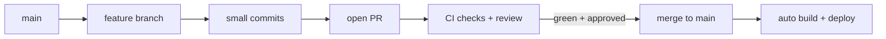
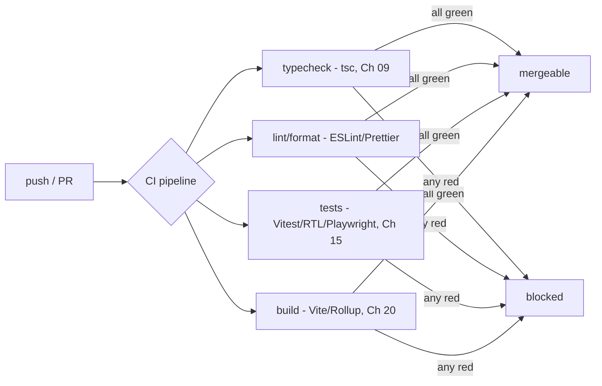
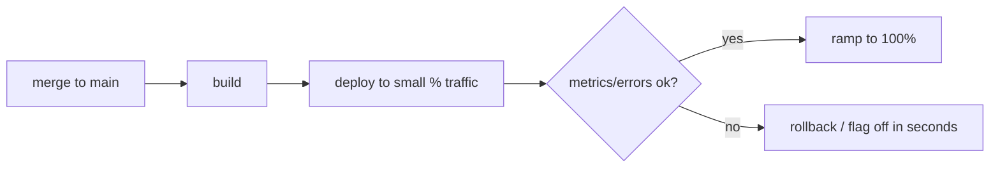

> **Prerequisites:** understanding of automated testing (unit, integration, e2e, Ch 15), the production build process (Vite/Rollup bundling, Ch 20), incident response with rollback as first move (Ch 22), and the deployment environment where the build runs (Ch 19).

---

## The one mental model

> **Shipping is a PIPELINE that trades manual risk for automated confidence. Every change flows
> from commit to branch to PR (review plus automated checks) to merge to build to deploy. The whole point
> is that machines verify quality (types, lint, tests, build) on every change. That way humans can ship
> small and often without fear. The deployment strategy (preview, gradual rollout, rollback)
> exists so a bad change has the smallest possible blast radius and can be reversed in seconds.**

From "automate confidence, shrink blast radius, stay reversible" you can see why small frequent
PRs beat big merges, why CI gates exist, why preview deployments matter, and why rollback and feature
flags are the senior incident move (Ch 22).

---

## Learning Objectives

1. Use Git effectively: small branches/PRs, meaningful commits, merge vs rebase, resolve conflicts.
2. Explain CI as automated quality gates (types/lint/test/build) on every PR.
3. Explain CD: preview deployments, gradual/rolling rollout, instant rollback, feature flags.
4. Connect "ship weekly + reversible" to incident response (Ch 22) and the job description's velocity value.

---

## Key Mental Models

- **Small, frequent changes** mean small blast radius, easy review, and easy revert.
- **CI = the same checks, every time, automatically.** This is the safety net that enables speed.
- **CD = make deploys boring and reversible.** Use preview, gradual rollout, one-click rollback.
- **Feature flags decouple deploy from release.** Ship code dark. Turn it on or off without redeploying.

---

## Introduction

"Ship weekly" and "own outcomes" (JD) only work on top of a pipeline that catches mistakes
automatically and makes bad releases reversible. You do not need to be a DevOps engineer. But an
SDE-2 must work the pipeline confidently and answer "how do you ship safely?" and "how do you handle a bad
release?"

---

## Git workflow

- **Branch per change.** Keep branches **small and short-lived**. This makes them easier to review and revert, with fewer
  conflicts. Long-lived branches drift and create painful merges.
- **Commits** tell a story. Conventional style (`feat:`, `fix:`) helps changelogs and automation.
- **Merge vs rebase:** merge preserves history (a merge commit); rebase replays your commits onto
  the latest base for a linear history. Rebase your *local* feature branch to stay current; don't
  rebase shared/pushed history others build on.
- **Conflicts** happen when two branches change the same lines; resolve by choosing/combining,
  then re-test. Small frequent merges minimize them.

---

## CI: automated quality gates

CI runs the *same* checks on every PR. Quality does not depend on someone remembering. The gate
makes "ship small and often" safe. A regression is caught before merge, not in production. This
is the job description's "maintainable, scalable code" enforced by machines. (Pre-commit hooks catch issues even earlier, locally.)

---

## CD: make deploys boring and reversible

- **Preview deployments.** Every PR gets a unique URL with that branch deployed (Vercel-style).
  Reviewers and product team test the real thing before merge. This is huge for a UI team.
- **Production deploy.** Merge to main. Build and deploy automatically.
- **Gradual or rolling releases.** Route a small percent of traffic to the new version first. Watch
  metrics and errors (Ch 22 Sentry). Then ramp to 100%. A bad release hits few users.
- **Instant rollback.** Promote the previous good build in seconds. This is the **first** move when
  something breaks (Ch 22 incident response).
- **Feature flags.** Deploy code disabled. Then flip it on for a group or everyone without a
  redeploy. Flip it **off** instantly if it misbehaves. This decouples *deploy* from *release*.

---

## Interview Discussion (reason first)

**Q1. "How do you ship safely while shipping weekly?"**
> "Small short-lived branches and PRs gated by CI. Typecheck, lint, tests, and build run on every
> change. So regressions are caught before merge. Preview deployments let product verify the real
> UI. Production uses gradual rollout with monitoring and one-click rollback. Feature flags let
> me release dark and toggle off instantly. Small, automated, reversible equals safe velocity."

**Q2. "A release broke production. What is your first move?"**
> "Mitigate before diagnosing. Roll back to the last good build or flip the feature flag off to
> stop user impact (Ch 22). Then Sentry, reproduce, fix with a guard or test, and postmortem. Rolling
> releases make the rollback fast and the blast radius small."

**Q3. "Merge vs rebase?"**
> "Merge keeps true history with a merge commit. Rebase replays commits for a linear history. I
> rebase my local feature branch to stay current and keep history clean. But I never rebase shared or
> pushed branches that others have based work on."

*Scoring:* full = small-PRs + CI-gates + rollout/rollback/flags + mitigate-first incident.

---

## Common Mistakes

- **Huge long-lived branches.** They cause painful reviews, conflicts, and risky merges.
- **Relying on humans to run checks** instead of CI gates.
- **No preview or staging.** The first real test happens in production.
- **Debugging a bad release before rolling back** (Ch 22). Users keep getting hit.
- **Rebasing shared history.** This rewrites others' base and causes chaos.
- **Coupling deploy and release** when a feature flag would let you ship dark and toggle.

---

## Interview Questions

1. Why do small, frequent PRs beat large merges (review, conflicts, revert)?
2. What checks belong in CI and why gate the merge on them?
3. Explain gradual rollout and rollback. How do feature flags relate?
4. What is your first action on a broken production release, and why (tie to Ch 22)?
5. Merge vs rebase. When do you use each? What must you never rebase?

---

## Homework

1. Set up a tiny GitHub Actions CI that runs typecheck, lint, test, and build on PRs. Make a PR fail
   a check and watch it block.
2. Add a feature flag to gate a new component. Flip it on and off without redeploying.
3. In `NOTES.md`: the commit to PR to CI to deploy pipeline plus "mitigate (rollback or flag) first" in 2 lines.

---

## Summary

- Shipping is a **pipeline that trades manual risk for automated confidence**. It goes commit to branch to
  PR (review plus CI) to merge to build to deploy.
- **Small, frequent changes** shrink blast radius and make review and revert easier. **CI** runs the same
  quality gates (types/lint/tests/build, Ch 09/15/20) on every PR so speed stays safe.
- **CD makes deploys boring and reversible.** It uses preview URLs, **gradual/rolling rollout** with
  monitoring (Ch 22), **instant rollback**, and **feature flags** that decouple deploy from
  release.
- On a bad release: **mitigate first (rollback or flag off)**, then diagnose (Ch 22). This is what
  "ship weekly with high ownership" rests on.

## Go deeper
Ch 15 (tests CI runs), Ch 20 (the build), Ch 22 (incident response/rollback), Ch 19 (deploy
targets). Your platform's docs (GitHub Actions, Vercel) are the reference once the pipeline model
is clear.
