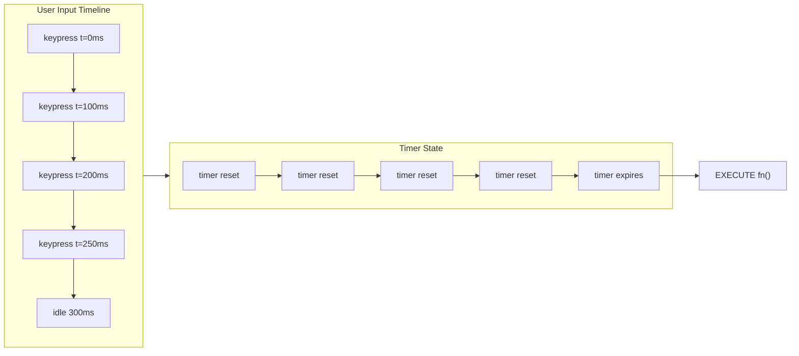
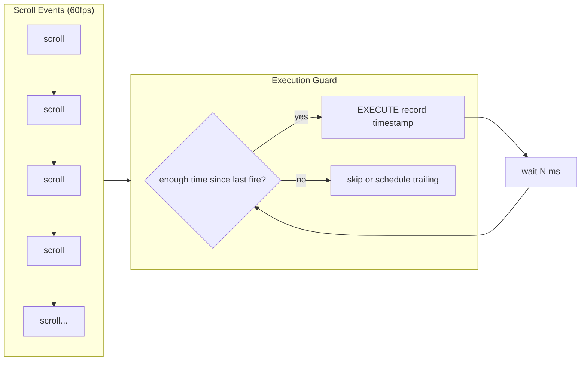
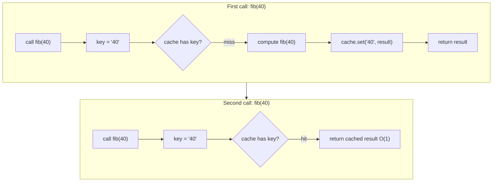

## Problem

You are in a coding interview. The prompt: "Implement debounce from scratch. No lodash." Or "Write your own Promise.all." Or "Deep clone this object handling all edge cases."

You need to build these utilities using only raw JavaScript. No libraries. No external code. The interviewer watches how you think, not whether you memorized the solution.

The real problem: most developers use lodash or utilities every day but never understood how they work internally. When asked to build them from scratch, they freeze. They do not know which JavaScript primitives to combine.

## Why Existing Solution Failed

Using lodash or built-in methods hides the internals. You import `debounce` and it works. You use `Promise.all` and it works. You spread an object for shallow copy. These work until the interview asks you to re-derive them.

Memorizing code fails too. You might remember one version of debounce. But the interviewer asks about leading edge, trailing edge, cancel, or `this` binding. Your memorized version cannot adapt.

The solution is to understand the underlying primitives. Every coding problem uses a combination of: closure, setTimeout, recursion, Promise, Map, and reduce. If you know how these work alone and together, you can build any utility from scratch.

## Mental Model

Six primitives power every coding problem:

- **Closure.** A function remembers variables from its outer scope. This is how debounce, throttle, and memoize store state across calls.

- **setTimeout.** Schedules a callback after a delay. This is how debounce delays execution and throttle schedules trailing calls.

- **Recursion.** A function calls itself with smaller input. This is how deep clone walks the object graph and flatten processes nested arrays.

- **Promise.** Represents an eventual value. This is how Promise.all, race, and allSettled coordinate async work.

- **Map.** Key-value storage with insertion order. This is how memoize caches results and LRU eviction works.

- **reduce.** Iterates and accumulates. This is how pipe, compose, and groupBy transform collections.

Ask: "What primitives does this problem need?" The answer tells you how to build it.

## Visualization



Debounce: every keystroke resets the timer. The function fires when the timer expires without reset.



Throttle: check the time since last execution. Fire only if enough time passed.



Memoize: check cache first. Hit returns O(1). Miss computes, stores, returns.

## Engine Simulation

Walk through each utility step by step.

**Debounce.**

```javascript
function debounce(fn, delay) {
  let timer = null;
  return function(...args) {
    const context = this;
    clearTimeout(timer);
    timer = setTimeout(() => fn.apply(context, args), delay);
  };
}
```

Internally: the outer function runs once. It creates a `timer` variable. The inner function closes over `timer`. Each call to the inner function clears any pending timeout and starts a new one. Only the last call's timeout survives. When the timeout fires, `fn` runs with the correct `this` and arguments.

The `this` binding works because `fn.apply(context, args)` calls the original function with the context that was captured when the wrapper was called. Without `apply`, `this` inside `fn` would be the global object or `undefined` in strict mode.

**Throttle (trailing edge).**

```javascript
function throttle(fn, limit) {
  let lastCall = 0;
  let timer = null;
  return function(...args) {
    const context = this;
    const now = Date.now();
    const remaining = limit - (now - lastCall);

    if (remaining <= 0) {
      if (timer) { clearTimeout(timer); timer = null; }
      lastCall = now;
      fn.apply(context, args);
    } else if (!timer) {
      timer = setTimeout(() => {
        lastCall = Date.now();
        timer = null;
        fn.apply(context, args);
      }, remaining);
    }
  };
}
```

Internally: `lastCall` tracks the timestamp of the last execution. `Date.now()` gets the current time. If the difference exceeds `limit`, fire immediately. Otherwise schedule a trailing call for the remaining time. The trailing call resets `lastCall` to when it actually fired, not when it was scheduled.

**Deep Clone.**

```javascript
function deepClone(value, seen = new WeakMap()) {
  if (value === null || typeof value !== 'object') return value;
  if (seen.has(value)) return seen.get(value);

  let result;
  if (value instanceof Date) result = new Date(value);
  else if (value instanceof RegExp) result = new RegExp(value.source, value.flags);
  else if (value instanceof Map) {
    result = new Map();
    seen.set(value, result);
    value.forEach((v, k) => result.set(deepClone(k, seen), deepClone(v, seen)));
    return result;
  } else if (value instanceof Set) {
    result = new Set();
    seen.set(value, result);
    value.forEach(v => result.add(deepClone(v, seen)));
    return result;
  } else if (Array.isArray(value)) {
    result = [];
    seen.set(value, result);
    for (let i = 0; i < value.length; i++) result[i] = deepClone(value[i], seen);
  } else {
    result = Object.create(Object.getPrototypeOf(value));
    seen.set(value, result);
    for (const key of [...Object.keys(value), ...Object.getOwnPropertySymbols(value)]) {
      result[key] = deepClone(value[key], seen);
    }
  }
  return result;
}
```

Internally: the function recurses into every value. The WeakMap `seen` tracks already-visited objects. When it encounters the same reference again (circular), it returns the cached clone instead of recursing. Each type needs different construction: Date uses `new Date(value)`, RegExp uses `new RegExp(source, flags)`, Map and Set need iteration with recursive cloning of keys and values. Arrays and plain objects copy each element or property recursively. Symbol keys require `Object.getOwnPropertySymbols()` because `Object.keys()` skips them.

**Promise.all.**

```javascript
function promiseAll(iterable) {
  return new Promise((resolve, reject) => {
    const arr = Array.from(iterable);
    if (arr.length === 0) return resolve([]);

    const results = new Array(arr.length);
    let completed = 0;

    arr.forEach((item, i) => {
      Promise.resolve(item).then(
        value => {
          results[i] = value;
          completed++;
          if (completed === arr.length) resolve(results);
        },
        reject
      );
    });
  });
}
```

Internally: the function creates a new Promise. It uses `Array.from` to handle any iterable. It pre-allocates the results array so indices match the input order. `Promise.resolve(item)` wraps non-Promise values. The `.then()` has two callbacks: on fulfillment, store the value and increment the counter. When all complete, resolve with results. The reject handler is passed directly as the second argument to `.then`. This makes the promise reject immediately on the first error, no waiting for others.

**Memoize with LRU.**

```javascript
function memoizeLRU(fn, maxSize = 100) {
  const cache = new Map();
  return function(...args) {
    const key = JSON.stringify(args);
    if (cache.has(key)) {
      const value = cache.get(key);
      cache.delete(key);
      cache.set(key, value);
      return value;
    }
    const result = fn.apply(this, args);
    cache.set(key, result);
    if (cache.size > maxSize) {
      const oldestKey = cache.keys().next().value;
      cache.delete(oldestKey);
    }
    return result;
  };
}
```

Internally: the Map stores cached results in insertion order. On cache hit, the entry is deleted and re-inserted, moving it to the end (most recently used). On cache miss, the result is computed and stored. If the cache exceeds `maxSize`, the first entry (oldest, least recently used) is deleted. `JSON.stringify(args)` converts arguments to a string key. This works for primitives and plain objects but fails for undefined, functions, Symbols, and circular references.

**Array Utilities.**

```javascript
function flatten(arr, depth = Infinity) {
  const result = [];
  for (const item of arr) {
    if (Array.isArray(item) && depth > 0) {
      result.push(...flatten(item, depth - 1));
    } else {
      result.push(item);
    }
  }
  return result;
}

function groupBy(arr, keyFn) {
  return arr.reduce((acc, item) => {
    const key = keyFn(item);
    if (!acc[key]) acc[key] = [];
    acc[key].push(item);
    return acc;
  }, {});
}

function unique(arr) {
  return [...new Set(arr)];
}

function chunk(arr, size) {
  const result = [];
  for (let i = 0; i < arr.length; i += size) {
    result.push(arr.slice(i, i + size));
  }
  return result;
}
```

Internally: flatten recurses or iterates with a stack, checking `Array.isArray` at each element. groupBy uses `reduce` to accumulate into an object keyed by the key function result. unique uses Set, which stores only unique values. chunk uses `slice` in a loop stepping by `size`.

**Async Flow Control.**

```javascript
async function series(tasks) {
  const results = [];
  for (const task of tasks) {
    results.push(await task());
  }
  return results;
}

async function parallel(tasks, concurrency = Infinity) {
  const iterator = tasks[Symbol.iterator]();
  const results = new Array(tasks.length);
  async function worker() {
    for (let i = 0; ; i++) {
      const { value, done } = iterator.next();
      if (done) break;
      results[i] = await value();
    }
  }
  const workers = Array.from({ length: Math.min(concurrency, tasks.length) }, worker);
  await Promise.all(workers);
  return results;
}

async function retry(fn, maxAttempts = 3, baseDelay = 1000) {
  for (let attempt = 1; attempt <= maxAttempts; attempt++) {
    try {
      return await fn();
    } catch (error) {
      if (attempt === maxAttempts) throw error;
      await new Promise(resolve => setTimeout(resolve, baseDelay * Math.pow(2, attempt - 1)));
    }
  }
}
```

Internally: series runs tasks sequentially with `await` in a loop. parallel uses workers that share an iterator. Each worker pulls the next task, awaits it, and stores the result. This limits concurrency to the number of workers. retry wraps the call in a try-catch loop. On failure, it waits with exponential backoff (base times 2^attempt) before retrying. After max attempts, it throws.

**Pipe and Compose.**

```javascript
const pipe = (...fns) => x => fns.reduce((acc, fn) => fn(acc), x);
const compose = (...fns) => x => fns.reduceRight((acc, fn) => fn(acc), x);
```

Pipe passes a value through functions left to right. Compose passes right to left. Both use reduce: pipe uses `reduce`, compose uses `reduceRight`.

**Currying.**

```javascript
function curry(fn) {
  return function curried(...args) {
    if (args.length >= fn.length) {
      return fn.apply(this, args);
    }
    return (...next) => curried(...args, ...next);
  };
}
```

Currying returns a function that collects arguments until it has enough (based on `fn.length`, the number of declared parameters). Then it calls the original function.

## Internal Implementation

**How closures work in V8.** When a function is created, V8 captures the outer scope's variables in a context object. The inner function holds a reference to this context. The context persists as long as the inner function exists, even after the outer function returns. In debounce, `timer` lives in this context. Each call to the returned function accesses and modifies the same `timer` variable.

**How setTimeout interacts with the event loop.** setTimeout schedules a callback in the macrotask queue. The event loop processes all microtasks (Promise callbacks) before processing the next macrotask. When you call `clearTimeout`, the scheduled callback is removed from the queue. In debounce, `clearTimeout` prevents the previous callback from firing. Then `setTimeout` adds a new one.

**How Promise execution works.** A Promise constructor runs the executor function synchronously. The `.then()` callbacks are scheduled as microtasks. They run after the current synchronous code completes and before any macrotask. In Promise.all, the executor iterates over the input array and calls `.then()` on each item synchronously. Each `.then()` callback runs later as a microtask when the promise resolves. The counter increments inside these microtasks. When the counter reaches the array length, the outer promise resolves.

**How Map maintains insertion order.** A Map stores entries in the order they were inserted. `map.keys().next().value` returns the first inserted key. When you `delete` and `set` the same key, it moves to the end. This insertion order is the key to LRU eviction.

## Real World Example

Build an autocomplete search input that handles fast typing, API calls, and cached results.

```javascript
async function fetchSuggestions(query, signal) {
  const response = await fetch(`/api/suggest?q=${query}`, { signal });
  return response.json();
}

const getSuggestions = memoizeLRU(fetchSuggestions, 50);

const handleInput = debounce(async (query) => {
  if (query.length < 2) return;
  setStatus('loading');
  try {
    const results = await getSuggestions(query);
    setResults(results);
    setStatus(results.length === 0 ? 'empty' : 'success');
  } catch (err) {
    if (err.name !== 'AbortError') setStatus('error');
  }
}, 300);

// AbortController for stale requests
useEffect(() => {
  const controller = new AbortController();
  if (query.length >= 2) {
    fetchSuggestions(query, controller.signal).then(setResults).catch(() => {});
  }
  return () => controller.abort();
}, [query]);
```

Internally: `debounce` prevents API calls on every keystroke. Only the final query after 300ms idle fires. `memoizeLRU` caches results for repeated queries. If the user types "rea", deletes to "r", and types "rea" again, the cached result returns instantly. `AbortController` cancels in-flight requests when the query changes. This prevents a race where a slow response overwrites newer results.

Without debounce: API call per keystroke at 60wpm is about 5 calls per second. Each response might arrive out of order. The UI flashes between results. Debounce reduces calls to 1 per pause. Memoize eliminates repeated calls entirely.

## Tradeoffs

**Debounce vs Throttle.** Debounce waits for a pause. It fires once after the user stops. Throttle fires at most once per interval. Use debounce for search and resize where you want the final state. Use throttle for scroll and progress where you want regular updates.

**Recursion vs iteration for flatten.** Recursion is simpler to read. But deep nesting can overflow the call stack (typically around 10000 frames). Iteration with a stack avoids this but is more complex.

**Shallow copy vs deep clone.** Shallow copy (spread, Object.assign) is O(n) where n is top-level properties. Deep clone is O(n) where n is every node in the object graph. Use shallow when you only need the top level. Use deep when you need nested independence.

**Memory vs CPU for memoize.** Memoize stores results in memory. Cache hits return O(1). Cache misses compute and store. The tradeoff: memory grows with unique inputs. LRU eviction bounds memory but adds overhead from delete-re-insert on every hit.

**JSON.stringify as key.** Simple and works for primitives and plain objects. But fails for undefined values, functions, Symbols, and circular references. A custom key function (e.g., using `Map` of argument tuples) is more robust but more complex.

**Promise.all vs Promise.allSettled.** all fails fast. Good when any failure means the whole operation is invalid. allSettled waits for all. Good when you want partial results.

## Common Mistakes

- Forget `this` binding in debounce and throttle. Use `fn.apply(context, args)` or arrow function.
- Forget to handle empty input in Promise.all. Empty array should resolve immediately with empty array.
- Forget circular references in deep clone. Leads to stack overflow. Use WeakMap cache.
- Use `typeof value === 'object'` without null check. `typeof null === 'object'`.
- Use `Object.keys()` only, missing Symbol keys in deep clone.
- Use recursion without depth parameter in flatten. Infinite recursion on circular arrays.
- Use `setInterval` for polling instead of recursive setTimeout with retry logic.
- Forget to return the result from memoized function on cache hit.
- Use `new Date()` for deep clone timestamps instead of `new Date(value.getTime())`.
- Forget to handle non-promise values in Promise polyfills. Use `Promise.resolve(item)`.

## SDE-2 Interview Answer

**Mid-level variant.** "I start by asking which primitives the problem needs. Debounce needs closure for the timer variable and setTimeout for the delay. I write the outer function that creates the timer, then the inner function that clears and restarts it. I use `fn.apply(this, args)` for correct binding. I talk through edge cases: what if delay is 0, what about leading edge."

**Senior variant.** "Every coding problem maps to JavaScript primitives. I think through the primitives first, then write the code. For deep clone, I need recursion for traversal and WeakMap for cycle detection. For Promise.all, I need a new Promise, a counter, and array iteration. I code the happy path first, then add edge cases like empty input, non-promise items, and circular references. I talk through the tradeoffs as I code."

**Engineering Lead variant.** "I teach the team to code from primitives. The six primitives cover 90% of coding problems. In code review, I look for edge case handling: empty inputs, special types, circular references, async error paths. I expect every utility to handle these gracefully. We write tests that cover edge cases before the happy path."

## Follow-up Questions

1. Debounce fires on the trailing edge (after pause). Implement a leading edge variant that fires immediately on the first call, then debounces subsequent calls. (Answer: add a `leading` flag. On first call, if `leading` is true and no timer is pending, fire immediately and start a timer. Subsequent calls reset the timer. On timer expiry, reset the flag so the next call fires immediately.)

2. How would you implement `Promise.all` with cancellation? If one promise rejects, cancel the others. (Answer: wrap each input promise so it stores a rejection handler. When one rejects, call a cancel function that ignores remaining resolutions. Use Promise.race with a cancel token or track pending promises and abort them.)

3. Your memoize function caches by `JSON.stringify(args)`. Two different objects with the same enumerable string properties will collide. How do you fix this without losing performance? (Answer: use a `Map` of `Map` chains, one per argument. First argument is the key in the first Map, second argument is the key in the nested Map, and so on. This avoids serialization entirely but adds per-argument lookup cost. Or use a custom stable serialization that includes constructor names.)

4. Implement `asyncPool` that takes N tasks and a concurrency limit K. Tasks start immediately but no more than K run at once. Show the version that preserves input order in results. (Answer: use a worker pattern. Create K workers. Each worker pulls the next task from a shared iterator using `Symbol.iterator.next()`. Store results by index. The worker loop: `for (let i = 0; ; i++) { const { value, done } = iterator.next(); if (done) break; results[i] = await value(); }`. This preserves order because each task writes to its original index.)

5. Deep clone handles circular references with WeakMap. But WeakMap keys are garbage collected. What happens when the original object is garbage collected but the clone is still referenced? (Answer: the WeakMap entry is automatically removed because the key (original object) is no longer reachable. This is safe. The clone is independent. A regular Map would leak memory by holding a reference to the collected original.)

## Mental Trigger

What primitives does this problem need?

## One Page Revision

- Six primitives: closure, setTimeout, recursion, Promise, Map, reduce.
- Debounce: closure + setTimeout. Clear previous, start new. Fires after pause.
- Throttle: closure + Date.now(). Check time since last fire. Fires at most once per interval.
- Deep clone: recursion + WeakMap. Handle null check, Date, RegExp, Map, Set, Array, Object, Symbol keys, circular refs.
- Promise.all: new Promise + counter + results array. Fail fast by passing reject as second .then arg.
- Promise.race: first settled. Use for timeout wrapping.
- Promise.allSettled: never rejects. Collects {status, value/reason} for all.
- Flatten: recursion with depth check or iterative stack.
- GroupBy: reduce with object accumulator.
- Unique: new Set(arr) or filter with Set for objects by key.
- Chunk: loop with slice stepping by size.
- Memoize: closure + Map. LRU uses Map insertion order.
- Series: await in for loop.
- Parallel with concurrency: shared iterator + K workers + Promise.all.
- Retry: for loop with try-catch, exponential backoff, max attempts.
- Pipe: reduce left to right. Compose: reduceRight right to left.
- Curry: collect args until arity reached, then call fn.
