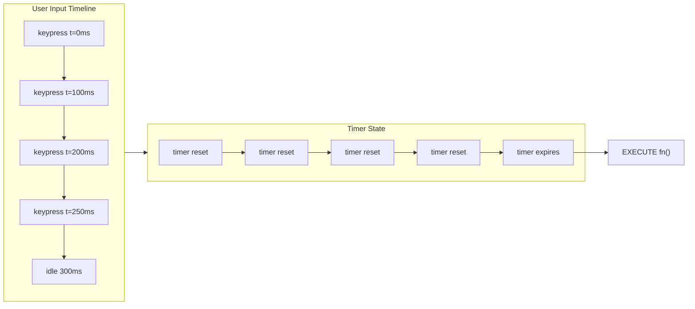
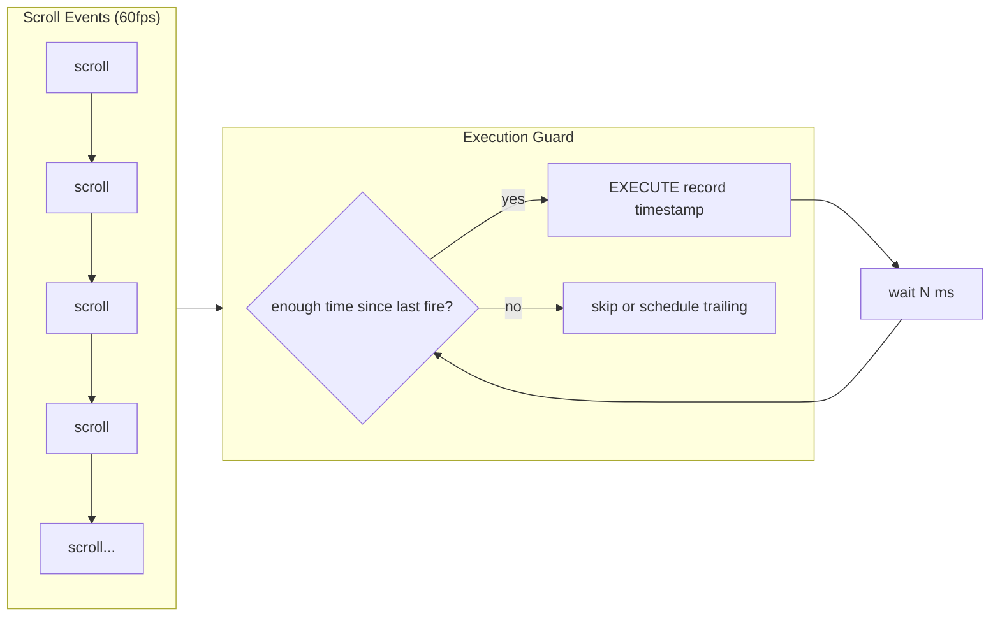
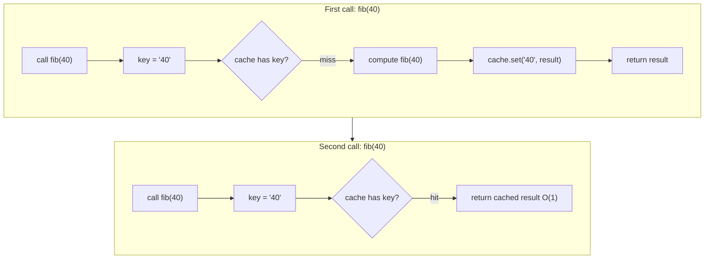

## The Problem That Hooks You

You're in a coding interview. The prompt: "Implement debounce from scratch. No lodash." Or "Write your own Promise.all." Or "Deep clone this object handling all edge cases."

You need to build these utilities using only raw JavaScript. No libraries. No external code. The interviewer watches how you think, not whether you memorized the solution.

The real problem: most developers use lodash or utilities every day but never understood how they work internally. When asked to build them from scratch, they freeze.

## Why It Happens

Using lodash or built-in methods hides the internals. You import `debounce` and it works. You use `Promise.all` and it works. These work until the interview asks you to re-derive them.

Memorizing code fails too. You might remember one version of debounce. But the interviewer asks about leading edge, trailing edge, cancel, or `this` binding. Your memorized version can't adapt.

The solution is to understand the underlying primitives.

## The One Insight

**Six primitives power every coding problem.** If you know how these work alone and together, you can build any utility from scratch.

- **Closure.** A function remembers variables from its outer scope. This is how debounce, throttle, and memoize store state across calls.

- **setTimeout.** Schedules a callback after a delay. This is how debounce delays execution and throttle schedules trailing calls.

- **Recursion.** A function calls itself with smaller input. This is how deep clone walks the object graph and flatten processes nested arrays.

- **Promise.** Represents an eventual value. This is how Promise.all, race, and allSettled coordinate async work.

- **Map.** Key-value storage with insertion order. This is how memoize caches results and LRU eviction works.

- **reduce.** Iterates and accumulates. This is how pipe, compose, and groupBy transform collections.

Ask: "What primitives does this problem need?" The answer tells you how to build it.

## Visualization



Debounce: every keystroke resets the timer. The function fires when the timer expires without reset.



Throttle: check the time since last execution. Fire only if enough time passed.



Memoize: check cache first. Hit returns O(1). Miss computes, stores, returns.

## Building Each Utility

**Debounce.**

```javascript
function debounce(fn, delay) {
  let timer = null;
  return function(...args) {
    const context = this;
    clearTimeout(timer);
    timer = setTimeout(() => fn.apply(context, args), delay);
  };
}
```

The outer function runs once. It creates a `timer` variable. The inner function closes over `timer`. Each call clears any pending timeout and starts a new one. Only the last call's timeout survives. When the timeout fires, `fn` runs with the correct `this` and arguments.

The `this` binding works because `fn.apply(context, args)` calls the original function with the context captured when the wrapper was called.

**Throttle (trailing edge).**

```javascript
function throttle(fn, limit) {
  let lastCall = 0;
  let timer = null;
  return function(...args) {
    const context = this;
    const now = Date.now();
    const remaining = limit - (now - lastCall);

    if (remaining <= 0) {
      if (timer) { clearTimeout(timer); timer = null; }
      lastCall = now;
      fn.apply(context, args);
    } else if (!timer) {
      timer = setTimeout(() => {
        lastCall = Date.now();
        timer = null;
        fn.apply(context, args);
      }, remaining);
    }
  };
}
```

`lastCall` tracks the timestamp of the last execution. If the difference exceeds `limit`, fire immediately. Otherwise schedule a trailing call for the remaining time. The trailing call resets `lastCall` to when it actually fired, not when it was scheduled.

**Deep Clone.**

```javascript
function deepClone(value, seen = new WeakMap()) {
  if (value === null || typeof value !== 'object') return value;
  if (seen.has(value)) return seen.get(value);

  let result;
  if (value instanceof Date) result = new Date(value);
  else if (value instanceof RegExp) result = new RegExp(value.source, value.flags);
  else if (value instanceof Map) {
    result = new Map();
    seen.set(value, result);
    value.forEach((v, k) => result.set(deepClone(k, seen), deepClone(v, seen)));
    return result;
  } else if (value instanceof Set) {
    result = new Set();
    seen.set(value, result);
    value.forEach(v => result.add(deepClone(v, seen)));
    return result;
  } else if (Array.isArray(value)) {
    result = [];
    seen.set(value, result);
    for (let i = 0; i < value.length; i++) result[i] = deepClone(value[i], seen);
  } else {
    result = Object.create(Object.getPrototypeOf(value));
    seen.set(value, result);
    for (const key of [...Object.keys(value), ...Object.getOwnPropertySymbols(value)]) {
      result[key] = deepClone(value[key], seen);
    }
  }
  return result;
}
```

The function recurses into every value. The WeakMap `seen` tracks already-visited objects. When it encounters the same reference again (circular), it returns the cached clone instead of recursing. Each type needs different construction. Symbol keys require `Object.getOwnPropertySymbols()` because `Object.keys()` skips them.

**Promise.all.**

```javascript
function promiseAll(iterable) {
  return new Promise((resolve, reject) => {
    const arr = Array.from(iterable);
    if (arr.length === 0) return resolve([]);

    const results = new Array(arr.length);
    let completed = 0;

    arr.forEach((item, i) => {
      Promise.resolve(item).then(
        value => {
          results[i] = value;
          completed++;
          if (completed === arr.length) resolve(results);
        },
        reject
      );
    });
  });
}
```

Pre-allocates the results array so indices match input order. `Promise.resolve(item)` wraps non-Promise values. The reject handler is passed directly — this makes the promise reject immediately on the first error, no waiting for others.

**Memoize with LRU.**

```javascript
function memoizeLRU(fn, maxSize = 100) {
  const cache = new Map();
  return function(...args) {
    const key = JSON.stringify(args);
    if (cache.has(key)) {
      const value = cache.get(key);
      cache.delete(key);
      cache.set(key, value);
      return value;
    }
    const result = fn.apply(this, args);
    cache.set(key, result);
    if (cache.size > maxSize) {
      const oldestKey = cache.keys().next().value;
      cache.delete(oldestKey);
    }
    return result;
  };
}
```

The Map stores cached results in insertion order. On cache hit, the entry is deleted and re-inserted, moving it to the end (most recently used). On cache miss, the result is computed and stored. If the cache exceeds `maxSize`, the first entry (oldest, least recently used) is deleted.

**Array Utilities.**

```javascript
function flatten(arr, depth = Infinity) {
  const result = [];
  for (const item of arr) {
    if (Array.isArray(item) && depth > 0) {
      result.push(...flatten(item, depth - 1));
    } else {
      result.push(item);
    }
  }
  return result;
}

function groupBy(arr, keyFn) {
  return arr.reduce((acc, item) => {
    const key = keyFn(item);
    if (!acc[key]) acc[key] = [];
    acc[key].push(item);
    return acc;
  }, {});
}

function unique(arr) {
  return [...new Set(arr)];
}

function chunk(arr, size) {
  const result = [];
  for (let i = 0; i < arr.length; i += size) {
    result.push(arr.slice(i, i + size));
  }
  return result;
}
```

**Async Flow Control.**

```javascript
async function series(tasks) {
  const results = [];
  for (const task of tasks) {
    results.push(await task());
  }
  return results;
}

async function parallel(tasks, concurrency = Infinity) {
  const iterator = tasks[Symbol.iterator]();
  const results = new Array(tasks.length);
  async function worker() {
    for (let i = 0; ; i++) {
      const { value, done } = iterator.next();
      if (done) break;
      results[i] = await value();
    }
  }
  const workers = Array.from({ length: Math.min(concurrency, tasks.length) }, worker);
  await Promise.all(workers);
  return results;
}

async function retry(fn, maxAttempts = 3, baseDelay = 1000) {  // See Ch 33 for fetchWithRetry with HTTP status checks
  for (let attempt = 1; attempt <= maxAttempts; attempt++) {
    try {
      return await fn();
    } catch (error) {
      if (attempt === maxAttempts) throw error;
      await new Promise(resolve => setTimeout(resolve, baseDelay * Math.pow(2, attempt - 1)));
    }
  }
}
```

series runs tasks sequentially with `await` in a loop. parallel uses workers that share an iterator — each pulls the next task, awaits it, and stores the result. retry wraps the call in try-catch with exponential backoff.

**Pipe, Compose, Curry.**

```javascript
const pipe = (...fns) => x => fns.reduce((acc, fn) => fn(acc), x);
const compose = (...fns) => x => fns.reduceRight((acc, fn) => fn(acc), x);

function curry(fn) {
  return function curried(...args) {
    if (args.length >= fn.length) {
      return fn.apply(this, args);
    }
    return (...next) => curried(...args, ...next);
  };
}
```

**Promise.all vs Promise.allSettled.**

```javascript
function promiseAllSettled(iterable) {
  return new Promise((resolve) => {
    const arr = Array.from(iterable);
    if (arr.length === 0) return resolve([]);

    const results = new Array(arr.length);
    let completed = 0;

    arr.forEach((item, i) => {
      Promise.resolve(item).then(
        value => {
          results[i] = { status: 'fulfilled', value };
          if (++completed === arr.length) resolve(results);
        },
        reason => {
          results[i] = { status: 'rejected', reason };
          if (++completed === arr.length) resolve(results);
        }
      );
    });
  });
}
```

Promise.all rejects immediately on the first failure — it's fail-fast. Promise.allSettled never rejects; it waits for all promises and returns an array of `{status, value}` or `{status, reason}` objects. Use all when you need every result or fail. Use allSettled when partial success is acceptable — like loading dashboard widgets where one failing widget shouldn't blank the whole page.

**Full LRU Cache with Doubly-Linked List.**

```javascript
class LRUCache {
  constructor(capacity) {
    this.capacity = capacity;
    this.cache = new Map();
  }

  get(key) {
    if (!this.cache.has(key)) return -1;
    const value = this.cache.get(key);
    this.cache.delete(key);
    this.cache.set(key, value);
    return value;
  }

  put(key, value) {
    if (this.cache.has(key)) this.cache.delete(key);
    this.cache.set(key, value);
    if (this.cache.size > this.capacity) {
      const oldestKey = this.cache.keys().next().value;
      this.cache.delete(oldestKey);
    }
  }
}
```

Map maintains insertion order. On access, delete and re-insert moves the entry to the end. On eviction, `keys().next().value` gives the oldest (least recently used) entry. This gives O(1) get and put without an actual doubly-linked list — Map's iterator is the list. The interviewer might ask "why not use a real linked list?" Answer: a Map-based approach is simpler, has the same O(1) complexity, and is idiomatic JavaScript. A linked list implementation is worth mentioning if they push on it.

**Event Emitter.**

```javascript
class EventEmitter {
  constructor() {
    this.events = new Map();
  }

  on(event, callback) {
    if (!this.events.has(event)) this.events.set(event, []);
    this.events.get(event).push(callback);
    return () => this.off(event, callback);
  }

  off(event, callback) {
    const callbacks = this.events.get(event);
    if (!callbacks) return;
    const index = callbacks.indexOf(callback);
    if (index > -1) callbacks.splice(index, 1);
  }

  emit(event, ...args) {
    const callbacks = this.events.get(event);
    if (!callbacks) return false;
    callbacks.forEach(cb => cb.apply(null, args));
    return true;
  }

  once(event, callback) {
    const wrapper = (...args) => {
      this.off(event, wrapper);
      callback.apply(null, args);
    };
    return this.on(event, wrapper);
  }
}
```

The `on` method returns an unsubscribe function — a closure over the callback. This pattern is used by React's useEffect cleanup, Express middleware, and every subscription API. `once` wraps the callback: it calls `off` before invoking the original, so the listener fires exactly once. The `emit` returns a boolean indicating whether listeners existed — useful for debugging.

**Async Iterator / Generator Pattern.**

```javascript
async function* generateAsyncSequence(fetchFn, pageSize = 10) {
  let page = 0;
  let hasMore = true;

  while (hasMore) {
    const response = await fetchFn(page, pageSize);
    for (const item of response.data) {
      yield item;
    }
    hasMore = response.data.length === pageSize;
    page++;
  }
}

async function consumeAsyncSequence() {
  const sequence = generateAsyncSequence(async (page, size) => {
    const res = await fetch(`/api/items?page=${page}&size=${size}`);
    return res.json();
  });

  for await (const item of sequence) {
    processItem(item);
  }
}
```

An async generator (`async function*`) yields values asynchronously. Each `yield` pauses execution until the consumer calls `next()`. `for await...of` consumes the iterator, handling the promise unwrapping automatically. This pattern replaces callback-based pagination and stream processing. It's how Node.js readable streams work internally — they implement the async iterator protocol.

**Auto-Curry with Argument Collection.**

```javascript
function autoCurry(fn) {
  return function curried(...args) {
    const allArgs = args;
    if (allArgs.length >= fn.length) {
      return fn.apply(this, allArgs);
    }
    return function(...nextArgs) {
      return curried.apply(this, [...allArgs, ...nextArgs]);
    };
  };
}

// Usage:
const add = autoCurry((a, b, c) => a + b + c);
add(1)(2)(3);    // 6
add(1, 2)(3);    // 6
add(1)(2, 3);    // 6
add(1, 2, 3);    // 6
```

Auto-curry collects arguments across multiple calls. It checks `fn.length` (the declared parameter count) to know when enough arguments have been collected. Each partial application returns a new function that concatenates the new args. This is different from manual curry where you define each parameter step — auto-curry works with any function regardless of arity.

## How Closures and the Event Loop Work Here

When a function is created, V8 captures the outer scope's variables in a context object. The inner function holds a reference to this context. The context persists as long as the inner function exists, even after the outer function returns. In debounce, `timer` lives in this context.

setTimeout schedules a callback in the macrotask queue. The event loop processes all microtasks (Promise callbacks) before the next macrotask. When you call `clearTimeout`, the scheduled callback is removed from the queue.

A Promise constructor runs the executor synchronously. The `.then()` callbacks are scheduled as microtasks. They run after the current synchronous code completes and before any macrotask.

## Real World: Autocomplete Search

Build an autocomplete search input that handles fast typing, API calls, and cached results.

```javascript
async function fetchSuggestions(query, signal) {
  const response = await fetch(`/api/suggest?q=${query}`, { signal });
  return response.json();
}

const getSuggestions = memoizeLRU(fetchSuggestions, 50);

const handleInput = debounce(async (query) => {
  if (query.length < 2) return;
  setStatus('loading');
  try {
    const results = await getSuggestions(query);
    setResults(results);
    setStatus(results.length === 0 ? 'empty' : 'success');
  } catch (err) {
    if (err.name !== 'AbortError') setStatus('error');
  }
}, 300);

// AbortController for stale requests (see Ch 33 for full pattern)
useEffect(() => {
  const controller = new AbortController();
  if (query.length >= 2) {
    fetchSuggestions(query, controller.signal).then(setResults).catch(() => {});
  }
  return () => controller.abort();
}, [query]);
```

Without debounce: API call per keystroke at 60wpm is about 5 calls per second. Each response might arrive out of order. Debounce reduces calls to 1 per pause. Memoize eliminates repeated calls entirely.

## Tradeoffs

**Debounce vs Throttle.** Debounce waits for a pause. Throttle fires at most once per interval. Use debounce for search and resize. Use throttle for scroll and progress.

**Recursion vs iteration for flatten.** Recursion is simpler but can overflow the call stack (around 10000 frames). Iteration with a stack avoids this.

**Shallow copy vs deep clone.** Shallow is O(n) for top-level properties. Deep is O(n) for every node. Use shallow when you only need the top level.

**Memory vs CPU for memoize.** Cache hits return O(1). LRU eviction bounds memory but adds overhead from delete-re-insert on every hit.

**Promise.all vs Promise.allSettled.** all fails fast. allSettled waits for all. Use all when you need every result. Use allSettled when partial success is acceptable.

**Event Emitter vs native EventTarget.** EventEmitter is simpler and works in Node.js. EventTarget requires DOM or Node's EventTarget class, uses CustomEvent objects, and has a different API. Use EventEmitter for internal pub/sub. Use EventTarget for browser/DOM interop.

**Async iterator vs array of promises.** Async iterator is lazy — yields one at a time. Array of promises executes all immediately. Use async iterator for infinite sequences, streams, or memory-constrained scenarios. Use array of promises when you need all results upfront.

**Auto-curry vs manual curry.** Auto-curry is convenient but relies on `fn.length` which has edge cases with rest params and defaults. Manual curry is explicit and works with any function. Use auto-curry for simple utilities. Use manual curry when arity is ambiguous.

## Common Mistakes

- Forget `this` binding in debounce and throttle. Use `fn.apply(context, args)`.
- Forget to handle empty input in Promise.all. Empty array should resolve immediately.
- Forget circular references in deep clone. Leads to stack overflow. Use WeakMap cache.
- Use `typeof value === 'object'` without null check. `typeof null === 'object'`.
- Forget to handle non-promise values in Promise polyfills. Use `Promise.resolve(item)`.
- Forget to return the result from memoized function on cache hit.
- In Event Emitter, forget to clone the callbacks array before iterating. Mutating during emit causes skipped or duplicate calls.
- In async generators, forget that yield pauses until the consumer calls next(). Don't yield in a tight loop expecting immediate consumption.
- In auto-curry, assume `fn.length` includes default parameters. It doesn't — default params are only counted if they have no value before them.

## SDE-2 Interview Answer

**Mid-level variant.** "I start by asking which primitives the problem needs. Debounce needs closure for the timer variable and setTimeout for the delay. I write the outer function that creates the timer, then the inner function that clears and restarts it. I use `fn.apply(this, args)` for correct binding."

**Senior variant.** "Every coding problem maps to JavaScript primitives. I think through the primitives first, then write the code. For deep clone, I need recursion for traversal and WeakMap for cycle detection. For Promise.all, I need a new Promise, a counter, and array iteration. I code the happy path first, then add edge cases."

**Engineering Lead variant.** "I teach the team to code from primitives. The six primitives cover 90% of coding problems. In code review, I look for edge case handling: empty inputs, special types, circular references, async error paths."

## Follow-up Questions

**Q1: Implement a leading edge debounce variant.**
A leading edge debounce fires on the *first* call in a burst, not the last. Add a `leading` flag parameter. On the first call, if no timer is pending, fire `fn` immediately and start a cooldown timer. Subsequent calls within the delay window are ignored — they reset the timer but don't fire. When the timer expires, the trailing call can optionally fire too.

```javascript
function debounce(fn, delay, { leading = false, trailing = true } = {}) {
  let timer = null;
  let lastArgs = null;

  return function (...args) {
    const context = this;
    const callNow = leading && !timer;

    clearTimeout(timer);
    lastArgs = args;

    timer = setTimeout(() => {
      timer = null;
      if (trailing && lastArgs) {
        fn.apply(context, lastArgs);
        lastArgs = null;
      }
    }, delay);

    if (callNow) {
      fn.apply(context, args);
      lastArgs = null;
    }
  };
}
```

The key insight: the `callNow` check fires only when `timer` is null (first call or after cooldown). The `clearTimeout` + `setTimeout` pattern ensures only the last trailing call survives. Use `{ leading: true, trailing: false }` for "fire once and ignore" behavior.

**Q2: How would you implement `Promise.all` with cancellation?**
The core challenge: `Promise.all` doesn't support `AbortController` natively. Wrap each promise so it accepts a shared signal. When one promise rejects, abort all others. Use a shared `AbortController` and pass its `signal` to each sub-promise. On first rejection, call `controller.abort()` — the remaining promises check `signal.aborted` and short-circuit.

```javascript
function promiseAllWithCancel(promises) {
  const controller = new AbortController();
  const wrapped = promises.map(p =>
    Promise.resolve(p).then(
      val => {
        if (controller.signal.aborted) throw new DOMException('Aborted', 'AbortError');
        return val;
      }
    )
  );

  const all = Promise.all(wrapped);
  all.catch(() => controller.abort());
  return Object.assign(all, { abort: () => controller.abort() });
}
```

The returned promise exposes an `abort()` method. When called, it aborts the controller, and any promise that checks `signal.aborted` rejects. This doesn't cancel in-flight network requests — you'd need to thread the `signal` into each `fetch` call for that.

**Q3: Your memoize function caches by `JSON.stringify(args)`. Two different objects with the same properties collide. How do you fix this?**
`JSON.stringify({a:1}) === JSON.stringify({a:1})` — different object references produce the same key. Fix: use a **chain of Maps**, one per argument position. Each argument's Map stores the next level of Maps. On lookup, traverse the chain: `cache.get(arg0).get(arg1).get(arg2)`. Since Maps use reference equality (`===`), distinct objects get distinct entries without serialization.

```javascript
function memoize(fn) {
  const cache = new Map();
  return function (...args) {
    let current = cache;
    for (const arg of args) {
      if (!current.has(arg)) current.set(arg, new Map());
      current = current.get(arg);
    }
    if (current.has('result')) return current.get('result');
    const result = fn.apply(this, args);
    current.set('result', result);
    return result;
  };
}
```

This gives exact reference-based caching. The tradeoff: it only works when the same object reference is passed again (not a clone with the same values). For value-based deep equality, you'd need a hash function or trie with structural comparison, which adds complexity.

**Q4: Implement `asyncPool` with concurrency limit K that preserves input order.**
Create K "worker" functions that pull tasks from a shared iterator. Each worker loops: pull the next task, await it, store the result by index, repeat until no tasks remain. Use `Promise.all` to wait for all workers to finish.

```javascript
async function asyncPool(concurrency, tasks, taskFn) {
  const results = new Array(tasks.length);
  const iterator = tasks[Symbol.iterator]();

  async function worker() {
    for (let i = 0; ; i++) {
      const { value: task, done } = iterator.next();
      if (done) break;
      const idx = tasks.indexOf(task); // or track index manually
      results[idx] = await taskFn(task);
    }
  }

  const workers = Array.from(
    { length: Math.min(concurrency, tasks.length) },
    () => worker()
  );
  await Promise.all(workers);
  return results;
}
```

The shared iterator ensures each task is picked up exactly once, and `results[idx]` preserves input order. The concurrency limit is the number of workers — at most K tasks run simultaneously. The iterator's `next()` call is synchronous and safe because JavaScript is single-threaded.

**Q5: Deep clone handles circular references with WeakMap. What happens when the original object is garbage collected but the clone is still referenced?**
The `WeakMap` entry is **automatically removed** when its key (the original object) is garbage collected. WeakMaps hold weak references to their keys — they don't prevent garbage collection. After the original is collected, the WeakMap entry becomes unreachable and is cleaned up by the GC. The clone is fully independent: it holds no reference to the original, and no reference to the WeakMap entry. The clone's structure is a plain object graph that the GC treats normally.

```javascript
const original = { self: null };
original.self = original; // circular

const cloned = deepClone(original);
// original = null → original is GC'd → WeakMap entry is cleaned up
// cloned remains valid: cloned.self === cloned
```

This is why `WeakMap` is the right choice over `Map` for cycle detection — a `Map` would keep the original alive indefinitely, causing a memory leak.

**Q6: Your Event Emitter's `on` returns an unsubscribe function. What's the advantage over requiring `off(event, callback)`?**
The callback reference doesn't need to be stored by the caller. With `off(event, callback)`, you must keep a reference to the exact function to pass it back for removal — if you create an inline function, you can't remove it. With the unsubscribe pattern, the closure captures the callback internally, and you only need to store the returned function.

```jsx
// With off: need to store callback reference
const handler = () => doSomething();
emitter.on('event', handler);
// later:
emitter.off('event', handler); // must use same reference

// With unsubscribe: just store the returned function
const unsub = emitter.on('event', () => doSomething());
// later:
unsub(); // no reference needed
```

This pattern is identical to React's `useEffect` cleanup, `addEventListener` removal, and every subscription API in the ecosystem. It's idiomatic because it reduces coupling — the subscriber doesn't need to know the emitter's internal callback list structure.

**Q7: How does an async generator differ from returning an array of promises?**
An **array of promises** executes all requests immediately and stores all results in memory at once. An **async generator** yields one result at a time, pausing until the consumer requests the next value via `for await...of`. This is **lazy evaluation** — you don't pay the memory cost for results you haven't consumed yet. For infinite sequences (live data streams, paginated APIs), an async generator is the only viable option because you can't materialize an infinite array.

```javascript
// Array of promises: all execute immediately, all in memory
const promises = urls.map(url => fetch(url).then(r => r.json()));
const results = await Promise.all(promises); // all in memory

// Async generator: one at a time, lazy
async function* fetchPages(urls) {
  for (const url of urls) {
    yield await fetch(url).then(r => r.json());
  }
}
// Only fetches next page when for-await requests it
```

The tradeoff: async generators can't run in parallel without extra orchestration. Array of promises with `Promise.all` naturally parallelizes. Use generators for sequential lazy loading; use `Promise.all` for batch parallel execution.

**Q8: Auto-curry checks `fn.length`. What if the function uses rest parameters?**
`fn.length` excludes parameters after rest params and default params. A function like `(...args) => args.length` has `length === 0`, so auto-curry would fire on the first call even though it expects multiple arguments. You can't reliably determine arity from rest params.

Three solutions: (1) **Require explicit arity** — pass the expected argument count as a second parameter: `autoCurry(fn, 3)`. (2) **Count from the source** — parse `fn.toString()` to count parameters, but this breaks with minification. (3) **Use partial application** — instead of auto-curry, use a manually curried function where each parameter is a separate function call:

```javascript
// Manual curry: explicit, works with any function
const add = curry((a, b, c) => a + b + c);
add(1)(2)(3); // 6

// Auto-curry: convenient but fn.length unreliable with rest params
const add = autoCurry((a, b, c) => a + b + c);
add(1)(2)(3); // works because fn.length === 3
```

Libraries like lodash take the explicit arity approach: `_.curry(fn, arity)`. The lesson: auto-curry works well for functions with known, fixed arity. For variadic functions, explicit is safer.

## Mental Trigger

What primitives does this problem need?

## One Page Revision

- Six primitives: closure, setTimeout, recursion, Promise, Map, reduce.
- Debounce: closure + setTimeout. Clear previous, start new. Fires after pause.
- Throttle: closure + Date.now(). Check time since last fire. Fires at most once per interval.
- Deep clone: recursion + WeakMap. Handle null check, Date, RegExp, Map, Set, Array, Object, Symbol keys, circular refs.
- Promise.all: new Promise + counter + results array. Fail fast by passing reject as second .then arg.
- Promise.race: first settled. Use for timeout wrapping.
- Promise.allSettled: never rejects. Collects {status, value/reason} for all.
- LRU Cache: Map-based O(1) get/put. Delete + re-insert moves to end. `keys().next().value` for eviction.
- Event Emitter: Map of callback arrays. on returns unsubscribe fn. once wraps + removes. emit returns boolean.
- Async Iterator: `async function*` yields values. `for await...of` consumes. Pauses until consumer requests next.
- Auto-Curry: collect args across calls. Check `fn.length` for arity. Returns new function concatenating args.
- Flatten: recursion with depth check or iterative stack.
- GroupBy: reduce with object accumulator.
- Unique: new Set(arr).
- Chunk: loop with slice stepping by size.
- Memoize: closure + Map. LRU uses Map insertion order.
- Series: await in for loop.
- Parallel with concurrency: shared iterator + K workers + Promise.all.
- Retry: for loop with try-catch, exponential backoff, max attempts.
- Pipe: reduce left to right. Compose: reduceRight right to left.
- Curry: collect args until arity reached, then call fn.
