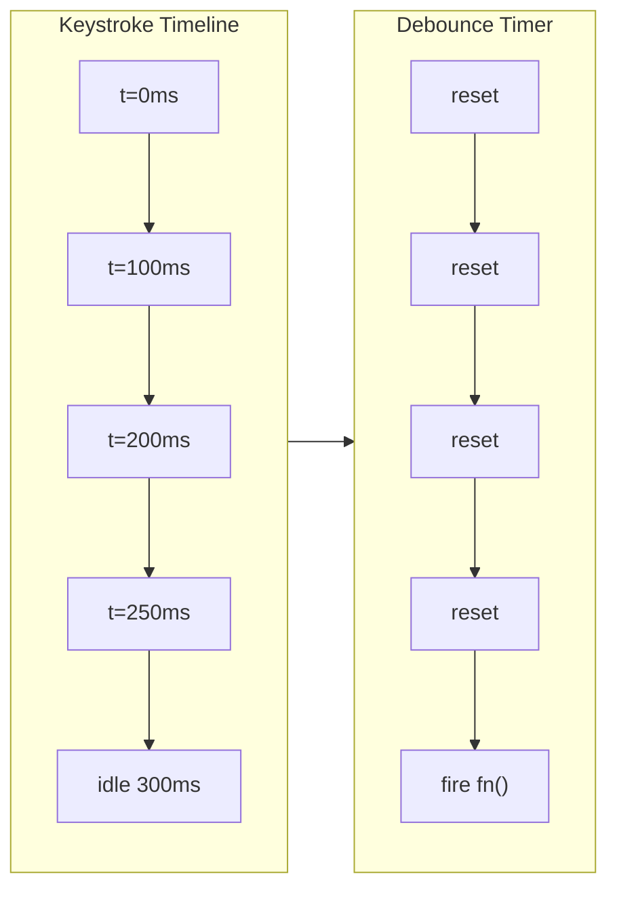

## The Problem That Hooks You

You're in a coding interview. "Implement debounce from scratch. No lodash." Or "Write your own Promise.all." You use these every day but never built them from scratch. You freeze.

The real problem: most developers use utilities daily but never understood how they work internally.

## The One Insight

**Six primitives power every coding problem.** If you know how these work alone and together, you can build any utility from scratch:

1. **Closure** — a function remembers variables from its outer scope. This powers debounce, throttle, and memoize.
2. **setTimeout** — schedules a callback after a delay. This powers debounce delays and throttle trailing calls.
3. **Recursion** — a function calls itself with smaller input. This powers deep clone and flatten.
4. **Promise** — represents an eventual value. This powers Promise.all, race, and allSettled.
5. **Map** — key-value storage with insertion order. This powers memoize caches and LRU eviction.
6. **reduce** — iterates and accumulates. This powers pipe, compose, and groupBy.

Ask: "What primitives does this problem need?" The answer tells you how to build it.



## Building Each Utility

**Debounce** — closure + setTimeout:
```javascript
function debounce(fn, delay) {
  let timer = null;
  return function(...args) {
    const context = this;
    clearTimeout(timer);
    timer = setTimeout(() => fn.apply(context, args), delay);
  };
}
```
Each call clears any pending timeout and starts a new one. Only the last call's timeout survives. `fn.apply(context, args)` preserves `this` binding.

**Throttle** — closure + Date.now():
```javascript
function throttle(fn, limit) {
  let lastCall = 0;
  let timer = null;
  return function(...args) {
    const context = this;
    const now = Date.now();
    const remaining = limit - (now - lastCall);
    if (remaining <= 0) {
      if (timer) { clearTimeout(timer); timer = null; }
      lastCall = now;
      fn.apply(context, args);
    } else if (!timer) {
      timer = setTimeout(() => {
        lastCall = Date.now();
        timer = null;
        fn.apply(context, args);
      }, remaining);
    }
  };
}
```
`lastCall` tracks the last execution timestamp. If enough time passed, fire immediately. Otherwise schedule a trailing call.

**Deep Clone** — recursion + WeakMap:
```javascript
function deepClone(value, seen = new WeakMap()) {
  if (value === null || typeof value !== 'object') return value;
  if (seen.has(value)) return seen.get(value);
  let result;
  if (value instanceof Date) result = new Date(value);
  else if (value instanceof RegExp) result = new RegExp(value.source, value.flags);
  else if (value instanceof Map) {
    result = new Map();
    seen.set(value, result);
    value.forEach((v, k) => result.set(deepClone(k, seen), deepClone(v, seen)));
    return result;
  } else if (value instanceof Set) {
    result = new Set();
    seen.set(value, result);
    value.forEach(v => result.add(deepClone(v, seen)));
    return result;
  } else if (Array.isArray(value)) {
    result = [];
    seen.set(value, result);
    for (let i = 0; i < value.length; i++) result[i] = deepClone(value[i], seen);
  } else {
    result = Object.create(Object.getPrototypeOf(value));
    seen.set(value, result);
    for (const key of [...Object.keys(value), ...Object.getOwnPropertySymbols(value)]) {
      result[key] = deepClone(value[key], seen);
    }
  }
  return result;
}
```
The `seen` WeakMap tracks already-visited objects. When it encounters the same reference again (circular), it returns the cached clone. WeakMap is the right choice over Map because entries are removed when the original object is garbage collected.

**Promise.all** — new Promise + counter:
```javascript
function promiseAll(iterable) {
  return new Promise((resolve, reject) => {
    const arr = Array.from(iterable);
    if (arr.length === 0) return resolve([]);
    const results = new Array(arr.length);
    let completed = 0;
    arr.forEach((item, i) => {
      Promise.resolve(item).then(
        value => {
          results[i] = value;
          if (++completed === arr.length) resolve(results);
        },
        reject
      );
    });
  });
}
```
Pre-allocates results array so indices match input order. `Promise.resolve(item)` wraps non-Promise values. Passing `reject` as the second arg makes it fail-fast on the first error.

**LRU Cache** — Map insertion order:
```javascript
class LRUCache {
  constructor(capacity) {
    this.capacity = capacity;
    this.cache = new Map();
  }
  get(key) {
    if (!this.cache.has(key)) return -1;
    const value = this.cache.get(key);
    this.cache.delete(key);
    this.cache.set(key, value);
    return value;
  }
  put(key, value) {
    if (this.cache.has(key)) this.cache.delete(key);
    this.cache.set(key, value);
    if (this.cache.size > this.capacity) {
      this.cache.delete(this.cache.keys().next().value);
    }
  }
}
```
On access, delete and re-insert moves the entry to the end (most recently used). On eviction, `keys().next().value` gives the oldest entry. O(1) get and put without a linked list.

**Event Emitter** — Map of callback arrays:
```javascript
class EventEmitter {
  constructor() { this.events = new Map(); }
  on(event, callback) {
    if (!this.events.has(event)) this.events.set(event, []);
    this.events.get(event).push(callback);
    return () => this.off(event, callback);
  }
  off(event, callback) {
    const cbs = this.events.get(event);
    if (!cbs) return;
    const i = cbs.indexOf(callback);
    if (i > -1) cbs.splice(i, 1);
  }
  emit(event, ...args) {
    const cbs = this.events.get(event);
    if (!cbs) return false;
    cbs.forEach(cb => cb.apply(null, args));
    return true;
  }
  once(event, callback) {
    const wrapper = (...args) => { this.off(event, wrapper); callback.apply(null, args); };
    return this.on(event, wrapper);
  }
}
```
`on` returns an unsubscribe function — the same pattern used by React's `useEffect` cleanup and every subscription API.

**Pipe, Compose, Curry:**
```javascript
const pipe = (...fns) => x => fns.reduce((acc, fn) => fn(acc), x);
const compose = (...fns) => x => fns.reduceRight((acc, fn) => fn(acc), x);
function curry(fn) {
  return function curried(...args) {
    if (args.length >= fn.length) return fn.apply(this, args);
    return (...next) => curried(...args, ...next);
  };
}
```

**Promise.allSettled** — never rejects, waits for all:
```javascript
function promiseAllSettled(iterable) {
  return new Promise((resolve) => {
    const arr = Array.from(iterable);
    if (arr.length === 0) return resolve([]);
    const results = new Array(arr.length);
    let completed = 0;
    arr.forEach((item, i) => {
      Promise.resolve(item).then(
        value => { results[i] = { status: 'fulfilled', value }; if (++completed === arr.length) resolve(results); },
        reason => { results[i] = { status: 'rejected', reason }; if (++completed === arr.length) resolve(results); }
      );
    });
  });
}
```

**Flatten Array** — recursion + type checking:
```javascript
function flatten(arr, depth = Infinity) {
  return arr.reduce((acc, item) => {
    if (Array.isArray(item) && depth > 0) {
      acc.push(...flatten(item, depth - 1));
    } else {
      acc.push(item);
    }
    return acc;
  }, []);
}
```
Recursively spreads each sub-array until hitting a non-array or hitting the depth limit. The `depth` parameter lets you control how many levels deep to go — `flatten([1, [2, [3]]], 1)` stops one level deep.

## Tradeoffs

- **Debounce vs throttle.** Debounce waits for a pause. Throttle fires at most once per interval.
- **Promise.all vs allSettled.** `all` fails fast. `allSettled` waits for all. Use `allSettled` when partial success is acceptable.
- **Recursion vs iteration for flatten.** Recursion is simpler but can overflow the stack (~10000 frames).
- **Map-based LRU vs linked list.** Map gives same O(1) with less code. Mention linked list if the interviewer pushes.

## Common Mistakes

- Forgetting `this` binding in debounce/throttle — use `fn.apply(context, args)`.
- Forgetting `typeof null === 'object'` — always null-check first.
- Forgetting circular references in deep clone — leads to stack overflow.
- Forgetting to handle non-promise values in Promise polyfills — use `Promise.resolve(item)`.
- Forgetting to return the result from memoized function on cache hit.

## Follow-up Questions

**Q1: Implement a leading edge debounce variant.**
Fire on the first call, not the last. Add a `leading` flag. On the first call, if no timer is pending, fire immediately and start a cooldown timer. Subsequent calls within the delay are ignored.

**Q2: How would you implement `Promise.all` with cancellation?**
Wrap each promise with a shared `AbortController`. On first rejection, call `controller.abort()`. Return the promise with an `abort()` method.

**Q3: Your memoize caches by `JSON.stringify(args)`. Two different objects with the same properties collide. How do you fix it?**
Use a chain of Maps, one per argument position. Each argument's Map stores the next level. Maps use reference equality (`===`), so distinct objects get distinct entries.

**Q4: How does an async generator differ from an array of promises?**
Array of promises executes all immediately, stores all in memory. Async generator yields one at a time — lazy evaluation. For infinite sequences or memory-constrained scenarios, use async generators.

**Q5: How would you flatten an array without recursion to avoid stack overflow?**
Use an explicit stack. Push items onto the stack, and when you pop an array, push its children back. Iterative approach handles arrays with 100k+ nesting levels without blowing the call stack.

**Q6: Your curry implementation uses `fn.length` to detect arity. What if the function uses default parameters?**
`fn.length` stops counting at the first parameter with a default value. So `function(a, b = 2)` has `length` of 1. Fix: track argument count manually, or let the caller explicitly pass the arity.

**Q7: How would you add wildcard support to your EventEmitter (`on('user.*', handler)`)?**
Store patterns in a separate list. On `emit`, iterate both exact matches and pattern matches. For `user.*`, split the event name on `.` and check if the pattern's segments match — first segment equals, second is `*`. Keep it simple: no regex, just segment-level comparison.

## Mental Trigger

What primitives does this problem need?

## One Page Revision

- Six primitives: closure, setTimeout, recursion, Promise, Map, reduce.
- Debounce: closure + setTimeout. Clears previous, starts new. Fires after pause.
- Throttle: closure + Date.now(). Fires at most once per interval.
- Deep clone: recursion + WeakMap for circular references.
- Promise.all: counter + results array. Fail-fast via reject passthrough.
- LRU Cache: Map delete + re-insert for O(1) get/put.
- Event Emitter: Map of callback arrays. `on` returns unsubscribe function.
- Pipe = reduce left to right. Compose = reduceRight right to left.
