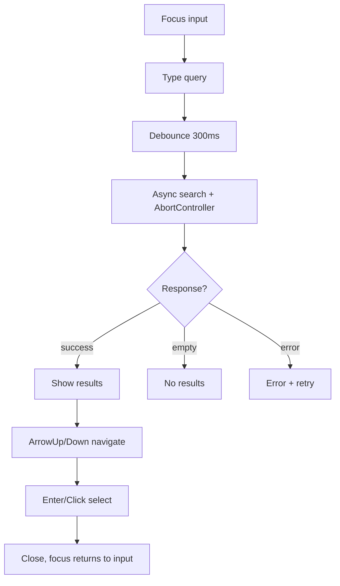

## The Problem That Hooks You

"Build a searchable dropdown that fetches from an API. Handle keyboard navigation, loading, and error state. You have 20 minutes."

You need to go from prompt to working component while narrating your reasoning. The interviewer watches your process — not just the code, but how you think.

The real problem isn't building the component. It's knowing which state you need, how to handle the full lifecycle, and how to talk through tradeoffs while coding.

## The One Insight

**Machine coding is a process, not a memorization exercise.** Follow these steps for every component:

1. **Clarify.** Sync or async? Controlled or uncontrolled? What keyboard interactions?
2. **Define minimal state.** Store only what cannot be derived. Use a discriminated union for status: `loading | empty | error | success`.
3. **Build happy path.** Get the component working for the ideal case.
4. **Add edge cases.** Empty input, no results, API failure, rapid typing, paste.
5. **Add accessibility.** ARIA roles, keyboard navigation, focus management.
6. **Talk about performance.** Memoization, virtualization, debouncing, aborting stale requests.



## Four Essential Components

**1. OTP Input** — the most common FAANG machine coding prompt:

```jsx
function OTPInput({ length = 6, onComplete }) {
  const [otp, setOtp] = useState(Array(length).fill(""));
  const inputRefs = useRef([]);

  const handleChange = (index, value) => {
    if (value.length > 1) value = value.slice(-1); // handle paste
    const newOtp = [...otp];
    newOtp[index] = value;
    setOtp(newOtp);

    // Auto-advance to next input
    if (value && index < length - 1) {
      inputRefs.current[index + 1]?.focus();
    }

    // Auto-submit when complete
    if (newOtp.every(d => d !== "") && onComplete) {
      onComplete(newOtp.join(""));
    }
  };

  const handleKeyDown = (index, e) => {
    if (e.key === "Backspace" && !otp[index] && index > 0) {
      inputRefs.current[index - 1]?.focus();
    }
  };

  const handlePaste = (e) => {
    e.preventDefault();
    const pasted = e.clipboardData.getData("text").slice(0, length);
    const newOtp = [...otp];
    pasted.split("").forEach((char, i) => { newOtp[i] = char; });
    setOtp(newOtp);
    inputRefs.current[Math.min(pasted.length, length - 1)]?.focus();
    if (newOtp.every(d => d !== "") && onComplete) onComplete(newOtp.join(""));
  };

  return (
    <div role="group" aria-label="One-time password">
      {otp.map((digit, i) => (
        <input
          key={i}
          ref={el => inputRefs.current[i] = el}
          type="text"
          inputMode="numeric"
          maxLength={1}
          value={digit}
          onChange={e => handleChange(i, e.target.value)}
          onKeyDown={e => handleKeyDown(i, e)}
          onPaste={handlePaste}
          aria-label={`Digit ${i + 1}`}
          className="otp-input"
        />
      ))}
    </div>
  );
}
```

**Key patterns:** Auto-advance on input, backspace moves to previous, paste fills all inputs, auto-submit on complete, `inputMode="numeric"` for mobile keyboard.

**2. Searchable Dropdown** — five pieces of state:

```jsx
function SearchableSelect({ options, onChange, async, onSearch }) {
  const [isOpen, setIsOpen] = useState(false);
  const [inputValue, setInputValue] = useState('');
  const [highlightedIndex, setHighlightedIndex] = useState(-1);
  const [items, setItems] = useState(async ? [] : options);
  const [status, setStatus] = useState('idle');
  const inputRef = useRef(null);

  useEffect(() => {
    if (!async || !inputValue) return;
    const controller = new AbortController();
    setStatus('loading');
    onSearch(inputValue, controller.signal)
      .then(data => {
        setItems(data);
        setStatus(data.length === 0 ? 'empty' : 'success');
      })
      .catch(err => { if (err.name !== 'AbortError') setStatus('error'); });
    return () => controller.abort();
  }, [inputValue, async]);

  const handleKeyDown = (e) => {
    switch (e.key) {
      case 'ArrowDown': e.preventDefault(); setHighlightedIndex(i => Math.min(i + 1, items.length - 1)); break;
      case 'ArrowUp': e.preventDefault(); setHighlightedIndex(i => Math.max(i - 1, 0)); break;
      case 'Enter': if (highlightedIndex >= 0) selectItem(items[highlightedIndex]); break;
      case 'Escape': setIsOpen(false); break;
    }
  };

  return (
    <div role="combobox" aria-expanded={isOpen}>
      <input ref={inputRef} value={inputValue}
        onChange={e => { setInputValue(e.target.value); setIsOpen(true); }}
        onKeyDown={handleKeyDown}
        aria-autocomplete="list" aria-activedescendant={highlightedIndex >= 0 ? `opt-${highlightedIndex}` : undefined} />
      {isOpen && (
        <ul role="listbox">
          {status === 'loading' && <li>Loading...</li>}
          {status === 'empty' && <li>No results</li>}
          {status === 'error' && <li>Something went wrong</li>}
          {status === 'success' && items.map((item, i) => (
            <li key={item.value} id={`opt-${i}`} role="option"
              aria-selected={i === highlightedIndex}
              onClick={() => selectItem(item)}
              onMouseEnter={() => setHighlightedIndex(i)}>
              {item.label}
            </li>
          ))}
        </ul>
      )}
    </div>
  );
}
```

The async `useEffect` creates an `AbortController` on each render. Cleanup calls `controller.abort()` when input changes, cancelling stale requests.

**2. Tabs** — controlled/uncontrolled pattern:

```jsx
function Tabs({ tabs, activeTab, onChange, defaultTab }) {
  const [internalActive, setInternalActive] = useState(defaultTab ?? 0);
  const current = activeTab !== undefined ? activeTab : internalActive;
  const select = (index) => {
    if (activeTab === undefined) setInternalActive(index);
    onChange?.(index);
  };
  return (
    <div role="tablist">
      {tabs.map((tab, i) => (
        <button key={i} role="tab" aria-selected={current === i}
          onClick={() => select(i)}
          onKeyDown={(e) => {
            if (e.key === 'ArrowRight') select(Math.min(i + 1, tabs.length - 1));
            if (e.key === 'ArrowLeft') select(Math.max(i - 1, 0));
          }}>
          {tab.label}
        </button>
      ))}
    </div>
  );
}
```

If `activeTab` is provided, the parent owns state. If undefined, the component manages internally. Arrow keys navigate between tabs.

**3. Infinite Scroll:**

```jsx
function useInfiniteScroll(loadMore, hasMore) {
  const sentinelRef = useRef(null);
  useEffect(() => {
    if (!hasMore) return;
    const observer = new IntersectionObserver(([entry]) => {
      if (entry.isIntersecting) loadMore();
    }, { rootMargin: '200px' });
    if (sentinelRef.current) observer.observe(sentinelRef.current);
    return () => observer.disconnect();
  }, [loadMore, hasMore]);
  return sentinelRef;
}
```

Use a `loading` ref guard to prevent duplicate page loads when the user scrolls fast. `IntersectionObserver` fires only at viewport boundaries — much better than scroll listeners firing 60+ times per second.

**4. Modal:**

```jsx
function Modal({ isOpen, onClose, title, children }) {
  const overlayRef = useRef(null);

  useEffect(() => {
    const handler = (e) => { if (e.key === 'Escape') onClose(); };
    if (isOpen) document.addEventListener('keydown', handler);
    return () => document.removeEventListener('keydown', handler);
  }, [isOpen, onClose]);

  if (!isOpen) return null;
  return (
    <div ref={overlayRef} onClick={(e) => { if (e.target === overlayRef.current) onClose(); }}
      role="dialog" aria-modal="true" aria-label={title}>
      <div className="modal-content">
        <button onClick={onClose} aria-label="Close">x</button>
        {children}
      </div>
    </div>
  );
}
```

Overlay click checks `e.target === overlayRef.current` — only closes when clicking the backdrop, not content children.

**5. Autocomplete with Debounce** — debounced search with keyboard navigation:

```jsx
function Autocomplete({ onSearch, onSelect, delay = 300 }) {
  const [query, setQuery] = useState('');
  const [suggestions, setSuggestions] = useState([]);
  const [highlightedIndex, setHighlightedIndex] = useState(-1);
  const [loading, setLoading] = useState(false);
  const [isOpen, setIsOpen] = useState(false);
  const timerRef = useRef(null);

  const handleChange = (value) => {
    setQuery(value);
    setHighlightedIndex(-1);
    clearTimeout(timerRef.current);
    if (!value.trim()) { setSuggestions([]); setIsOpen(false); return; }
    timerRef.current = setTimeout(() => {
      setLoading(true);
      onSearch(value).then(data => { setSuggestions(data); setIsOpen(true); setLoading(false); });
    }, delay);
  };

  useEffect(() => () => clearTimeout(timerRef.current), []);

  const handleKeyDown = (e) => {
    if (!isOpen) return;
    if (e.key === 'ArrowDown') { e.preventDefault(); setHighlightedIndex(i => Math.min(i + 1, suggestions.length - 1)); }
    else if (e.key === 'ArrowUp') { e.preventDefault(); setHighlightedIndex(i => Math.max(i - 1, 0)); }
    else if (e.key === 'Enter' && highlightedIndex >= 0) { onSelect(suggestions[highlightedIndex]); setIsOpen(false); }
    else if (e.key === 'Escape') { setIsOpen(false); }
  };

  return (
    <div role="combobox" aria-expanded={isOpen}>
      <input value={query} onChange={e => handleChange(e.target.value)} onKeyDown={handleKeyDown} />
      {loading && <span>Loading...</span>}
      {isOpen && suggestions.length > 0 && (
        <ul role="listbox">
          {suggestions.map((item, i) => (
            <li key={item.id} role="option" aria-selected={i === highlightedIndex}
              onMouseEnter={() => setHighlightedIndex(i)} onClick={() => { onSelect(item); setIsOpen(false); }}>
              {item.label}
            </li>
          ))}
        </ul>
      )}
    </div>
  );
}
```

The debounce timer lives in a ref so the timeout persists across renders without triggering re-renders. Each keystroke clears the previous timer, so only the last keystroke fires the API call. AbortController would be the next step for true request cancellation.

**6. Toast Notification System** — imperative notifications with auto-dismiss:

```jsx
function ToastProvider({ children }) {
  const [toasts, setToasts] = useState([]);
  const addToast = useCallback((message, { type = 'info', duration = 3000 } = {}) => {
    const id = crypto.randomUUID();
    setToasts(prev => [...prev, { id, message, type }]);
    if (duration > 0) setTimeout(() => removeToast(id), duration);
  }, []);

  const removeToast = useCallback((id) => {
    setToasts(prev => prev.filter(t => t.id !== id));
  }, []);

  const value = useMemo(() => ({ addToast, toasts }), [addToast, toasts]);

  return (
    <ToastContext.Provider value={value}>
      {children}
      <div className="toast-container">
        {toasts.map(t => (
          <div key={t.id} className={`toast toast-${t.type}`} role="alert">
            {t.message}
            <button onClick={() => removeToast(t.id)} aria-label="Dismiss">x</button>
          </div>
        ))}
      </div>
    </ToastContext.Provider>
  );
}

const useToast = () => useContext(ToastContext);
```

The hook returns `{ addToast, toasts }` — callers never touch state directly. Using `crypto.randomUUID()` avoids key collisions without extra IDs. The `setTimeout` captures the toast ID at creation, so removal is always correct even if the toasts array changed since. For stacking, CSS `position: fixed; bottom: 1rem` with `:nth-child` offsets or flex column-reverse handles layout automatically.

**7. Drag-and-Drop List** — sortable list using native HTML drag events:

```jsx
function DragList({ items, onReorder }) {
  const [dragIndex, setDragIndex] = useState(null);

  const handleDragStart = (e, index) => {
    setDragIndex(index);
    e.dataTransfer.effectAllowed = 'move';
  };

  const handleDragOver = (e, index) => {
    e.preventDefault();
    if (index === dragIndex) return;
    e.dataTransfer.dropEffect = 'move';
  };

  const handleDrop = (e, index) => {
    e.preventDefault();
    if (index === dragIndex || dragIndex === null) return;
    const updated = [...items];
    const [moved] = updated.splice(dragIndex, 1);
    updated.splice(index, 0, moved);
    onReorder(updated);
    setDragIndex(null);
  };

  return (
    <ul>
      {items.map((item, i) => (
        <li key={item.id} draggable
          onDragStart={e => handleDragStart(e, i)}
          onDragOver={e => handleDragOver(e, i)}
          onDrop={e => handleDrop(e, i)}
          onDragEnd={() => setDragIndex(null)}
          style={{ opacity: dragIndex === i ? 0.4 : 1 }}>
          {item.label}
        </li>
      ))}
    </ul>
  );
}
```

Native drag events need no library but lack the visual polish of a library — the browser provides a default drag ghost image. `onDragEnd` resets state to clean up if the drop never happened (e.g., dropped outside the list). The splice-remove-then-splice-insert pattern is the simplest reorder for small lists; for 1000+ items, consider immutable updates with index mapping instead.

## Tradeoffs

- **Controlled vs uncontrolled.** Controlled gives parent full control. Uncontrolled is simpler. Support both: check if the prop is provided.
- **IntersectionObserver vs scroll listener.** IO is callback-driven, fires at boundaries. Scroll fires 60+ fps. Use IO.
- **useState vs useReducer.** useState for single values. useReducer for complex state with multiple fields.
- **Portal vs no portal.** Portal avoids z-index stacking issues. Use portal for production modals.
- **Debounce in ref vs state.** Timer lives in ref, not state — no re-render on every tick. State would cause a render per keystroke.
- **Native drag vs library.** Native drag needs zero deps but gives you no animation. Libraries like dnd-kit add animation and touch support at the cost of bundle size and complexity.

## Common Mistakes

- Storing derived values in state — compute during render instead.
- Forgetting loading, empty, and error states — UI shows blank space.
- Forgetting keyboard navigation — screen reader users can't use it.
- Forgetting to abort stale requests — slow response overwrites fast one.
- Forgetting to disconnect IntersectionObserver — setState on unmounted component.
- Using index as key in reorderable lists.
- Debouncing by storing the timer in state — causes unnecessary re-renders on every keystroke.
- Drag-and-drop using index as key when items reorder — causes React to unmount/remount incorrectly.

## Follow-up Questions

**Q1: Your infinite scroll fires twice when the user scrolls fast. How do you prevent duplicate loads?**
Add a `loading` ref guard. Check it at the top of `loadMore` and return early if already loading. Use `useRef` instead of `useState` to avoid extra re-renders — the check is synchronous.

**Q2: An OTP input with 6 boxes. The user pastes a 6-digit code. How do you split it?**
Listen for `onPaste` on the container. Extract with `e.clipboardData.getData('text')`, filter digits with `replace(/\D/g, '')`, split into characters, distribute by index, auto-focus the last filled box.

**Q3: Your dropdown has 10,000 options. The filter blocks the main thread for 200ms. How do you fix it?**
The filter itself is fast. The bottleneck is DOM rendering. Fix with virtualization — only render the 20-30 visible options. Use a fixed-height container, calculate the visible range from scroll position, render only those items with absolute positioning.

**Q4: Your modal closes when the user clicks inside the modal content. How does the overlay check work?**
`e.target` is the actual clicked element. When clicking a child inside the modal, `e.target` is the child, not the overlay. Since `e.target !== overlayRef.current`, `onClose()` is not called. Only clicking the backdrop triggers close.

**Q5: Your autocomplete fires an API call on every keystroke, overwhelming the server. How do you fix it without a library?**
Use a debounce pattern: store the timeout ID in a `useRef`, clear it on each keystroke, and set a new `setTimeout` that only fires the API call after the delay. This way, rapid typing produces one call for the final value. Add a loading boolean for the UI, and use `AbortController` to cancel in-flight requests when a new one fires.

**Q6: Your drag-and-drop list reorders correctly, but the dropped item disappears for a frame. What's happening?**
You're updating state before the drag operation completes. The `onDragEnd` event fires after `onDrop` — if you clear `dragIndex` in `onDrop`, React re-renders with the item at its new position but `dragIndex` is already null, causing a flicker. Clear `dragIndex` in `onDragEnd` instead, or keep the opacity at 1 once dropped.

## Mental Trigger

Minimal state, keyboard and mouse, loading empty error success, debounce ref, drag key stability.

## One Page Revision

- Process: clarify → state → happy path → edge cases → accessibility → performance.
- Minimal state: store only what cannot be derived. Status as discriminated union.
- Searchable dropdown: isOpen, inputValue, highlightedIndex, items, status. AbortController for stale requests.
- Tabs: controlled/uncontrolled via prop check. Arrow keys navigate.
- Infinite scroll: IntersectionObserver + sentinel + loading guard ref.
- Modal: overlay click check (`e.target === currentTarget`), Escape listener, focus trap, portal.
- Autocomplete: debounce via ref, keyboard nav, loading state.
- Toast: context provider, addToast imperative API, auto-dismiss via setTimeout + ID capture.
- Drag-and-drop: native drag events, splice reorder, onDragEnd resets, opacity feedback.
- Keyboard: ArrowUp/Down/Left/Right, Enter, Escape, Tab.
- ARIA: combobox, listbox, option, dialog, tablist, tab, tabpanel, aria-selected, aria-activedescendant.
