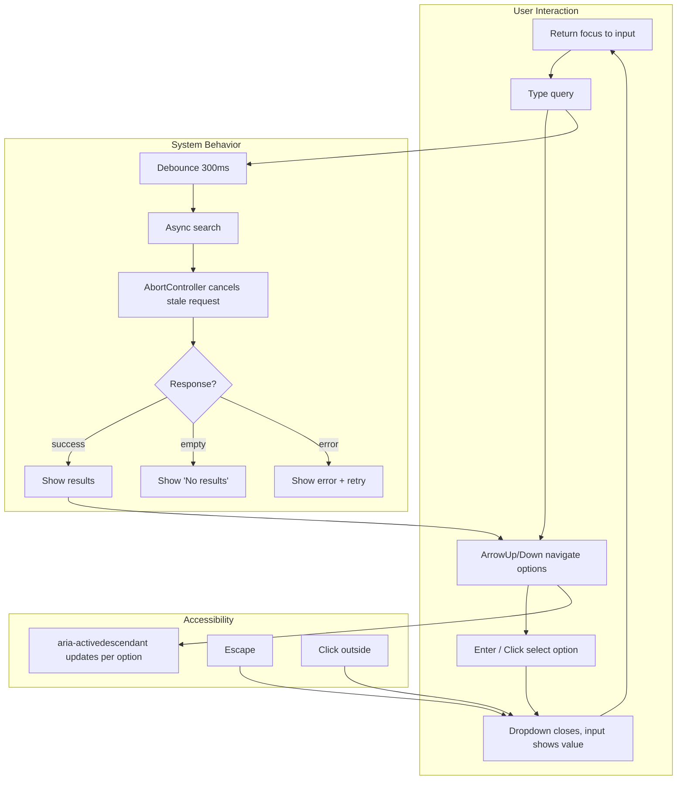
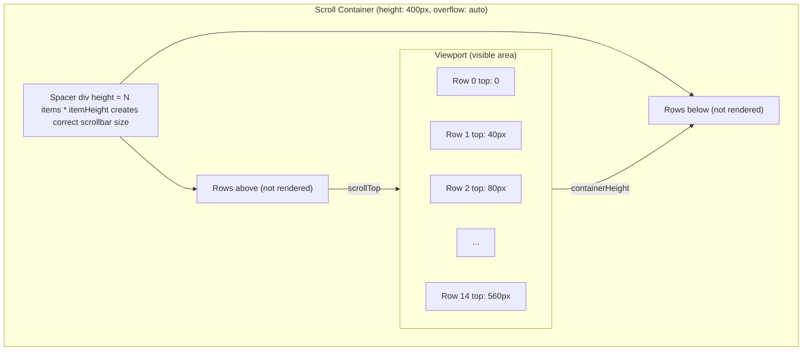

## Problem

You are in a coding interview. The prompt: "Build a searchable dropdown that fetches results from an API. Handle keyboard navigation, loading state, and error state. You have 20 minutes."

You need to go from prompt to working component while narrating your reasoning. The interviewer watches your process. They check if you understand state management, edge cases, accessibility, and performance.

The real problem is not building the component. It is knowing which state you need, how to handle the full interaction lifecycle, and how to talk through tradeoffs while coding.

## Why Existing Solution Failed

Copying component libraries hides the internals. You import a Dropdown from Material UI or a Modal from Ant Design. They work. But in an interview you cannot import anything. You must build from scratch using only React hooks.

Relying on muscle memory fails. You might know how to write a dropdown but forget keyboard navigation. You might build the happy path but miss the loading state. You might handle click but forget Escape key. The interviewer probes these gaps.

The fix is a repeatable process: clarify the prompt, define minimal state, build the happy path, add edge cases, add accessibility, then talk about performance.

## Mental Model

Machine coding is a process, not a memorization exercise. Follow these steps for every component:

1. **Clarify.** Ask: synchronous or async? Controlled or uncontrolled? Single select or multi select? What states: loading, empty, error, success? What keyboard interactions? What screen reader support?

2. **Define minimal state.** Store only what cannot be derived. Everything else is computed. Use a discriminated union for status: `{ status: 'loading' | 'empty' | 'error' | 'success', data?, error? }`. This covers every UI state without impossible combinations.

3. **Build happy path.** Get the component working for the ideal case. Input filters list. User clicks or presses Enter. Value updates.

4. **Add edge cases.** Empty input, no results, API failure, rapid typing, paste, backspace on empty field.

5. **Add accessibility.** ARIA roles, keyboard navigation, focus management, screen reader attributes.

6. **Talk about performance.** Memoization, virtualization, debouncing, aborting stale requests.

## Visualization





## Engine Simulation

Walk through four essential components step by step.

**1. Searchable Dropdown.**

```jsx
function SearchableSelect({ options, onChange, async, onSearch }) {
  const [isOpen, setIsOpen] = useState(false);
  const [inputValue, setInputValue] = useState('');
  const [highlightedIndex, setHighlightedIndex] = useState(-1);
  const [items, setItems] = useState(async ? [] : options);
  const [status, setStatus] = useState('idle');
  const inputRef = useRef(null);
  const listRef = useRef(null);

  useEffect(() => {
    if (!async || !inputValue) return;
    const controller = new AbortController();
    setStatus('loading');
    onSearch(inputValue, controller.signal)
      .then(data => {
        setItems(data);
        setStatus(data.length === 0 ? 'empty' : 'success');
      })
      .catch(err => {
        if (err.name !== 'AbortError') setStatus('error');
      });
    return () => controller.abort();
  }, [inputValue, async]);

  useEffect(() => {
    if (async) return;
    const filtered = options.filter(o =>
      o.label.toLowerCase().includes(inputValue.toLowerCase())
    );
    setItems(filtered);
    setStatus(filtered.length === 0 ? 'empty' : 'success');
  }, [inputValue, options]);

  const handleKeyDown = (e) => {
    switch (e.key) {
      case 'ArrowDown':
        e.preventDefault();
        setHighlightedIndex(i => Math.min(i + 1, items.length - 1));
        break;
      case 'ArrowUp':
        e.preventDefault();
        setHighlightedIndex(i => Math.max(i - 1, 0));
        break;
      case 'Enter':
        if (highlightedIndex >= 0) selectItem(items[highlightedIndex]);
        break;
      case 'Escape':
        setIsOpen(false);
        break;
    }
  };

  const selectItem = (item) => {
    onChange?.(item);
    setInputValue(item.label);
    setIsOpen(false);
  };

  return (
    <div className="autocomplete" role="combobox" aria-expanded={isOpen}>
      <input
        ref={inputRef}
        value={inputValue}
        onChange={e => { setInputValue(e.target.value); setIsOpen(true); }}
        onFocus={() => setIsOpen(true)}
        onKeyDown={handleKeyDown}
        aria-autocomplete="list"
        aria-controls="listbox"
        aria-activedescendant={highlightedIndex >= 0 ? `option-${highlightedIndex}` : undefined}
      />
      {isOpen && (
        <ul ref={listRef} role="listbox" id="listbox">
          {status === 'loading' && <li>Loading...</li>}
          {status === 'empty' && <li>No results</li>}
          {status === 'error' && <li>Something went wrong</li>}
          {status === 'success' && items.map((item, i) => (
            <li
              key={item.value}
              id={`option-${i}`}
              role="option"
              aria-selected={i === highlightedIndex}
              className={i === highlightedIndex ? 'highlighted' : ''}
              onClick={() => selectItem(item)}
              onMouseEnter={() => setHighlightedIndex(i)}
            >
              {item.label}
            </li>
          ))}
        </ul>
      )}
    </div>
  );
}
```

Internally: the component has four pieces of state. `isOpen` controls the dropdown visibility. `inputValue` stores the typed text. `highlightedIndex` tracks which option is focused via keyboard. `items` holds the filtered or fetched results. `status` drives the loading, empty, error, and success UI.

The async useEffect creates an AbortController on each render. It passes the signal to the fetch call. When the input changes again, the cleanup function calls `controller.abort()`. This cancels the in-flight request. The `.catch` ignores `AbortError` so the UI does not flicker on cancellation.

The keyboard handler uses a switch on `e.key`. ArrowDown and ArrowUp clamp the index between 0 and items.length minus 1. Enter selects the highlighted item. Escape closes the dropdown.

The ARIA attributes make the component accessible. `role="combobox"` on the wrapper tells screen readers this is a combobox interaction. `aria-activedescendant` on the input points to the current highlighted option. `role="listbox"` and `role="option"` define the list.

**2. Tabs and Accordion.**

```jsx
function Tabs({ tabs, activeTab, onChange, defaultTab }) {
  const [internalActive, setInternalActive] = useState(defaultTab ?? 0);
  const current = activeTab !== undefined ? activeTab : internalActive;

  const select = (index) => {
    if (activeTab === undefined) setInternalActive(index);
    onChange?.(index);
  };

  return (
    <div role="tablist">
      {tabs.map((tab, i) => (
        <button
          key={i}
          role="tab"
          aria-selected={current === i}
          aria-controls={`panel-${i}`}
          onClick={() => select(i)}
          onKeyDown={(e) => {
            if (e.key === 'ArrowRight') select(Math.min(i + 1, tabs.length - 1));
            if (e.key === 'ArrowLeft') select(Math.max(i - 1, 0));
          }}
        >
          {tab.label}
        </button>
      ))}
      {tabs.map((tab, i) => (
        <div key={i} role="tabpanel" id={`panel-${i}`} hidden={current !== i}>
          {tab.content}
        </div>
      ))}
    </div>
  );
}
```

Internally: the controlled/uncontrolled pattern checks if `activeTab` prop is provided. If it is `undefined`, the component manages state internally. `current` picks the right source. `select` updates internal state only if uncontrolled, then calls `onChange` in both cases. The `hidden` attribute on tabpanels hides inactive content. ARIA roles connect the tabs and panels for screen readers.

```jsx
function Accordion({ items, allowMultiple = false }) {
  const [openIndexes, setOpenIndexes] = useState([]);

  const toggle = (index) => {
    setOpenIndexes(prev =>
      prev.includes(index)
        ? prev.filter(i => i !== index)
        : allowMultiple ? [...prev, index] : [index]
    );
  };

  return (
    <div>
      {items.map((item, i) => (
        <div key={i}>
          <button onClick={() => toggle(i)} aria-expanded={openIndexes.includes(i)}
            aria-controls={`accordion-panel-${i}`}>
            {item.title}
          </button>
          <div id={`accordion-panel-${i}`} role="region" hidden={!openIndexes.includes(i)}>
            {item.content}
          </div>
        </div>
      ))}
    </div>
  );
}
```

Internally: `allowMultiple` controls whether toggling one item closes others. When `allowMultiple` is false, the toggle replaces the entire array with the new index. When true, it adds or removes the index.

**3. Infinite Scroll.**

```jsx
function useInfiniteScroll(loadMore, hasMore) {
  const sentinelRef = useRef(null);

  useEffect(() => {
    if (!hasMore) return;
    const observer = new IntersectionObserver(([entry]) => {
      if (entry.isIntersecting) loadMore();
    }, { rootMargin: '200px' });

    if (sentinelRef.current) observer.observe(sentinelRef.current);
    return () => observer.disconnect();
  }, [loadMore, hasMore]);

  return sentinelRef;
}
```

Internally: `IntersectionObserver` watches the sentinel element. When it enters the viewport plus `rootMargin` (200px lookahead), the callback fires. The observer must be disconnected in cleanup to prevent memory leaks. `hasMore` being false stops the observer entirely.

The loading guard prevents duplicate calls. Without it, the observer might fire multiple times before the state updates.

**4. Virtual List.**

```jsx
function VirtualList({ items, itemHeight = 40, containerHeight = 400 }) {
  const [scrollTop, setScrollTop] = useState(0);
  const containerRef = useRef(null);

  const totalHeight = items.length * itemHeight;
  const startIndex = Math.max(0, Math.floor(scrollTop / itemHeight) - 2);
  const endIndex = Math.min(items.length,
    Math.ceil((scrollTop + containerHeight) / itemHeight) + 2);
  const visibleItems = items.slice(startIndex, endIndex);

  const handleScroll = () => {
    setScrollTop(containerRef.current.scrollTop);
  };

  return (
    <div ref={containerRef} onScroll={handleScroll}
      style={{ height: containerHeight, overflow: 'auto' }}>
      <div style={{ height: totalHeight, position: 'relative' }}>
        {visibleItems.map((item, i) => (
          <div key={item.id} style={{
            position: 'absolute',
            top: (startIndex + i) * itemHeight,
            height: itemHeight, width: '100%',
          }}>
            {item.content}
          </div>
        ))}
      </div>
    </div>
  );
}
```

Internally: the container has a fixed height and overflow auto. The inner spacer div has height equal to total items times item height. This creates the correct scrollbar size. `scrollTop` drives which rows are visible. `startIndex` and `endIndex` calculate the visible range with 2 rows of overscan above and below. Each visible row is positioned absolutely at `(startIndex + i) * itemHeight`. The overscan prevents blank space during fast scrolling because the next rows are already rendered before they enter the viewport.

**5. Modal.**

```jsx
function Modal({ isOpen, onClose, title, children }) {
  const overlayRef = useRef(null);

  useEffect(() => {
    const handler = (e) => { if (e.key === 'Escape') onClose(); };
    if (isOpen) document.addEventListener('keydown', handler);
    return () => document.removeEventListener('keydown', handler);
  }, [isOpen, onClose]);

  const handleOverlayClick = (e) => {
    if (e.target === overlayRef.current) onClose();
  };

  useEffect(() => {
    if (!isOpen) return;
    const focusable = overlayRef.current?.querySelector(
      'button, input, [tabindex]:not([tabindex="-1"])'
    );
    focusable?.focus();
  }, [isOpen]);

  if (!isOpen) return null;

  return (
    <div ref={overlayRef} className="modal-overlay" onClick={handleOverlayClick}
      role="dialog" aria-modal="true" aria-label={title}>
      <div className="modal-content">
        <header>
          <h2>{title}</h2>
          <button onClick={onClose} aria-label="Close modal">x</button>
        </header>
        {children}
      </div>
    </div>
  );
}
```

Internally: the modal adds a keydown listener when open that handles Escape. It removes the listener in cleanup. Clicking the overlay closes the modal only if the click target is the overlay itself (not a child). The focus trap selects the first focusable element inside the modal and focuses it. `role="dialog"` and `aria-modal="true"` tell screen readers this is a modal that traps focus.

## Internal Implementation

**How React handles state updates.** When you call `setState`, React adds the update to a queue. During the next render, React processes the queue, computes the new state, and runs the component function. The return value is the new virtual DOM. React compares it with the previous virtual DOM (reconciliation) and applies only the changed parts to the real DOM.

**How useEffect scheduling works.** useEffect runs after the browser paints. The effect function runs asynchronously. The cleanup function from the previous render runs before the new effect. In the dropdown, the AbortController cleanup runs when the input value changes, cancelling the stale request before the new one starts.

**How IntersectionObserver works.** The browser's internals track element visibility. When an observed element crosses the threshold relative to the root, the browser queues a callback in the microtask queue. The callback receives an array of IntersectionObserverEntry objects with `isIntersecting`, `intersectionRatio`, and bounding box data. The callback runs asynchronously, not on the scroll event, so it does not block the main thread.

**How refs work.** `useRef` creates an object with a `current` property. The same object persists across renders. Mutating `current` does not trigger a re-render. This makes refs ideal for storing DOM references, timer IDs, or any mutable value that should not cause re-renders.

## Real World Example

Build a product search page with autocomplete, infinite scroll results, and a modal for product details.

Step 1: search input with autocomplete. Use the SearchableSelect component. It debounces input (300ms), cancels stale requests, and shows loading, empty, and error states.

Step 2: search results with infinite scroll. Use the InfiniteList component with IntersectionObserver. Each page loads 20 products. When the sentinel enters the viewport, the next page loads. The loading flag prevents duplicate page loads.

Step 3: product detail modal. When the user clicks a product, open the Modal with product details. Close on Escape, click outside, and the close button. Focus is trapped inside the modal.

Step 4: accessibility. The autocomplete has `aria-combobox` pattern. The results list has `aria-live="polite"` for screen reader updates. The modal has `role="dialog"` and `aria-modal="true"`.

Performance concerns: virtualize the product list if it grows beyond 500 items. Debounce the search input. Memoize expensive computations.

## Tradeoffs

**Controlled vs uncontrolled.** Controlled components give the parent full control over state. The parent owns the value and passes it down. This is more predictable but requires more code. Uncontrolled components manage their own state. They are simpler but harder to integrate. Best practice: support both. Check if the prop is provided (controlled) or undefined (uncontrolled).

**IntersectionObserver vs scroll listener.** IntersectionObserver is callback-driven. It fires only when elements cross the viewport boundary. Scroll listeners fire on every pixel scroll, 60+ times per second on the main thread. IntersectionObserver performs better and is easier to use. But it has browser support considerations (Safari added it later).

**useState vs useReducer.** useState is simpler for single values. useReducer is better for complex state with multiple fields that update together. The dropdown could use either. useState is fine for 4 fields. useReducer wins when the state logic grows.

**Fixed vs dynamic height in virtual lists.** Fixed height is simple. The math is straightforward: totalHeight = count * itemHeight. Dynamic height requires measuring each row with ResizeObserver and maintaining a cumulative height array. It is more complex but handles real content. Libraries like react-virtuoso handle dynamic heights well.

**Portal vs no portal for modals.** A portal renders the modal outside the parent DOM hierarchy. This avoids z-index stacking issues and overflow clipping. Without a portal, the modal inherits the parent's stacking context, which can hide it behind other elements. Use a portal for production modals.

## Common Mistakes

- Store derived values in state. If a value can be computed from existing state, compute it during render.
- Forget to handle the loading, empty, and error states. The UI shows a blank screen during loading or on error.
- Forget keyboard navigation. The component works with mouse only. Screen reader and keyboard users cannot use it.
- Forget ARIA attributes. Screen readers announce unhelpful generic roles.
- Forget to abort stale requests. Two API calls race. The slow one overwrites the fast one.
- Forget to disconnect IntersectionObserver. The observer keeps firing after the component unmounts, causing setState on unmounted component.
- Use index as key in lists that can reorder. Causes incorrect DOM reuse and state bugs.
- Forget to prevent body scroll when a modal is open. The user scrolls the background content.
- Forget to restore focus when modal closes. The user is left without focus.

## SDE-2 Interview Answer

**Mid-level variant.** "I start by clarifying the requirements. Then I define the minimal state. For a dropdown, I need isOpen, inputValue, highlightedIndex, items, and status. I build the happy path: input filters list, click selects. Then I add keyboard navigation: ArrowUp, ArrowDown, Enter, Escape. Then I add accessibility: aria roles and attributes. I test loading, empty, and error states last."

**Senior variant.** "My process is clarify, state, happy path, edge cases, accessibility, performance. I always ask: is this controlled or uncontrolled? Sync or async? What are the interaction states? I use a discriminated union for status so impossible states are impossible. I handle keyboard and mouse equally. I abort stale async requests. I talk through tradeoffs as I code: why I use useRef for the sentinel, why I overscan by 2, why I check `e.target === overlayRef.current` for modal close."

**Engineering Lead variant.** "I teach the team a repeatable component-building process. Every component must handle loading, empty, error, and success states. Every interactive component must support keyboard and screen reader. We use a controlled-uncontrolled pattern consistently. We write tests that cover edge cases: empty input, rapid typing, paste, backspace. We review each other's components for accessibility before shipping. The process removes the guesswork from building UI."

## Follow-up Questions

1. Your infinite scroll fires twice in quick succession when the user scrolls fast. How do you prevent duplicate page loads? (Answer: add a `loading` flag. Set it to true when loadMore starts. Check it at the beginning of loadMore and return early if true. Reset to false after the fetch completes. This is a guard, not a debounce.)

2. The modal closes when the user clicks inside the modal content but the click event bubbles to the overlay. How does your close-on-overlay-click check work? (Answer: `if (e.target === overlayRef.current)` checks that the click target is the overlay element itself, not a child. Because the overlay is the outermost element, clicks on the modal content have content elements as targets, not the overlay.)

3. Your virtual list uses fixed item height. But the items have variable content. What happens to the scroll position when items are different heights? (Answer: the scroll bar jumps because the actual content height differs from the calculated `totalHeight`. Fix: use ResizeObserver to measure each item's actual height, store a cumulative height array, and calculate the visible range by binary searching the array for the scrollTop position.)

4. An OTP input with 6 boxes. The user pastes a 6-digit code. Your onChange handler must split the paste into individual boxes. But the React onChange event fires once with the full pasted value. How do you handle this? (Answer: the handleChange function splits the value by characters, filters digits, and writes each digit to the corresponding box by index. The onChange handler on the first input receives the full pasted value. The handler iterates over the digits and assigns them to consecutive boxes. The remaining boxes stay empty.)

5. Your dropdown has 10000 options. The filter function runs on every keystroke and blocks the main thread for 200ms. How do you make it fast? (Answer: virtualize the options list. Use the virtual list pattern: render only the visible options. This drops the DOM nodes from 10000 to about 20. The filter still runs on all 10000 items in JavaScript, but that is fast (less than 5ms for 10000 strings). The bottleneck is DOM, not JavaScript. Alternatively, use a Web Worker for the filter or debounce the input to reduce filter calls.)

## Mental Trigger

Minimal state, keyboard and mouse, loading empty error success.

## One Page Revision

- Process: clarify, state, happy path, edge cases, accessibility, performance.
- Minimal state: store only what cannot be derived.
- Status: use discriminated union (loading, empty, error, success).
- Controlled vs uncontrolled: check if prop is provided.
- Searchable dropdown: isOpen, inputValue, highlightedIndex, items, status.
- Tabs: TabList + Tab + TabPanel. aria-selected, aria-controls. Arrow keys.
- Accordion: single vs multi-expand. aria-expanded, aria-controls.
- Infinite scroll: IntersectionObserver + sentinel + loading guard.
- Virtual list: totalHeight spacer + absolute positioned visible rows + overscan.
- Modal: overlay click check, Escape listener, focus trap, body scroll lock, portal.
- OTP: ref array, paste splitting, auto-focus next, backspace to previous.
- Toast: hook with addToast, auto-dismiss, removeToast. aria-live="polite".
- Multi-step form: step index + wizard pattern + progress indicator.
- Keyboard: ArrowUp/Down/Left/Right, Enter, Escape, Tab.
- ARIA: combobox, listbox, option, dialog, tablist, tab, tabpanel, aria-selected, aria-controls, aria-activedescendant, aria-modal, aria-live.
- Perf: memo, debounce, AbortController, virtualization, IntersectionObserver.
