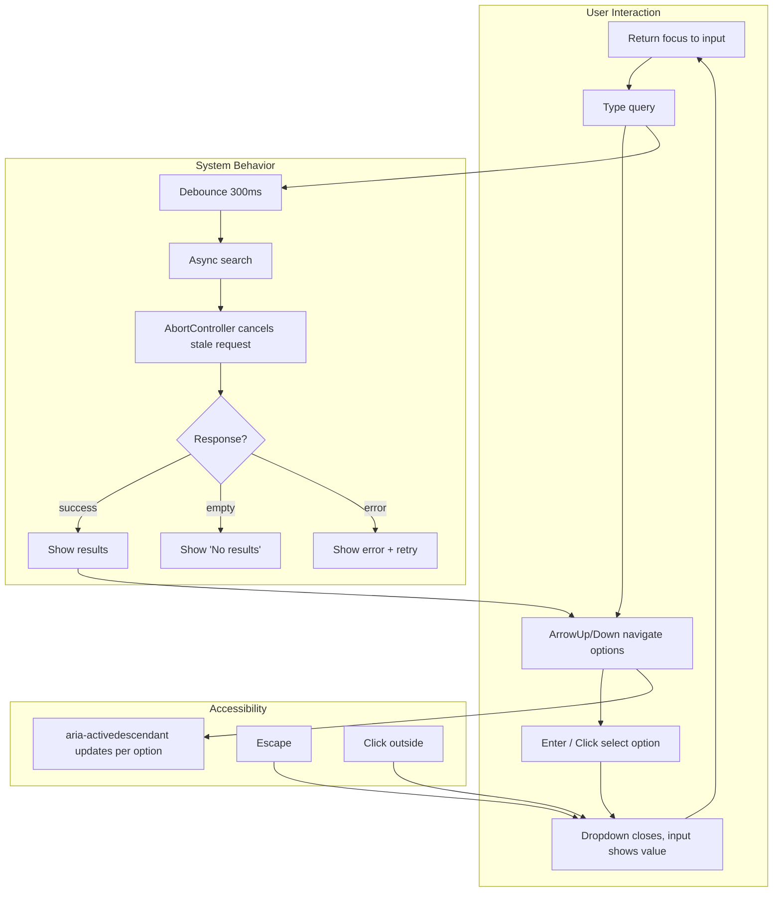

## The Problem That Hooks You

You're in a coding interview. The prompt: "Build a searchable dropdown that fetches results from an API. Handle keyboard navigation, loading state, and error state. You have 20 minutes."

You need to go from prompt to working component while narrating your reasoning. The interviewer watches your process. They check if you understand state management, edge cases, accessibility, and performance.

The real problem isn't building the component. It's knowing which state you need, how to handle the full interaction lifecycle, and how to talk through tradeoffs while coding.

## Why It Happens

Copying component libraries hides the internals. You import a Dropdown from Material UI or a Modal from Ant Design. They work. But in an interview you can't import anything. You must build from scratch using only React hooks.

Relying on muscle memory fails. You might know how to write a dropdown but forget keyboard navigation. You might build the happy path but miss the loading state. The interviewer probes these gaps.

The fix is a repeatable process.

## The One Insight

**Machine coding is a process, not a memorization exercise.** Follow these steps for every component:

1. **Clarify.** Ask: synchronous or async? Controlled or uncontrolled? Single or multi select? What states? What keyboard interactions? What screen reader support?

2. **Define minimal state.** Store only what cannot be derived. Everything else is computed. Use a discriminated union for status: `{ status: 'loading' | 'empty' | 'error' | 'success', data?, error? }`.

3. **Build happy path.** Get the component working for the ideal case.

4. **Add edge cases.** Empty input, no results, API failure, rapid typing, paste, backspace on empty field.

5. **Add accessibility.** ARIA roles, keyboard navigation, focus management.

6. **Talk about performance.** Memoization, virtualization, debouncing, aborting stale requests.

## Visualization



## Four Essential Components

**1. Searchable Dropdown.**

```jsx
function SearchableSelect({ options, onChange, async, onSearch }) {
  const [isOpen, setIsOpen] = useState(false);
  const [inputValue, setInputValue] = useState('');
  const [highlightedIndex, setHighlightedIndex] = useState(-1);
  const [items, setItems] = useState(async ? [] : options);
  const [status, setStatus] = useState('idle');
  const inputRef = useRef(null);
  const listRef = useRef(null);

  useEffect(() => {
    if (!async || !inputValue) return;
    const controller = new AbortController();
    setStatus('loading');
    onSearch(inputValue, controller.signal)
      .then(data => {
        setItems(data);
        setStatus(data.length === 0 ? 'empty' : 'success');
      })
      .catch(err => {
        if (err.name !== 'AbortError') setStatus('error');
      });
    return () => controller.abort();
  }, [inputValue, async]);

  useEffect(() => {
    if (async) return;
    const filtered = options.filter(o =>
      o.label.toLowerCase().includes(inputValue.toLowerCase())
    );
    setItems(filtered);
    setStatus(filtered.length === 0 ? 'empty' : 'success');
  }, [inputValue, options]);

  const handleKeyDown = (e) => {
    switch (e.key) {
      case 'ArrowDown':
        e.preventDefault();
        setHighlightedIndex(i => Math.min(i + 1, items.length - 1));
        break;
      case 'ArrowUp':
        e.preventDefault();
        setHighlightedIndex(i => Math.max(i - 1, 0));
        break;
      case 'Enter':
        if (highlightedIndex >= 0) selectItem(items[highlightedIndex]);
        break;
      case 'Escape':
        setIsOpen(false);
        break;
    }
  };

  const selectItem = (item) => {
    onChange?.(item);
    setInputValue(item.label);
    setIsOpen(false);
  };

  return (
    <div className="autocomplete" role="combobox" aria-expanded={isOpen}>
      <input
        ref={inputRef}
        value={inputValue}
        onChange={e => { setInputValue(e.target.value); setIsOpen(true); }}
        onFocus={() => setIsOpen(true)}
        onKeyDown={handleKeyDown}
        aria-autocomplete="list"
        aria-controls="listbox"
        aria-activedescendant={highlightedIndex >= 0 ? `option-${highlightedIndex}` : undefined}
      />
      {isOpen && (
        <ul ref={listRef} role="listbox" id="listbox">
          {status === 'loading' && <li>Loading...</li>}
          {status === 'empty' && <li>No results</li>}
          {status === 'error' && <li>Something went wrong</li>}
          {status === 'success' && items.map((item, i) => (
            <li
              key={item.value}
              id={`option-${i}`}
              role="option"
              aria-selected={i === highlightedIndex}
              className={i === highlightedIndex ? 'highlighted' : ''}
              onClick={() => selectItem(item)}
              onMouseEnter={() => setHighlightedIndex(i)}
            >
              {item.label}
            </li>
          ))}
        </ul>
      )}
    </div>
  );
}
```

Four pieces of state: `isOpen`, `inputValue`, `highlightedIndex`, `items`. Plus `status` drives loading, empty, error, and success UI.

The async useEffect creates an AbortController on each render (see Ch 33 for the full pattern with TanStack Query). The cleanup function calls `controller.abort()` when the input changes, cancelling the in-flight request.

The keyboard handler uses a switch on `e.key`. ArrowDown and ArrowUp clamp the index. Enter selects. Escape closes.

ARIA attributes: `role="combobox"` tells screen readers this is a combobox. `aria-activedescendant` points to the current highlighted option. `role="listbox"` and `role="option"` define the list.

**2. Tabs and Accordion.**

```jsx
function Tabs({ tabs, activeTab, onChange, defaultTab }) {
  const [internalActive, setInternalActive] = useState(defaultTab ?? 0);
  const current = activeTab !== undefined ? activeTab : internalActive;

  const select = (index) => {
    if (activeTab === undefined) setInternalActive(index);
    onChange?.(index);
  };

  return (
    <div role="tablist">
      {tabs.map((tab, i) => (
        <button
          key={i}
          role="tab"
          aria-selected={current === i}
          aria-controls={`panel-${i}`}
          onClick={() => select(i)}
          onKeyDown={(e) => {
            if (e.key === 'ArrowRight') select(Math.min(i + 1, tabs.length - 1));
            if (e.key === 'ArrowLeft') select(Math.max(i - 1, 0));
          }}
        >
          {tab.label}
        </button>
      ))}
      {tabs.map((tab, i) => (
        <div key={i} role="tabpanel" id={`panel-${i}`} hidden={current !== i}>
          {tab.content}
        </div>
      ))}
    </div>
  );
}
```

The controlled/uncontrolled pattern: if `activeTab` is provided, the parent owns state. If undefined, the component manages internally. Arrow keys navigate between tabs.

```jsx
function Accordion({ items, allowMultiple = false }) {
  const [openIndexes, setOpenIndexes] = useState([]);

  const toggle = (index) => {
    setOpenIndexes(prev =>
      prev.includes(index)
        ? prev.filter(i => i !== index)
        : allowMultiple ? [...prev, index] : [index]
    );
  };

  return (
    <div>
      {items.map((item, i) => (
        <div key={i}>
          <button onClick={() => toggle(i)} aria-expanded={openIndexes.includes(i)}
            aria-controls={`accordion-panel-${i}`}>
            {item.title}
          </button>
          <div id={`accordion-panel-${i}`} role="region" hidden={!openIndexes.includes(i)}>
            {item.content}
          </div>
        </div>
      ))}
    </div>
  );
}
```

**3. Infinite Scroll.**

```jsx
function useInfiniteScroll(loadMore, hasMore) {
  const sentinelRef = useRef(null);

  useEffect(() => {
    if (!hasMore) return;
    const observer = new IntersectionObserver(([entry]) => {
      if (entry.isIntersecting) loadMore();
    }, { rootMargin: '200px' });

    if (sentinelRef.current) observer.observe(sentinelRef.current);
    return () => observer.disconnect();
  }, [loadMore, hasMore]);

  return sentinelRef;
}
```

`IntersectionObserver` watches the sentinel element (see Ch 17 for full API details). When it enters the viewport plus `rootMargin` (200px lookahead), the callback fires. The observer must be disconnected in cleanup to prevent memory leaks.

**4. Virtual List.**

For the full virtualization explanation, see Ch 08. Here's the pattern:

```jsx
function VirtualList({ items, itemHeight = 40, containerHeight = 400 }) {
  const [scrollTop, setScrollTop] = useState(0);
  const containerRef = useRef(null);

  const totalHeight = items.length * itemHeight;
  const startIndex = Math.max(0, Math.floor(scrollTop / itemHeight) - 2);
  const endIndex = Math.min(items.length,
    Math.ceil((scrollTop + containerHeight) / itemHeight) + 2);
  const visibleItems = items.slice(startIndex, endIndex);

  const handleScroll = () => {
    setScrollTop(containerRef.current.scrollTop);
  };

  return (
    <div ref={containerRef} onScroll={handleScroll}
      style={{ height: containerHeight, overflow: 'auto' }}>
      <div style={{ height: totalHeight, position: 'relative' }}>
        {visibleItems.map((item, i) => (
          <div key={item.id} style={{
            position: 'absolute',
            top: (startIndex + i) * itemHeight,
            height: itemHeight, width: '100%',
          }}>
            {item.content}
          </div>
        ))}
      </div>
    </div>
  );
}
```

**5. Modal.**

```jsx
function Modal({ isOpen, onClose, title, children }) {
  const overlayRef = useRef(null);

  useEffect(() => {
    const handler = (e) => { if (e.key === 'Escape') onClose(); };
    if (isOpen) document.addEventListener('keydown', handler);
    return () => document.removeEventListener('keydown', handler);
  }, [isOpen, onClose]);

  const handleOverlayClick = (e) => {
    if (e.target === overlayRef.current) onClose();
  };

  useEffect(() => {
    if (!isOpen) return;
    const focusable = overlayRef.current?.querySelector(
      'button, input, [tabindex]:not([tabindex="-1"])'
    );
    focusable?.focus();
  }, [isOpen]);

  if (!isOpen) return null;

  return (
    <div ref={overlayRef} className="modal-overlay" onClick={handleOverlayClick}
      role="dialog" aria-modal="true" aria-label={title}>
      <div className="modal-content">
        <header>
          <h2>{title}</h2>
          <button onClick={onClose} aria-label="Close modal">x</button>
        </header>
        {children}
      </div>
    </div>
  );
}
```

The modal adds a keydown listener for Escape when open. Clicking the overlay closes only if the click target is the overlay itself. The focus trap selects the first focusable element. `role="dialog"` and `aria-modal="true"` tell screen readers this is a modal that traps focus.

## How React Handles State and Effects

When you call `setState`, React adds the update to a queue. During the next render, React processes the queue, computes the new state, and runs the component function. The return value is the new virtual DOM. React compares it with the previous and applies only the changed parts.

useEffect runs after the browser paints. The cleanup function from the previous render runs before the new effect. In the dropdown, the AbortController cleanup runs when the input value changes, cancelling the stale request before the new one starts.

`useRef` creates an object with a `current` property. The same object persists across renders. Mutating `current` doesn't trigger a re-render. This makes refs ideal for DOM references and timer IDs.

## Real World: Product Search Page

Build a product search page with autocomplete, infinite scroll results, and a modal for product details.

Step 1: search input with autocomplete. Debounces input (300ms), cancels stale requests, shows loading, empty, and error states.

Step 2: search results with infinite scroll. IntersectionObserver loads 20 products per page. The loading flag prevents duplicate page loads.

Step 3: product detail modal. Close on Escape, click outside, and the close button. Focus trapped inside.

Performance: virtualize the product list if it grows beyond 500 items. Debounce the search input.

## Tradeoffs

**Controlled vs uncontrolled.** Controlled gives the parent full control. Uncontrolled is simpler. Best practice: support both. Check if the prop is provided or undefined.

**IntersectionObserver vs scroll listener.** IntersectionObserver is callback-driven and fires only at viewport boundaries. Scroll listeners fire 60+ times per second. Use IntersectionObserver.

**useState vs useReducer.** useState is simpler for single values. useReducer is better for complex state with multiple fields that update together.

**Fixed vs dynamic height in virtual lists.** Fixed is simple. Dynamic requires measuring with ResizeObserver and maintaining a cumulative height array.

**Portal vs no portal for modals.** A portal renders outside the parent DOM hierarchy. This avoids z-index stacking issues. Use a portal for production modals.

## Common Mistakes

- Store derived values in state. Compute during render instead.
- Forget loading, empty, and error states. The UI shows blank space.
- Forget keyboard navigation. Screen reader and keyboard users can't use it.
- Forget to abort stale requests. The slow response overwrites the fast one.
- Forget to disconnect IntersectionObserver. Causes setState on unmounted component.
- Use index as key in lists that can reorder.
- Forget to prevent body scroll when a modal is open.
- Forget to restore focus when modal closes.

## SDE-2 Interview Answer

**Mid-level variant.** "I start by clarifying the requirements. Then I define the minimal state. For a dropdown, I need isOpen, inputValue, highlightedIndex, items, and status. I build the happy path. Then keyboard navigation: ArrowUp, ArrowDown, Enter, Escape. Then accessibility: aria roles and attributes. I test loading, empty, and error states last."

**Senior variant.** "My process is clarify, state, happy path, edge cases, accessibility, performance. I always ask: controlled or uncontrolled? Sync or async? What are the interaction states? I use a discriminated union for status so impossible states are impossible. I handle keyboard and mouse equally. I abort stale async requests. I talk through tradeoffs as I code."

**Engineering Lead variant.** "I teach the team a repeatable component-building process. Every component must handle loading, empty, error, and success states. Every interactive component must support keyboard and screen reader. We use a controlled-uncontrolled pattern consistently. We review each other's components for accessibility before shipping."

## Follow-up Questions

**Q1: Your infinite scroll fires twice when the user scrolls fast. How do you prevent duplicate page loads?**
Add a `loading` flag to guard the `loadMore` function. Set it to `true` when the fetch starts, check it at the top of `loadMore` and return early if already loading, and reset it when the fetch completes. The `IntersectionObserver` callback fires every time the sentinel enters the viewport — if the user scrolls fast, the callback fires before the previous fetch resolves.

```jsx
const loadingRef = useRef(false);

const loadMore = useCallback(async () => {
  if (loadingRef.current || !hasMore) return;
  loadingRef.current = true;
  try {
    const nextPage = await fetchPage(currentPage + 1);
    setItems(prev => [...prev, ...nextPage]);
    setCurrentPage(p => p + 1);
  } finally {
    loadingRef.current = false;
  }
}, [hasMore, currentPage]);
```

Using `useRef` instead of `useState` for the loading flag avoids an extra re-render. The ref check is synchronous — even if the observer fires twice in the same event loop tick, the second call sees `loadingRef.current === true` and bails out.

**Q2: The modal closes when the user clicks inside the modal content but the event bubbles to the overlay. How does your check work?**
The overlay's click handler checks `e.target === overlayRef.current`. When you click a child element inside the modal, `e.target` is the child (e.g., the `<div className="modal-content">`), not the overlay div. Since the child element is not the overlay itself, the condition is false and `onClose()` is not called. Only clicking the overlay backdrop — where `e.target` is literally the overlay element — triggers close. This avoids needing `e.stopPropagation()` on every child element, which is fragile and breaks if you add new children.

```jsx
const handleOverlayClick = (e) => {
  if (e.target === overlayRef.current) onClose();
};
```

An alternative approach uses `e.currentTarget` (always the element the listener is on) vs `e.target` (the actual clicked element). The `e.target === e.currentTarget` check is equivalent and equally reliable.

**Q3: Your virtual list uses fixed item height but items have variable content. What happens?**
The calculated `totalHeight` (item count × fixed height) doesn't match the actual rendered height of all items. This causes two problems: (1) The **scrollbar jumps** because the browser measures real content height while your spacer div estimates differently. (2) Items at the bottom may be **clipped or have gaps** because the offset calculations are wrong.

Fix with **dynamic height measurement**: use `ResizeObserver` to measure each item's actual height after render. Store heights in an array and compute a **cumulative height array** (prefix sums). The visible range is determined by binary-searching the cumulative heights for the scroll position. Items are positioned using their cumulative offset, not `index * fixedHeight`.

```jsx
const heights = useRef([]);
const offsets = useRef([]);

useEffect(() => {
  const observer = new ResizeObserver(entries => {
    entries.forEach(entry => {
      const idx = entry.target.dataset.index;
      heights.current[idx] = entry.contentRect.height;
    });
    // Recompute offsets from heights
  });
  // observe each rendered item
  return () => observer.disconnect();
}, []);
```

This is more complex but handles mixed content (text wrapping, images, nested elements) correctly.

**Q4: An OTP input with 6 boxes. The user pastes a 6-digit code. How do you split it?**
Listen for the `onPaste` event on the input container. Extract the pasted value from `e.clipboardData.getData('text')`, filter to keep only digits, split into individual characters, and distribute them across the boxes by index. Auto-focus the last filled box.

```jsx
const handlePaste = (e) => {
  e.preventDefault();
  const pasted = e.clipboardData.getData('text').replace(/\D/g, '').slice(0, 6);
  const newValues = pasted.split('');
  setValues(prev => {
    const next = [...prev];
    newValues.forEach((char, i) => { next[i] = char; });
    return next;
  });
  // Focus the last filled input or the next empty one
  const focusIndex = Math.min(newValues.length, 5);
  inputRefs.current[focusIndex]?.focus();
};
```

The `replace(/\D/g, '')` strips non-digit characters (spaces, dashes from formatted codes like "123-456"). The `slice(0, 6)` limits to the box count. Each input's `onChange` handler moves focus to the next box on input and to the previous box on backspace when empty.

**Q5: Your dropdown has 10000 options. The filter blocks the main thread for 200ms. How do you make it fast?**
The filter itself is fast — `Array.filter` on 10,000 strings takes less than 5ms in JavaScript. The bottleneck is **DOM rendering**: creating 10,000 `<li>` elements overwhelms the browser's layout engine. Fix with **virtualization**: only render the 20-30 options visible in the dropdown viewport. Use a fixed-height container with `overflow: auto`, calculate the visible range from scroll position, and render only those items with absolute positioning.

```jsx
const VISIBLE_COUNT = 10;
const ITEM_HEIGHT = 36;

const visibleItems = filteredItems.slice(scrollIndex, scrollIndex + VISIBLE_COUNT);
```

Additionally, debounce the filter input (300ms) to avoid filtering on every keystroke. For very large lists (100k+), consider moving the filter to a **Web Worker** so it doesn't block the main thread at all — though for 10,000 items, virtualization alone is sufficient.

## Mental Trigger

Minimal state, keyboard and mouse, loading empty error success.

## One Page Revision

- Process: clarify, state, happy path, edge cases, accessibility, performance.
- Minimal state: store only what cannot be derived.
- Status: use discriminated union (loading, empty, error, success).
- Controlled vs uncontrolled: check if prop is provided.
- Searchable dropdown: isOpen, inputValue, highlightedIndex, items, status.
- Tabs: TabList + Tab + TabPanel. aria-selected, aria-controls. Arrow keys.
- Accordion: single vs multi-expand. aria-expanded, aria-controls.
- Infinite scroll: IntersectionObserver + sentinel + loading guard.
- Virtual list: totalHeight spacer + absolute positioned visible rows + overscan.
- Modal: overlay click check, Escape listener, focus trap, body scroll lock, portal.
- OTP: ref array, paste splitting, auto-focus next, backspace to previous.
- Toast: hook with addToast, auto-dismiss, removeToast. aria-live="polite".
- Multi-step form: step index + wizard pattern + progress indicator.
- Keyboard: ArrowUp/Down/Left/Right, Enter, Escape, Tab.
- ARIA: combobox, listbox, option, dialog, tablist, tab, tabpanel, aria-selected, aria-controls, aria-activedescendant, aria-modal, aria-live.
- Perf: memo, debounce, AbortController, virtualization, IntersectionObserver.
