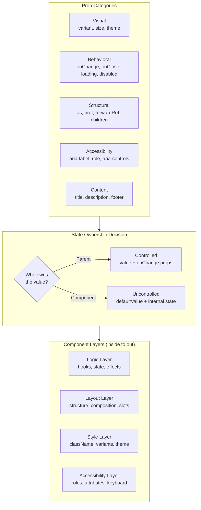

## The Problem That Hooks You

You need a Button component. You add variant, size, loading, disabled, onClick. Then someone needs it as a link. You add href. Then someone needs it as a router link. You add as prop. Soon you have 15 props. The API is inconsistent. Developers use your components wrong and file bugs.

The problem isn't the code. It's that you designed the API as you went, reacting to needs instead of thinking about the contract.

## Why It Happens

Most developers start coding components without defining the API contract first. They add props as needs arise. No categorization. No thought about state ownership. No planning for accessibility. The result is an API surface that fights against the consumer.

## The One Insight

**A component's API is its contract.** A well-designed component is easy to use correctly and hard to use incorrectly. Every prop serves exactly one purpose: styling, behavior, accessibility, or layout. If a prop does two things, split it.

Think of it like a restaurant menu. A good menu has categories (appetizers, mains, desserts), each item has a clear description, and you never have to guess what you're ordering. A bad menu lists 50 items with vague descriptions and no structure.

Always support controlled and uncontrolled because you don't know who owns the value. Forward refs because you don't know who needs focus or measurement.

## Visualization



## The Button Walkthrough

When a user renders `<Button variant="primary" loading={true} disabled={false}>Save</Button>`, here's what happens internally:

1. Button receives props via forwardRef.
2. It computes `isDisabled = disabled || loading` (true).
3. It determines the HTML element: `as` prop defaults to 'button', unless `href` is present (then 'a').
4. It builds className using clsx: 'btn', 'btn--primary', 'btn--md', 'btn--loading'.
5. It renders the element with `aria-disabled={true}` and `aria-busy={true}`.
6. It does NOT pass the HTML `disabled` attribute if the element is an `<a>` (anchor tags don't support it).
7. It shows a spinner span with `aria-hidden="true"`.
8. It hides the children text while loading with CSS.
9. The onClick handler is set to undefined when disabled, preventing action.

```jsx
const Button = forwardRef(({
  variant = 'primary',
  size = 'md',
  loading = false,
  disabled = false,
  as,
  href,
  type = 'button',
  children,
  onClick,
  ...rest
}, ref) => {
  const isDisabled = disabled || loading;
  const Component = as || (href ? 'a' : 'button');

  const classes = clsx(
    'btn',
    `btn--${variant}`,
    `btn--${size}`,
    { 'btn--loading': loading },
  );

  return (
    <Component
      ref={ref}
      className={classes}
      disabled={isDisabled}
      href={href}
      type={Component === 'button' ? type : undefined}
      onClick={isDisabled ? undefined : onClick}
      aria-disabled={isDisabled}
      aria-busy={loading}
      {...rest}
    >
      {loading && <span className="btn__spinner" aria-hidden="true" />}
      <span className={loading ? 'btn__text--hidden' : ''}>{children}</span>
    </Component>
  );
});
```

The `disabled` attribute only works on `<button>`, `<input>`, `<select>`, and `<textarea>`. When rendering as `<a>`, we use `aria-disabled` instead. This preserves keyboard focus while preventing the click action.

## The Building Blocks

### Controlled/Uncontrolled Pattern

Every interactive component needs to support both modes. Use a shared hook:

```jsx
function useControllableState({ value, defaultValue, onChange }) {
  const [internal, setInternal] = useState(defaultValue);
  const isControlled = value !== undefined;

  const set = (next) => {
    if (!isControlled) setInternal(next);
    onChange?.(next);
  };

  return [isControlled ? value : internal, set];
}
```

When `value` is passed, the component ignores internal state. When `value` is undefined, it falls back to `useState(defaultValue)`.

### forwardRef for Escape Hatches

Every interactive component should forward its ref to the DOM element. This lets parents focus, measure, scroll to, or position tooltips on the element.

### Portals for Overlays

Components that break out of parent overflow or z-index context (Modal, Dropdown, Tooltip, Toast) use `createPortal` to render into `document.body`.

### Table with Column Config

A Table uses an array-based column config. This is declarative, testable, and trivially sortable and filterable.

```typescript
type Column<T> = {
  key: string;
  header: string;
  render: (row: T) => ReactNode;
  sortKey?: string;
  filter?: (row: T, value: string) => boolean;
  width?: number | string;
  align?: 'left' | 'center' | 'right';
  pinned?: 'left' | 'right';
};

type TableProps<T> = {
  columns: Column<T>[];
  data: T[];
  rowKey: (row: T) => string | number;
  sortable?: boolean;
  onSort?: (key: string, direction: 'asc' | 'desc') => void;
  selectable?: boolean;
  selectedKeys?: Set<string>;
  onSelectionChange?: (keys: Set<string>) => void;
  loading?: boolean;
  emptyState?: ReactNode;
  error?: Error | null;
  onRetry?: () => void;
  virtualized?: boolean;
  rowHeight?: number;
  onRowClick?: (row: T) => void;
};
```

The Table never knows what data it renders. It delegates cell rendering to `col.render(row)`. The `rowKey` function generates unique identifiers for reconciliation. Native ARIA roles make the div-based table accessible.

| Decision | Why |
|----------|-----|
| Column config as array | Declarative, testable, trivially sortable and filterable |
| `render` function | Caller controls cell rendering. Table just manages layout |
| Sort controlled externally | Parent owns sort state (ties to URL params) |
| Virtualization toggle | Opt in when needed |
| Loading/empty/error states | Every data component needs these |

## Real World: Production Modal

A production Modal needs: portal rendering, focus trapping, Escape key close, overlay click close, body scroll lock, focus restoration on close, and screen reader support.

```jsx
function Modal({
  open,
  onClose,
  title,
  children,
  footer,
  size = 'md',
  closeOnOverlay = true,
  closeOnEsc = true,
  preventBodyScroll = true,
  initialFocusRef,
}) {
  const overlayRef = useRef(null);
  const previousActiveElement = useRef(null);

  useEffect(() => {
    if (!open || !closeOnEsc) return;
    const handler = (e) => { if (e.key === 'Escape') onClose(); };
    document.addEventListener('keydown', handler);
    return () => document.removeEventListener('keydown', handler);
  }, [open, closeOnEsc, onClose]);

  useEffect(() => {
    if (!open) return;
    previousActiveElement.current = document.activeElement;
    const target = initialFocusRef?.current || overlayRef.current?.querySelector('[autofocus], button, input');
    target?.focus();
    return () => previousActiveElement.current?.focus();
  }, [open]);

  useEffect(() => {
    if (!open || !preventBodyScroll) return;
    const original = document.body.style.overflow;
    document.body.style.overflow = 'hidden';
    return () => { document.body.style.overflow = original; };
  }, [open, preventBodyScroll]);

  if (!open) return null;

  return createPortal(
    <div
      ref={overlayRef}
      className="modal-overlay"
      onClick={closeOnOverlay ? (e) => { if (e.target === overlayRef.current) onClose(); } : undefined}
    >
      <div className={`modal modal--${size}`} role="dialog" aria-modal="true" aria-label={title}>
        <header className="modal__header">
          <h2>{title}</h2>
          <button onClick={onClose} aria-label="Close">X</button>
        </header>
        <div className="modal__body">{children}</div>
        {footer && <footer className="modal__footer">{footer}</footer>}
      </div>
    </div>,
    document.body
  );
}
```

On open, the Modal saves the currently focused element so it can restore focus on close. It traps focus inside via a portal outside the component tree. It locks body scroll by setting `overflow: hidden`. On unmount, it restores both scroll and focus.

### Toast System Architecture

A Toast system is not just a component. It's a full system with a Provider, Context, Hook, Container, and individual Toast instances.

```text
App
  └── ToastProvider (context)
        └── ToastContainer (portal + fixed position)
              ├── Toast 1 (auto-dismiss in 3s)
              ├── Toast 2 (manual dismiss)
              └── Toast 3 (persistent error)

Any component
  └── useToast().addToast('Saved!', 'success')
  └── useToast().addToast('Failed', 'error', { persist: true })
```

The Provider holds a queue of toast objects in state. The Container renders as a portal at a fixed position. Toasts auto-dismiss via setTimeout. `maxVisible` limits how many show at once.

## Tradeoffs

| Decision | Why | Cost |
|----------|-----|------|
| Controlled + uncontrolled | Works for any consumer | More code, more testing |
| Polymorphic `as` prop | Reuse Button as link | TypeScript complexity |
| Column config array | Declarative, testable | Less flexible than render props |
| Portal for overlays | Avoids z-index issues | Focus management required |
| Slot pattern (renderX) | Full customization | More complex API |

The minimum viable API principle: don't add a prop until you have 3 use cases.

## Common Mistakes

- **Boolean props for visual variants**: Use enums (`variant: 'primary' | 'secondary' | 'ghost'`). Booleans don't scale.
- **Missing forwardRef**: Parent cannot focus, measure, or integrate with form libraries.
- **No loading state**: User clicks Save and nothing happens. Double-submit bug.
- **No empty state**: Data component shows blank white space.
- **Hardcoded structure**: Table rows aren't customizable because cell rendering is in the Table.
- **Not using portals**: Modal or Dropdown clips inside parent with `overflow: hidden`.
- **Missing focus management**: Modal opens but focus stays on the trigger button.

## SDE-2 Interview Answer

### Mid-level

"I design the API before writing any code. I categorize props into visual (variant, size), behavioral (loading, disabled, onChange), structural (as, href, forwardRef), and accessibility (aria-label, role). I always support controlled and uncontrolled via a shared useControllableState hook. I forwardRef every interactive component. I use enums for visual variants, not booleans."

### Senior

"I design component APIs with the minimum viable surface. I add props only when there are 3 use cases. I use slot patterns (renderX) instead of configuration props for customization. I review component APIs for composition: can consumers extend this without forking the component? I ensure every overlay component uses portals, focus traps, and scroll lock."

### Engineering Lead

"I define component API standards for the team. Every component must have: forwardRef, controlled/uncontrolled support, proper aria attributes, keyboard navigation, and four-state handling for data components. I enforce these in code review. I maintain a component API checklist in the team's design system docs."

## Follow-up Questions

**Q1: Design a Select component API that supports search, multi-select, async options, keyboard navigation, and custom option rendering. Where does each concern belong?**
Split concerns into props by category: **Visual** — `size`, `variant`, `className`. **Behavioral** — `value`/`defaultValue` + `onChange` for controlled/uncontrolled, `isMulti` boolean for multi-select mode, `isSearchable` for search, `isLoading` for async, `isDisabled`. **Content** — `options` array for sync data, `loadOptions` async function for async (TanStack Query pattern), `formatOption` render prop for custom option rendering. **Accessibility** — `inputId`, `aria-label`, `menuAriaLabel`. Keyboard navigation is internal — ArrowUp/Down moves focus, Enter selects, Escape closes, typing filters when searchable.

```tsx
type SelectProps = {
  // Visual
  size?: 'sm' | 'md' | 'lg';
  variant?: 'default' | 'error';
  className?: string;
  // Behavioral (controlled/uncontrolled)
  value?: Option | Option[];
  defaultValue?: Option | Option[];
  onChange?: (value: Option | Option[]) => void;
  isMulti?: boolean;
  isSearchable?: boolean;
  isLoading?: boolean;
  isDisabled?: boolean;
  // Content
  options: Option[];
  loadOptions?: (input: string) => Promise<Option[]>;
  formatOption?: (option: Option) => ReactNode;
  // A11y
  'aria-label'?: string;
};
```

**Q2: How would you add virtual scrolling to the Table without changing its API?**
Make virtualization an **internal optimization** controlled by a single boolean prop. When `virtualized` is true, the Table internally uses `@tanstack/react-virtual` to render only visible rows. The `rowHeight` prop (default 48) tells the virtualizer each row's height. From the consumer's perspective, the API is identical — `columns`, `data`, `rowKey`, `onRowClick` all stay the same. The Table wraps its body in a virtualized container internally.

```jsx
// Consumer API doesn't change
<Table columns={columns} data={rows} virtualized rowHeight={48} />

// Internal implementation change only
{virtualized ? (
  <VirtualTableBody rows={visibleRows} columns={columns} />
) : (
  <TableBody rows={rows} columns={columns} />
)}
```

The key: virtualization should be a **deployment detail**, not an API contract. The consumer shouldn't need to restructure their code to enable it. If the Table uses `render` functions in column config, those work the same way — the virtualizer just renders fewer rows.

**Q3: A Data Grid needs inline editing, column resize, column reorder, and pagination. How does the API grow without becoming unmanageable?**
Group features into **opt-in modules** via a configuration object, not individual boolean props. Each module is a config block — if the block is present, the feature is enabled. This keeps the API surface small while supporting rich functionality.

```tsx
type DataGridProps = {
  columns: Column[];
  data: T[];
  // Each feature is a config block, not a boolean
  editing?: {
    onCellEdit: (rowId: string, colId: string, value: any) => Promise<void>;
    validator?: (value: any, column: Column) => string | null;
  };
  resizing?: {
    onResize: (colId: string, width: number) => void;
    minColumnWidth?: number;
  };
  reordering?: {
    onReorder: (fromIndex: number, toIndex: number) => void;
  };
  pagination?: {
    pageSize: number;
    currentPage: number;
    onPageChange: (page: number) => void;
    totalItems: number;
  };
};
```

The rule: **no boolean props for features**. A missing `editing` block means no editing. An empty `editing: {}` means editing with defaults. This pattern scales to 10+ features without the prop count explosion that boolean flags cause.

**Q4: Design a Toast system API. Who creates toasts? Who positions them? Who dismisses them?**
The architecture has four layers: (1) **Provider** wraps the app and holds the toast queue in state. (2) **Hook** (`useToast`) is the public API — any component calls `toast.success('Saved')` or `toast.error('Failed', { duration: 5000 })`. (3) **Container** renders as a portal at a fixed position (top-right, bottom-center, etc.) and is the only component that knows positioning. (4) **Toast** is the individual notification with auto-dismiss, action buttons, and dismiss on swipe.

```jsx
// Creation: any component via hook
const { toast } = useToast();
toast.success('Contact saved');
toast.error('Failed to delete', { duration: 10000, action: { label: 'Retry', onClick: retry } });

// Positioning: Provider config, not consumer
<ToastProvider position="top-right" maxVisible={3}>
  <App />
</ToastProvider>

// Dismissal: automatic (timeout) + manual (close button or swipe)
// Toast component handles both internally
```

The Provider owns positioning (via config). The hook owns creation (public API). The Container owns layout (renders toasts in the right order). The Toast owns its lifecycle (auto-dismiss timer, pause on hover, dismiss on interaction). No component reaches into another's domain.

**Q5: How do you test a Modal component? What edge cases do you verify?**
Test these categories: (1) **Render conditions** — renders nothing when closed, renders portal content when open. (2) **Close mechanisms** — closes on Escape key, closes on overlay click (but not on content click), closes via close button. (3) **Focus management** — focus moves to first focusable element on open, focus returns to trigger element on close, Tab cycles within the modal (focus trap). (4) **Accessibility** — `role="dialog"` and `aria-modal="true"` are present, `aria-labelledby` or `aria-label` is set. (5) **Body scroll** — body scroll is locked when open, restored on close. (6) **Nested modals** — second modal opens above first, closing second returns focus to first. (7) **Animation** — exit animation completes before unmount (test with `AnimatePresence`).

```jsx
it('closes on Escape but not on content click', async () => {
  render(<Modal isOpen onClose={onClose}><div data-testid="content">text</div></Modal>);
  await userEvent.keyboard('{Escape}');
  expect(onClose).toHaveBeenCalledTimes(1);

  await userEvent.click(screen.getByTestId('content'));
  expect(onClose).toHaveBeenCalledTimes(1); // still 1, not 2
});

it('restores focus to trigger on close', async () => {
  render(<><button>Open</button><Modal isOpen onClose={onClose}>content</Modal></>);
  screen.getByText('Open').focus();
  await userEvent.keyboard('{Escape}');
  expect(screen.getByText('Open')).toHaveFocus();
});
```

Use `@testing-library/react` with `userEvent` for realistic keyboard/mouse interactions. Test with `jest-axe` for automated accessibility checks.

## Mental Trigger

"API is contract."

## One Page Revision

- Every prop has one owner: styling, behavior, accessibility, or layout.
- Support controlled + uncontrolled via useControllableState hook.
- forwardRef every interactive component for focus, measure, form integration.
- Enums over booleans for visual variants. Boolean props don't scale.
- Portal for overlay components (Modal, Dropdown, Toast).
- Focus trap for Modal. Lock body scroll. Restore focus on close.
- Four states for data components: loading (skeleton), empty (message + action), error (message + retry), data.
- Column config array for Table. render function for cell customization. rowKey for reconciliation.
- Slot pattern (renderX) for component customization.
- Minimum viable API: don't add prop until 3 use cases exist.
- cn() for class merging: clsx + tailwind-merge.
- Design checklist: state ownership, visual variants, interaction states, content states, keyboard nav, accessibility, ref, portal, animation, composability.
