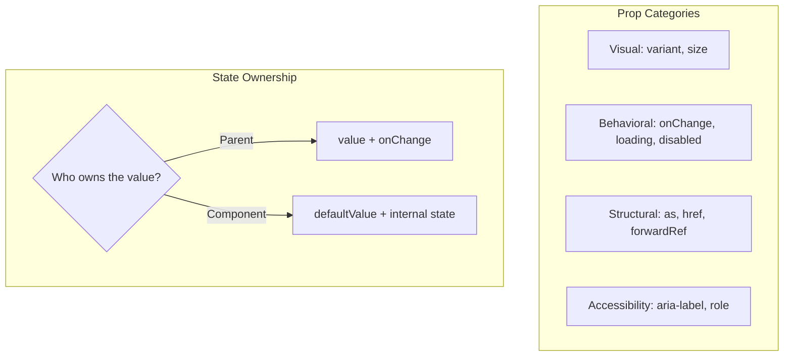

## The Problem That Hooks You

You need a Button component. You add variant, size, loading, disabled, onClick. Then someone needs it as a link — you add href. Then as a router link — you add `as` prop. Soon you have 15 props. The API is inconsistent. Developers use it wrong and file bugs.

The problem isn't the code. It's that you designed the API as you went.

## The One Insight

**A component's API is its contract.** A well-designed component is easy to use correctly and hard to use incorrectly. Every prop serves exactly one purpose: styling, behavior, accessibility, or layout. If a prop does two things, split it.

Think of it like a restaurant menu. A good menu has categories, clear descriptions, and you never guess what you're ordering. A bad menu lists 50 items with vague descriptions and no structure.



## The Button Walkthrough

When you render `<Button variant="primary" loading={true}>Save</Button>`:

1. Receives props via `forwardRef`.
2. Computes `isDisabled = disabled || loading`.
3. Determines HTML element: `as` prop defaults to `button`, unless `href` is present (then `a`).
4. Builds className: `btn btn--primary btn--md btn--loading`.
5. Renders with `aria-disabled={true}` and `aria-busy={true}`.
6. Does NOT pass HTML `disabled` to `<a>` (anchors don't support it — use `aria-disabled`).
7. Shows spinner with `aria-hidden="true"`.

```jsx
const Button = forwardRef(({
  variant = 'primary', size = 'md', loading = false, disabled = false,
  as, href, type = 'button', children, onClick, ...rest
}, ref) => {
  const isDisabled = disabled || loading;
  const Component = as || (href ? 'a' : 'button');
  return (
    <Component ref={ref}
      className={cn('btn', `btn--${variant}`, `btn--${size}`, loading && 'btn--loading')}
      disabled={isDisabled} href={href}
      type={Component === 'button' ? type : undefined}
      onClick={isDisabled ? undefined : onClick}
      aria-disabled={isDisabled} aria-busy={loading} {...rest}>
      {loading && <span className="btn__spinner" aria-hidden="true" />}
      <span className={loading ? 'btn__text--hidden' : ''}>{children}</span>
    </Component>
  );
});
```

## The Building Blocks

**Controlled/Uncontrolled pattern** — shared hook:
```jsx
function useControllableState({ value, defaultValue, onChange }) {
  const [internal, setInternal] = useState(defaultValue);
  const isControlled = value !== undefined;
  const set = (next) => {
    if (!isControlled) setInternal(next);
    onChange?.(next);
  };
  return [isControlled ? value : internal, set];
}
```

**forwardRef** — every interactive component should forward its ref. Parents need focus, measure, scroll-to, and form integration.

**Portals** — components that break out of parent overflow or z-index context (Modal, Dropdown, Tooltip, Toast) use `createPortal` to render into `document.body`.

**Table with column config** — declarative, testable, trivially sortable:
```typescript
type Column<T> = {
  key: string;
  header: string;
  render: (row: T) => ReactNode;
  sortKey?: string;
  width?: number | string;
};
type TableProps<T> = {
  columns: Column<T>[];
  data: T[];
  rowKey: (row: T) => string | number;
  sortable?: boolean;
  onSort?: (key: string, direction: 'asc' | 'desc') => void;
  loading?: boolean;
  emptyState?: ReactNode;
  error?: Error | null;
};
```

The Table never knows what data it renders. It delegates cell rendering to `col.render(row)`. The `rowKey` function generates unique IDs for reconciliation.

## Real World: Production Modal

A production Modal needs: portal rendering, focus trapping, Escape close, overlay click close, body scroll lock, focus restoration on close, and screen reader support.

```jsx
function Modal({ open, onClose, title, children, footer, size = 'md',
  closeOnOverlay = true, closeOnEsc = true, preventBodyScroll = true }) {
  const overlayRef = useRef(null);
  const previousActiveElement = useRef(null);

  useEffect(() => {
    if (!open || !closeOnEsc) return;
    const handler = (e) => { if (e.key === 'Escape') onClose(); };
    document.addEventListener('keydown', handler);
    return () => document.removeEventListener('keydown', handler);
  }, [open, closeOnEsc, onClose]);

  useEffect(() => {
    if (!open) return;
    previousActiveElement.current = document.activeElement;
    overlayRef.current?.querySelector('[autofocus], button, input')?.focus();
    return () => previousActiveElement.current?.focus();
  }, [open]);

  useEffect(() => {
    if (!open || !preventBodyScroll) return;
    const original = document.body.style.overflow;
    document.body.style.overflow = 'hidden';
    return () => { document.body.style.overflow = original; };
  }, [open, preventBodyScroll]);

  if (!open) return null;
  return createPortal(
    <div ref={overlayRef} className="modal-overlay"
      onClick={closeOnOverlay ? (e) => { if (e.target === overlayRef.current) onClose(); } : undefined}>
      <div className={`modal modal--${size}`} role="dialog" aria-modal="true" aria-label={title}>
        <header><h2>{title}</h2><button onClick={onClose} aria-label="Close">X</button></header>
        <div className="modal__body">{children}</div>
        {footer && <footer className="modal__footer">{footer}</footer>}
      </div>
    </div>,
    document.body
  );
}
```

## Toast System Architecture

Four layers: Provider (holds queue), Hook (`useToast()` — public API), Container (portal + fixed position), Toast (auto-dismiss lifecycle).

```text
App → ToastProvider (context)
        → ToastContainer (portal)
              ├── Toast 1 (auto-dismiss 3s)
              └── Toast 2 (manual dismiss)

Any component: useToast().addToast('Saved!', 'success')
```

## Tradeoffs

| Decision | Gain | Cost |
|----------|------|------|
| Controlled + uncontrolled | Works for any consumer | More code, more testing |
| Polymorphic `as` prop | Reuse Button as link | TypeScript complexity |
| Column config array | Declarative, testable | Less flexible than render props |
| Portal for overlays | Avoids z-index issues | Focus management required |

**Minimum viable API:** don't add a prop until you have 3 use cases.

## Common Mistakes

- Boolean props for visual variants — use enums. Booleans don't scale.
- Missing `forwardRef` — parent can't focus, measure, or integrate with forms.
- No loading state — user clicks Save, nothing happens. Double-submit bug.
- No empty state — data component shows blank white space.
- Not using portals — Modal or Dropdown clips inside `overflow: hidden`.
- Missing focus management — modal opens but focus stays on the trigger.

## Follow-up Questions

**Q1: Design a Select API that supports search, multi-select, async options, and custom rendering.**
Split by category: **Visual** — `size`, `variant`. **Behavioral** — `value`/`defaultValue` + `onChange`, `isMulti`, `isSearchable`, `isLoading`. **Content** — `options` array, `loadOptions` async function, `formatOption` render prop. **A11y** — `aria-label`. Keyboard nav is internal.

**Q2: How do you add virtualization to a Table without changing its API?**
Make it an internal optimization controlled by a single `virtualized` boolean prop. When true, the Table internally uses `@tanstack/react-virtual`. From the consumer's perspective, the API is identical — columns, data, rowKey all stay the same.

**Q3: A Data Grid needs inline editing, column resize, reorder, and pagination. How does the API grow?**
Group features into opt-in config blocks, not boolean props. Each feature is a config object — if present, the feature is enabled. `editing?: { onCellEdit, validator? }`. `resizing?: { onResize, minColumnWidth? }`. No boolean explosion.

**Q4: Design a Toast system. Who creates, positions, and dismisses?**
Provider owns positioning (config). Hook owns creation (public API). Container owns layout (renders in order). Toast owns its lifecycle (auto-dismiss, pause on hover). No component reaches into another's domain.

## Mental Trigger

API is contract. Every prop one purpose. Controlled + uncontrolled. forwardRef everything.

## One Page Revision

- Every prop has one owner: styling, behavior, accessibility, or layout.
- Support controlled + uncontrolled via `useControllableState` hook.
- `forwardRef` every interactive component for focus, measure, form integration.
- Enums over booleans for visual variants. Boolean props don't scale.
- Portal for overlay components (Modal, Dropdown, Toast).
- Four states for data components: loading, empty, error, data.
- Column config array for Table. `render` function for cell customization.
- Minimum viable API: don't add prop until 3 use cases exist.
