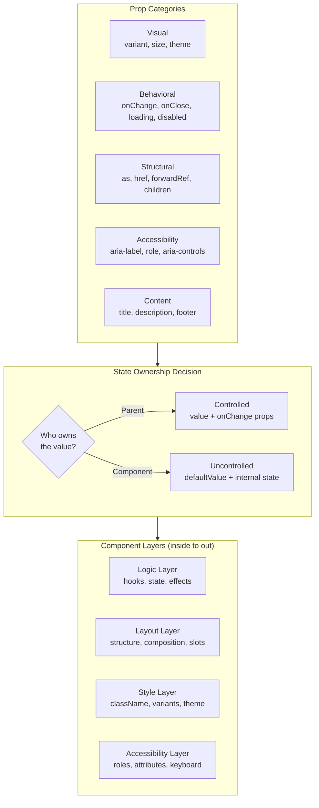

## Problem

You need a Button component. You add variant, size, loading, disabled, onClick. Then someone needs it as a link. You add href. Then someone needs it as a router link. You add as prop. Soon you have 15 props. The API is inconsistent. Developers use your components wrong and file bugs.

## Why Existing Solution Failed

Most developers start coding components without defining the API contract first. They add props as needs arise. No categorization. No thought about state ownership. No planning for accessibility. No consideration of the four component layers. The result is an API surface that fights against the consumer.

## Mental Model

A component's API is its CONTRACT. A well-designed component is easy to use correctly and hard to use incorrectly. Every prop serves exactly one purpose: styling, behavior, accessibility, or layout. If a prop does two things, split it. Always support controlled and uncontrolled because you do not know who owns the value. Forward refs because you do not know who needs focus or measurement.

## Visualization



## Engine Simulation

When a user renders `<Button variant="primary" loading={true} disabled={false}>Save</Button>`, here is the internal execution:

1. Button receives props via forwardRef.
2. It computes `isDisabled = disabled || loading` (true).
3. It determines the HTML element: `as` prop defaults to 'button', unless `href` is present (then 'a').
4. It builds className using clsx: 'btn', 'btn--primary', 'btn--md', 'btn--loading'.
5. It renders the element with `aria-disabled={true}` and `aria-busy={true}`.
6. It does NOT pass the HTML `disabled` attribute if the element is an `<a>` (anchor tags do not support it).
7. It shows a spinner span with `aria-hidden="true"`.
8. It hides the children text while loading with CSS.
9. The onClick handler is set to undefined when disabled, preventing action.

```jsx
// The actual implementation
const Button = forwardRef(({
  variant = 'primary',
  size = 'md',
  loading = false,
  disabled = false,
  as,
  href,
  type = 'button',
  children,
  onClick,
  ...rest
}, ref) => {
  const isDisabled = disabled || loading;
  const Component = as || (href ? 'a' : 'button');

  const classes = clsx(
    'btn',
    `btn--${variant}`,
    `btn--${size}`,
    { 'btn--loading': loading },
  );

  return (
    <Component
      ref={ref}
      className={classes}
      disabled={isDisabled}
      href={href}
      type={Component === 'button' ? type : undefined}
      onClick={isDisabled ? undefined : onClick}
      aria-disabled={isDisabled}
      aria-busy={loading}
      {...rest}
    >
      {loading && <span className="btn__spinner" aria-hidden="true" />}
      <span className={loading ? 'btn__text--hidden' : ''}>{children}</span>
    </Component>
  );
});
```

What happens internally: The `disabled` attribute only works on `<button>`, `<input>`, `<select>`, and `<textarea>`. When rendering as `<a>`, we use `aria-disabled` instead. This preserves keyboard focus on the link while preventing the click action. The loading state combines visual feedback (spinner) and behavioral prevention (disabled clicks). The `as` prop enables polymorphic rendering without losing type safety.

## Internal Implementation

### Controlled/Uncontrolled Pattern

Every interactive component needs to support both controlled and uncontrolled modes. The consumer decides who owns the state. Use a shared hook:

```jsx
function useControllableState({ value, defaultValue, onChange }) {
  const [internal, setInternal] = useState(defaultValue);
  const isControlled = value !== undefined;

  const set = (next) => {
    if (!isControlled) setInternal(next);
    onChange?.(next);
  };

  return [isControlled ? value : internal, set];
}
```

What happens internally: When `value` is passed, the component ignores internal state and uses `value` directly. When `value` is undefined, it falls back to `useState(defaultValue)`. The `set` function always calls `onChange` so the parent stays notified regardless of mode. This hook enables every component below to support controlled + uncontrolled with no extra logic.

### forwardRef for Escape Hatches

Every interactive component should forward its ref to the DOM element. This lets parents focus, measure, scroll to, or position tooltips on the element. Form libraries like React Hook Form use refs to register inputs.

### Portals for Overlays

Components that need to break out of their parent's overflow or z-index context (Modal, Dropdown, Tooltip, Toast) use `createPortal` to render into `document.body`.

```text
Modal    → createPortal(jsx, document.body)
Dropdown → createPortal(menu, document.body)
Toast    → createPortal(container, document.body)
```

### Table with Column Config

A Table uses an array-based column config. This is declarative, testable, and trivially sortable and filterable.

```typescript
type Column<T> = {
  key: string;
  header: string;
  render: (row: T) => ReactNode;
  sortKey?: string;
  filter?: (row: T, value: string) => boolean;
  width?: number | string;
  align?: 'left' | 'center' | 'right';
  pinned?: 'left' | 'right';
};

type TableProps<T> = {
  columns: Column<T>[];
  data: T[];
  rowKey: (row: T) => string | number;
  sortable?: boolean;
  onSort?: (key: string, direction: 'asc' | 'desc') => void;
  selectable?: boolean;
  selectedKeys?: Set<string>;
  onSelectionChange?: (keys: Set<string>) => void;
  loading?: boolean;
  emptyState?: ReactNode;
  error?: Error | null;
  onRetry?: () => void;
  virtualized?: boolean;
  rowHeight?: number;
  onRowClick?: (row: T) => void;
};
```

What happens internally: The Table never knows what data it renders. It delegates cell rendering to the `col.render(row)` function. This keeps the Table generic and reusable. The `rowKey` function generates unique identifiers for each row, which React uses for reconciliation. Native ARIA roles (`role="table"`, `role="rowgroup"`, `role="row"`, `role="columnheader"`, `role="cell"`) make the div-based table accessible to screen readers.

### Design Decisions for Table

| Decision | Why |
|----------|-----|
| Column config as array | Declarative, testable, trivially sortable and filterable |
| `render` function | Caller controls cell rendering. Table just manages layout |
| Sort controlled externally | So parent owns the sort state (ties to URL params) |
| Virtualization toggle | Table does not force one approach. Opt in when needed |
| Loading/empty/error states | Every data component needs these. Each state needs its own UI |

## Real World Example

### Modal with All Edge Cases

A production Modal needs: portal rendering, focus trapping, Escape key close, overlay click close, body scroll lock, focus restoration on close, and screen reader support.

```jsx
function Modal({
  open,
  onClose,
  title,
  children,
  footer,
  size = 'md',
  closeOnOverlay = true,
  closeOnEsc = true,
  preventBodyScroll = true,
  initialFocusRef,
}) {
  const overlayRef = useRef(null);
  const previousActiveElement = useRef(null);

  // Close on Escape
  useEffect(() => {
    if (!open || !closeOnEsc) return;
    const handler = (e) => { if (e.key === 'Escape') onClose(); };
    document.addEventListener('keydown', handler);
    return () => document.removeEventListener('keydown', handler);
  }, [open, closeOnEsc, onClose]);

  // Save and restore focus
  useEffect(() => {
    if (!open) return;
    previousActiveElement.current = document.activeElement;
    const target = initialFocusRef?.current || overlayRef.current?.querySelector('[autofocus], button, input');
    target?.focus();
    return () => previousActiveElement.current?.focus();
  }, [open]);

  // Lock body scroll
  useEffect(() => {
    if (!open || !preventBodyScroll) return;
    const original = document.body.style.overflow;
    document.body.style.overflow = 'hidden';
    return () => { document.body.style.overflow = original; };
  }, [open, preventBodyScroll]);

  if (!open) return null;

  return createPortal(
    <div
      ref={overlayRef}
      className="modal-overlay"
      onClick={closeOnOverlay ? (e) => { if (e.target === overlayRef.current) onClose(); } : undefined}
    >
      <div className={`modal modal--${size}`} role="dialog" aria-modal="true" aria-label={title}>
        <header className="modal__header">
          <h2>{title}</h2>
          <button onClick={onClose} aria-label="Close">X</button>
        </header>
        <div className="modal__body">{children}</div>
        {footer && <footer className="modal__footer">{footer}</footer>}
      </div>
    </div>,
    document.body
  );
}
```

What happens internally: On open, the Modal saves the currently focused element so it can restore focus on close. It traps focus inside the modal by rendering a portal outside the component tree, which avoids z-index and overflow clipping issues. It locks body scroll by setting `overflow: hidden` on the body element. On unmount, it restores both scroll and focus. The overlay click handler checks `e.target === overlayRef.current` so it only closes when clicking the overlay background, not the modal content itself.

### Toast System Architecture

A Toast system is not just a component. It is a full system with a Provider, Context, Hook, Container, and individual Toast instances.

```text
App
  └── ToastProvider (context)
        └── ToastContainer (portal + fixed position)
              ├── Toast 1 (auto-dismiss in 3s)
              ├── Toast 2 (manual dismiss)
              └── Toast 3 (persistent error)

Any component
  └── useToast().addToast('Saved!', 'success')
  └── useToast().addToast('Failed', 'error', { persist: true })
```

What happens internally: The Provider holds a queue of toast objects in state. Each toast has an id, message, type, duration, and optional action. The Container renders as a portal at a fixed position. Toasts auto-dismiss after their duration via setTimeout. Programmatic dismiss calls `dismissToast(id)`. The `maxVisible` option limits how many toasts show at once, queuing the rest.

## Tradeoffs

| Decision | Why | Cost |
|----------|-----|------|
| Controlled + uncontrolled | Works for any consumer | More code, more testing |
| Polymorphic `as` prop | Reuse Button as link | TypeScript complexity |
| Column config array | Declarative, testable | Less flexible than render props |
| Portal for overlays | Avoids z-index issues | Focus management required |
| Slot pattern (renderX) | Full customization | More complex API |

The minimum viable API principle: Do not add a prop until you have 3 use cases. Premature API surface makes components unusable.

## Common Mistakes

- **Boolean props for visual variants**: Use enums (`variant: 'primary' | 'secondary' | 'ghost'`). Booleans do not scale. What happens when you need a third variant?
- **Missing forwardRef**: Parent cannot focus, measure, or integrate with form libraries.
- **No loading state**: User clicks Save and nothing happens. Double-submit bug.
- **No empty state**: Data component shows blank white space when there are no results.
- **Hardcoded structure**: Table rows are not customizable because cell rendering is in the Table, not the consumer.
- **Not using portals**: Modal or Dropdown clips inside parent with `overflow: hidden`.
- **Missing focus management**: Modal opens, but focus stays on the trigger button. Screen reader cannot find the modal content.

## SDE-2 Interview Answer

### Mid-level

"I design the API before writing any code. I categorize props into visual (variant, size), behavioral (loading, disabled, onChange), structural (as, href, forwardRef), and accessibility (aria-label, role). I always support controlled and uncontrolled via a shared useControllableState hook. I forwardRef every interactive component. I use enums for visual variants, not booleans. For data components, I design all four states: loading, empty, error, data."

### Senior

"I design component APIs with the minimum viable surface. I add props only when there are 3 use cases. I use slot patterns (renderX) instead of configuration props for customization. I review component APIs for composition: can consumers extend this without forking the component? I ensure every overlay component uses portals, focus traps, and scroll lock. I reject PRs that add boolean variants instead of enums."

### Engineering Lead

"I define component API standards for the team. Every component must have: forwardRef, controlled/uncontrolled support, proper aria attributes, keyboard navigation, and four-state handling for data components. I enforce these in code review. I maintain a component API checklist in the team's design system docs. The checklist prevents the API drift that makes component libraries hard to use over time."

## Follow-up Questions

1. Design a Select component API that supports search, multi-select, async options, keyboard navigation, and custom option rendering. Where does each concern belong?
2. How would you add virtual scrolling to the Table without changing its API? What props would you add?
3. A Data Grid needs inline editing, column resize, column reorder, and pagination. How does the API grow without becoming unmanageable?
4. Design a Toast system API. How does state management work? Who creates toasts? Who positions them? Who dismisses them?
5. How do you test a Modal component? What edge cases do you verify in unit tests and integration tests?

## Mental Trigger

"API is contract."

## One Page Revision

- Every prop has one owner: styling, behavior, accessibility, or layout.
- Support controlled + uncontrolled via useControllableState hook.
- forwardRef every interactive component for focus, measure, form integration.
- Enums over booleans for visual variants. Boolean props do not scale.
- Portal for overlay components (Modal, Dropdown, Toast).
- Focus trap for Modal. Lock body scroll. Restore focus on close.
- Four states for data components: loading (skeleton), empty (message + action), error (message + retry), data.
- Column config array for Table. render function for cell customization. rowKey for reconciliation.
- Slot pattern (renderX) for component customization.
- Minimum viable API: do not add prop until 3 use cases exist.
- cn() for class merging: clsx + tailwind-merge.
- Design checklist: state ownership, visual variants, interaction states, content states, keyboard nav, accessibility, ref, portal, animation, composability.
