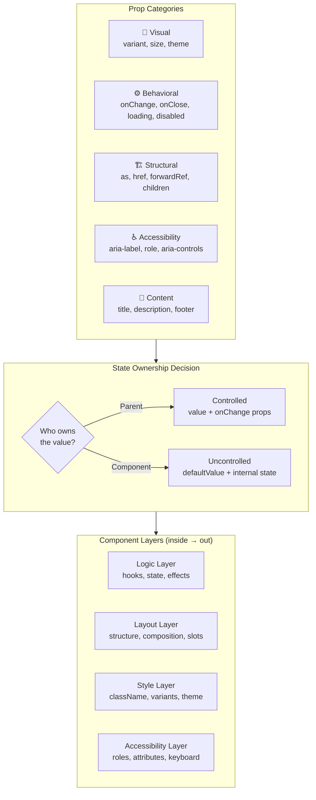

> Prerequisites: React component patterns (controlled/uncontrolled, render props, compound components, higher-order components), accessibility fundamentals (ARIA roles/attributes, keyboard navigation, focus management, screen reader behavior), and form handling (controlled inputs, validation strategies, form library integration patterns).
> The "design a Button/Modal/Table" question tests whether you think about API surface, composition, edge states, and
> accessibility before writing a single line of code.

---

## The one mental model

> **A component's API is its CONTRACT. A well-designed component is easy to use correctly,**
> **hard to use incorrectly, and doesn't force the consumer to fight React. Every prop should**
> **have a clear owner: is this for styling, behavior, accessibility, or layout? If a prop**
> **doesn't serve exactly one purpose, split it. And always support controlled + uncontrolled**
> **because you don't know who owns the value.**

From "contract" you derive: props are the public API, state is internal, refs are escape
hatches. Design the minimum viable API first, then add convenience props. Every boolean
prop is a potential expansion point. Prefer variant or enum over boolean for visual options.



---

## Learning Objectives

1. Design a Button component with variants, sizes, loading state, and forwardRef
2. Design a Modal with portal, focus trap, animation, and a11y
3. Design a Table with sort, select, resize, virtualization
4. Design a Select with search, multi-select, async, keyboard nav
5. Design a Data Grid with column config, pagination, editable cells

---

## Key Mental Models

- **Forward refs**: Every interactive component (Button, Input, Select) should `forwardRef`
  so parent can focus, measure, or integrate with form libraries.
- **Controlled + uncontrolled**: If a component manages its own state (internal), expose
  `defaultValue`. If a parent needs to drive it, expose `value` + `onChange`. Support both
  via the same internal hook (see pattern below).
- **Polymorphism**: Button should render as `<button>`, `<a>`, or `<div>` based on `as` prop
  or `href` presence. Do this without losing accessibility.
- **Slot pattern**: Accept `renderX` or slot props for customization (e.g., `renderRow`,
  `renderCell` in Table) instead of hardcoding content structure.
- **Minimum API**: Don't add props until you have 3 use cases that need them. Premature
  API surface is how components become unusable.

---

## 1. Button

The simplest component that tests every design skill: variants, sizes, loading, disabled,
polymorphism, forwardRef, accessibility.

### API contract

```typescript
type ButtonProps = {
  variant?: 'primary' | 'secondary' | 'ghost' | 'danger';
  size?: 'sm' | 'md' | 'lg';
  loading?: boolean;
  disabled?: boolean;
  as?: 'button' | 'a' | 'div';
  href?: string;          // renders as <a> if provided
  type?: 'button' | 'submit' | 'reset';
  children: ReactNode;
  onClick?: () => void;
} & React.ComponentPropsWithoutRef<'button'>;
```

### Implementation

```jsx
const Button = forwardRef(({
  variant = 'primary',
  size = 'md',
  loading = false,
  disabled = false,
  as,
  href,
  type = 'button',
  children,
  onClick,
  ...rest
}, ref) => {
  const isDisabled = disabled || loading;
  const Component = as || (href ? 'a' : 'button');

  const classes = clsx(
    'btn',
    `btn--${variant}`,
    `btn--${size}`,
    { 'btn--loading': loading },
  );

  return (
    <Component
      ref={ref}
      className={classes}
      disabled={isDisabled}
      href={href}
      type={Component === 'button' ? type : undefined}
      onClick={isDisabled ? undefined : onClick}
      aria-disabled={isDisabled}
      aria-busy={loading}
      {...rest}
    >
      {loading && <span className="btn__spinner" aria-hidden="true" />}
      <span className={loading ? 'btn__text--hidden' : ''}>{children}</span>
    </Component>
  );
});
```

### Interview answer (SDE-2)

"Button has three layers: visual (variant, size), behavioral (loading, disabled), and
structural (as, href, type, forwardRef). Loading disables the button and shows a spinner
to prevent double-submit. Using `aria-disabled` instead of the HTML `disabled` attribute
when rendering as `<a>` preserves keyboard focus while preventing action. The `as` prop
allows polymorphic rendering via `as={Link}` for router integration. Always forwardRef
so parent components can focus or position tooltips."

### Edge cases to discuss

- **Loading + disabled**: Clicking a loading button should do nothing.
- **Icon-only**: Support `aria-label` for accessibility when children is just an icon.
- **Form submit**: `type="submit"` must trigger form `onSubmit`. Do not prevent this.
- **Router link**: Use `as={Link}` pattern so Button can render as a Next.js/React Router link.

---

## 2. Modal

### API contract

```typescript
type ModalProps = {
  open: boolean;
  onClose: () => void;
  title: string;
  children: ReactNode;
  footer?: ReactNode;
  size?: 'sm' | 'md' | 'lg' | 'fullscreen';
  closeOnOverlay?: boolean;
  closeOnEsc?: boolean;
  preventBodyScroll?: boolean;
  initialFocusRef?: RefObject<HTMLElement>;
};
```

### Design decisions

| Decision | Rationale |
|---|---|
| Portal | Renders outside parent DOM tree to avoid z-index/overflow clipping |
| Focus trap | Tab cycles through modal content; doesn't escape to background |
| Esc to close | Standard modal behavior; make configurable |
| Overlay click | Closes modal if `closeOnOverlay` is true (default) |
| Body scroll lock | Prevents background scroll while modal is open |
| `aria-modal="true"` | Tells screen readers to ignore content behind modal |
| Restore focus | On close, return focus to the element that triggered the modal |

### Simplified implementation

```jsx
function Modal({
  open,
  onClose,
  title,
  children,
  footer,
  size = 'md',
  closeOnOverlay = true,
  closeOnEsc = true,
  preventBodyScroll = true,
  initialFocusRef,
}) {
  const overlayRef = useRef(null);
  const previousActiveElement = useRef(null);

  // Close on Escape
  useEffect(() => {
    if (!open || !closeOnEsc) return;
    const handler = (e) => { if (e.key === 'Escape') onClose(); };
    document.addEventListener('keydown', handler);
    return () => document.removeEventListener('keydown', handler);
  }, [open, closeOnEsc, onClose]);

  // Save and restore focus
  useEffect(() => {
    if (!open) return;
    previousActiveElement.current = document.activeElement;
    const target = initialFocusRef?.current || overlayRef.current?.querySelector('[autofocus], button, input');
    target?.focus();
    return () => previousActiveElement.current?.focus();
  }, [open]);

  // Lock body scroll
  useEffect(() => {
    if (!open || !preventBodyScroll) return;
    const original = document.body.style.overflow;
    document.body.style.overflow = 'hidden';
    return () => { document.body.style.overflow = original; };
  }, [open, preventBodyScroll]);

  if (!open) return null;

  return createPortal(
    <div
      ref={overlayRef}
      className="modal-overlay"
      onClick={closeOnOverlay ? (e) => { if (e.target === overlayRef.current) onClose(); } : undefined}
    >
      <div className={`modal modal--${size}`} role="dialog" aria-modal="true" aria-label={title}>
        <header className="modal__header">
          <h2>{title}</h2>
          <button onClick={onClose} aria-label="Close">×</button>
        </header>
        <div className="modal__body">{children}</div>
        {footer && <footer className="modal__footer">{footer}</footer>}
      </div>
    </div>,
    document.body
  );
}
```

---

## 3. Select

### API contract

```typescript
type SelectOption = {
  value: string;
  label: string;
  disabled?: boolean;
};

type SelectProps = {
  value?: string | string[];       // controlled
  defaultValue?: string | string[]; // uncontrolled
  onChange: (value: string | string[]) => void;
  options: SelectOption[];
  multiple?: boolean;
  searchable?: boolean;
  async?: boolean;
  onSearch?: (query: string, signal: AbortSignal) => Promise<SelectOption[]>;
  placeholder?: string;
  loading?: boolean;
  disabled?: boolean;
  renderOption?: (option: SelectOption, state: { selected: boolean; highlighted: boolean }) => ReactNode;
};
```

### Design decisions

| Feature | Why |
|---|---|
| Controlled/uncontrolled | Parent may own value (form) or component may self-manage (quick filter) |
| Searchable | Filter options client-side by default, server-side when async |
| Async | Debounce input, abort stale requests, show loading/empty/error states |
| Keyboard nav | Arrow keys, Enter to select, Escape to close |
| Multi-select | `multiple` prop changes value type to `string[]`, shows tags |
| Custom render | `renderOption` for icons, avatars, rich formatting |
| Portal menu | Menu should overflow container boundaries. Render in portal |

### Controlled/uncontrolled pattern

```javascript
function useControllableState({ value, defaultValue, onChange }) {
  const [internal, setInternal] = useState(defaultValue);
  const isControlled = value !== undefined;

  const set = (next) => {
    if (!isControlled) setInternal(next);
    onChange?.(next);
  };

  return [isControlled ? value : internal, set];
}
```

This single hook enables every component below to support controlled + uncontrolled with no
extra logic. This pattern works in ButtonGroup, Tabs, Accordion, Modal, Table selection, and any
component with internal state.

---

## 4. Table

### API contract (the hardest component to design well)

```typescript
type Column<T> = {
  key: string;
  header: string;
  render: (row: T) => ReactNode;
  sortKey?: string;               // if sortable
  filter?: (row: T, value: string) => boolean;
  width?: number | string;
  align?: 'left' | 'center' | 'right';
  pinned?: 'left' | 'right';      // sticky column
};

type TableProps<T> = {
  columns: Column<T>[];
  data: T[];
  rowKey: (row: T) => string | number;
  sortable?: boolean;
  onSort?: (key: string, direction: 'asc' | 'desc') => void;
  selectable?: boolean;
  selectedKeys?: Set<string>;
  onSelectionChange?: (keys: Set<string>) => void;
  loading?: boolean;
  emptyState?: ReactNode;
  error?: Error | null;
  onRetry?: () => void;
  virtualized?: boolean;
  rowHeight?: number;
  onRowClick?: (row: T) => void;
  renderExpand?: (row: T) => ReactNode;     // expandable rows
};
```

### Design decisions

| Decision | Why |
|---|---|
| Column config as array | Declarative, testable, trivially sortable/filterable |
| `render` function | Caller controls cell rendering. Table just manages layout |
| Sort controlled externally | So parent owns the sort state (ties to URL params) |
| Virtualization toggle | Table does not force one approach. It lets you opt in |
| Loading/empty/error states | Every data component needs these. Each state needs its own UI look: skeleton or spinner for loading, message and action for empty, error message and retry for errors |

### Simplified skeleton

```jsx
function Table({ columns, data, rowKey, loading, emptyState, error, onRetry, sortable, onSort }) {
  if (loading) return <TableSkeleton columns={columns} />;
  if (error) return <ErrorState message={error.message} onRetry={onRetry} />;
  if (data.length === 0) return emptyState || <EmptyState />;

  return (
    <div role="table" aria-label="Data table">
      <div role="rowgroup">
        <div role="row">
          {columns.map(col => (
            <div key={col.key} role="columnheader" style={{ width: col.width }}>
              {col.header}
              {sortable && col.sortKey && <SortButton />}
            </div>
          ))}
        </div>
      </div>
      <div role="rowgroup">
        {data.map(row => (
          <div key={rowKey(row)} role="row">
            {columns.map(col => (
              <div key={col.key} role="cell" style={{ width: col.width, textAlign: col.align }}>
                {col.render(row)}
              </div>
            ))}
          </div>
        ))}
      </div>
    </div>
  );
}
```

---

## 5. Data Grid (Advanced Table)

Production data grid combines everything: virtualization, column resize/reorder, inline edit,
sticky header, sticky columns, row grouping.

### API contract additions

```typescript
type DataGridProps<T> = TableProps<T> & {
  editable?: boolean;
  onCellEdit?: (rowKey: string, columnKey: string, value: unknown) => void;
  columnResizable?: boolean;
  columnReorderable?: boolean;
  pagination?: {
    page: number;
    pageSize: number;
    total: number;
    onPageChange: (page: number) => void;
  };
  grouping?: {
    groupBy: (row: T) => string;
    renderGroupHeader: (group: string) => ReactNode;
  };
  infiniteScroll?: {
    loadMore: () => void;
    hasMore: boolean;
  };
};
```

---

## 6. Toast System Design

Not just a Toast component. This is a full system.

### Architecture

```
App
 └── ToastProvider (context)
       └── ToastContainer (portal + fixed position)
             ├── Toast 1 (auto-dismiss in 3s)
             ├── Toast 2 (manual dismiss)
             └── Toast 3 (persistent error)

Any component
 └── useToast().addToast('Saved!', 'success')
 └── useToast().addToast('Failed', 'error', { persist: true })
```

### API

```typescript
// Hook
function useToast(): {
  toasts: Toast[];
  addToast: (message: string, type?: 'info' | 'success' | 'error' | 'warning', options?: {
    duration?: number;       // 0 = persistent
    action?: { label: string; onClick: () => void };
    onClose?: () => void;
  }) => string;             // returns id for programmatic dismiss
  dismissToast: (id: string) => void;
  dismissAll: () => void;
}

// Provider
<ToastProvider position="bottom-right" maxVisible={5}>
  <App />
</ToastProvider>
```

---

## 7. Common Component Design Questions

| Component | Key concerns |
|---|---|
| **Button** | Loading, disabled, polymorphic, forwardRef, icon + text |
| **Modal** | Portal, focus trap, esc/overlay close, scroll lock, animation |
| **Tooltip** | Positioning (floating-ui), show/hide trigger, delay, arrow |
| **Popover** | Same as Tooltip + dismiss on click-outside, Escape |
| **Select** | Controlled/uncontrolled, search, async, keyboard, multi |
| **Table/Grid** | Column config, sort, filter, select, virtualize, edit, resize |
| **Tabs** | Controlled/uncontrolled, keyboard roving tabindex, dynamic tabs |
| **Form inputs** | Label, error, helper text, required indicator, focus ring |
| **Autocomplete** | Combobox pattern, async, debounce, cancel, keyboard nav |
| **DatePicker** | Calendar grid, keyboard nav, min/max dates, timezone, localization |

---

## Component Design Checklist

Before writing any component code, ask:

1. **Who owns the state?** Is it controlled, uncontrolled, or both?
2. **Is this a basic or composite component?** Button is basic. Table is composite.
3. **What are the visual variants?** Use enums, not booleans.
4. **What are the interaction states?** Hover, focus, active, disabled, loading, error.
5. **What are the content states?** Empty, data, error, loading.
6. **Is keyboard navigation needed?** Arrows? Enter? Escape? Tab?
7. **Is it accessible?** Check role, aria-* attributes, focus management, screen reader.
8. **Does it need a ref?** Use `forwardRef` for focus, measure, form integration.
9. **Does it need a portal?** Needed for Modal, Dropdown, Tooltip, Toast.
10. **Does it need animation?** Enter and exit transitions (Framer Motion, CSS transitions).
11. **Can I make it composable?** Use `renderX` slots, `as` prop, children-based extension.

---

## Summary

> **Design the API before writing the code. The API is the contract with every**
> **consumer of your component. A strong API makes correct usage easy and incorrect usage**
> **hard. Forward refs, support controlled and uncontrolled, use enums over booleans, and**
> **always cover the four states for data-display components.**

---

## Homework

1. Design a DatePicker component. Write the full TypeScript API contract (no code needed)
2. Design a notification badge / avatar group component
3. Design a file uploader with drag-and-drop, preview, progress, retry
4. Design a carousel/slider component API
5. Design a tree view / nested list component
