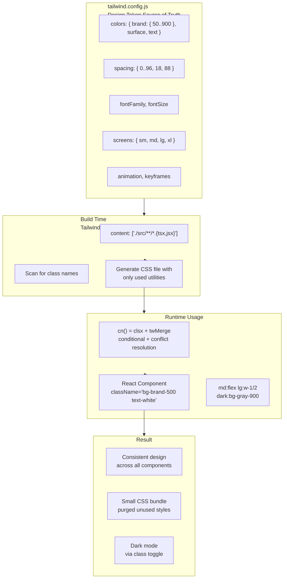

## The Problem That Hooks You

CSS at scale is hard. Naming things is hard. Every component invents its own spacing, colors, and type scale. Over time the UI drifts. The button blue on the settings page is `#3b82f6` but the button blue on the dashboard is `#3b83f7`. Design consistency breaks because there is no constraint system.

## Why It Happens

BEM (Block Element Modifier) requires naming discipline that degrades as teams grow. CSS Modules scope styles but don't limit values. Styled-components gives infinite CSS power per component, which means every component invents its own design tokens. None of these solutions enforce a design system at the build level. They trust developers to stay consistent. Trust is not a design tool.

## The One Insight

**Tailwind is a design token system expressed as atomic CSS classes.** Every utility is a single CSS property-value pair. Instead of writing custom CSS that varies per component, you compose utilities from a constrained set of design tokens. This enforces consistency by limiting the design space. You can't invent an arbitrary margin. You pick from `m-1` through `m-96`.

Think of it like Lego bricks. Each brick is a specific size and color. You can't make a custom-sized brick. The constraint is the feature — every creation looks consistent because the building blocks are consistent.

## Visualization



## How It Works

When you write `className="bg-brand-500 text-white p-4 rounded-lg"`, here's what happens:

1. **Build time**: Tailwind's scanner reads your source file. It finds the complete string `bg-brand-500`. It checks `tailwind.config.js` for the `brand.500` color value.
2. **CSS generation**: Tailwind generates only the CSS classes found in your scanned files. Unused classes are purged.
3. **Class resolution**: The browser receives `bg-brand-500` and applies the corresponding CSS rule.
4. **Conflict resolution**: If you also pass `className="bg-red-500"` from outside, `tailwind-merge` removes `bg-brand-500` and keeps only `bg-red-500`. Without twMerge, both classes apply and CSS cascade order determines the winner.

```jsx
// What you write
<button className="bg-brand-500 text-white px-4 py-2 rounded-lg">
  Save
</button>

// What CSS applies
.bg-brand-500 { background-color: #3b82f6; }
.text-white { color: #ffffff; }
.px-4 { padding-left: 1rem; padding-right: 1rem; }
.py-2 { padding-top: 0.5rem; padding-bottom: 0.5rem; }
.rounded-lg { border-radius: 0.5rem; }
```

Each utility is independent. The design token system ensures every `bg-brand-500` references the same color everywhere.

## Configuration: The Design Token Hub

`tailwind.config.js` is the single source of truth for design tokens.

```js
module.exports = {
  content: ['./src/**/*.{js,jsx,ts,tsx}'],
  darkMode: 'class',
  theme: {
    extend: {
      colors: {
        brand: {
          50: '#eff6ff',
          500: '#3b82f6',
          600: '#2563eb',
          700: '#1d4ed8',
        },
        surface: {
          primary: 'var(--color-surface-primary)',
          secondary: 'var(--color-surface-secondary)',
        },
      },
      spacing: { '18': '4.5rem', '88': '22rem' },
      fontFamily: { sans: ['Inter', 'system-ui', 'sans-serif'] },
    },
  },
};
```

When you reference `bg-brand-500` in JSX, Tailwind maps it to `#3b82f6` from the config. Change the config value and every `bg-brand-500` across the app updates.

### Dark Mode

```js
// tailwind.config.js
darkMode: 'class', // toggle via JS
```

```jsx
<div className="bg-white dark:bg-gray-900 text-gray-900 dark:text-gray-100">

// Toggle
document.documentElement.classList.toggle('dark');
```

Two strategies: `darkMode: 'media'` respects `prefers-color-scheme: dark` with no manual toggle. `darkMode: 'class'` gives you full control.

### Responsive Design

Tailwind breakpoints are mobile-first:

| Prefix | Min width |
|--------|-----------|
| `sm:` | 640px |
| `md:` | 768px |
| `lg:` | 1024px |
| `xl:` | 1280px |
| `2xl:` | 1536px |

```jsx
// Mobile: stack, Desktop: row
<div className="flex flex-col md:flex-row gap-4">
  <div className="w-full md:w-1/3">Sidebar</div>
  <div className="w-full md:w-2/3">Content</div>
</div>
```

The mobile layout (`flex-col`, `w-full`) is the base. `md:flex-row` only applies when the viewport is 768px or wider.

### cn() for Class Composition

```js
import { clsx } from 'clsx';
import { twMerge } from 'tailwind-merge';

export function cn(...inputs) {
  return twMerge(clsx(inputs));
}
```

`clsx` handles conditional class joining. `tailwind-merge` resolves conflicting Tailwind utilities so the last one wins. Without `twMerge`, passing `className="bg-red-500"` to a component with `bg-blue-600` results in both classes — unpredictable.

```jsx
function Button({ variant = 'primary', className }) {
  return (
    <button className={cn(
      'bg-blue-500 text-white',
      variant === 'ghost' && 'bg-transparent border',
      className
    )}>
      {children}
    </button>
  );
}

// Consumer
<Button variant="ghost" className="bg-red-500" />
// cn() resolves to: "bg-transparent border bg-red-500"
// twMerge removes bg-transparent, keeps bg-red-500
```

### shadcn/ui Architecture

shadcn/ui is NOT a component library you install from npm. It's a collection of components you COPY into your project. Every line is yours to modify.

```
components/ui/
  button.tsx          ← copied by `npx shadcn add button`
  dialog.tsx
  table.tsx
lib/
  utils.ts            ← cn() helper
```

Each shadcn/ui component owns its default styles via `cn()`. Consumer `className` always comes last, so consumer overrides win. The component uses Radix UI primitives for accessibility. You own every line because you copied the source.

## Real World: White-Label Theming

A SaaS product needs different brand colors per client. All components stay the same. Only colors change.

```css
[data-theme="acme-corp"] {
  --color-primary: #2563eb;
  --color-primary-hover: #1d4ed8;
}
[data-theme="megacorp"] {
  --color-primary: #dc2626;
  --color-primary-hover: #b91c1c;
}
```

```js
// tailwind.config.js
colors: {
  primary: {
    DEFAULT: 'var(--color-primary)',
    hover: 'var(--color-primary-hover)',
  },
}
```

```jsx
// Components stay the same across clients
<button className="bg-primary text-white">Save</button>
```

The CSS custom property `--color-primary` resolves at runtime based on the `data-theme` attribute. Tailwind generates `bg-primary` as `background-color: var(--color-primary)`. No rebuild needed for new clients.

## Tradeoffs

| Decision | Gain | Cost |
|----------|------|------|
| Utility-first | No naming, consistent spacing | Ugly JSX for complex components |
| Build-time CSS generation | Zero runtime cost | Cannot use dynamic class strings |
| Design token config | Single source of truth | Learning curve for custom values |
| Copy-paste components (shadcn) | Full ownership | Manual updates |
| JIT engine | Small CSS bundles | Slower initial build |

The constraint system prevents design drift but requires learning the token names. Worth it for teams of 3+ developers.

## Common Mistakes

- **Using `@apply` everywhere**: Recreates the naming and abstraction problem Tailwind solves. Extract a React component instead.
- **Dynamic class strings** (`text-${color}-500`): Broken in production because Tailwind scans for complete strings, not fragments.
- **Not using `cn()` for component props**: Consumer `className` overrides don't work correctly without twMerge.
- **Abusing arbitrary values** (`w-[calc(100%-2rem)]`): Bypasses the design token system. If you use a value more than twice, add it to the config.
- **Mixing BEM and Tailwind**: Two mental models conflict.
- **No Prettier plugin**: Class order is arbitrary. Causes diff noise in PRs.

## SDE-2 Interview Answer

### Mid-level

"Tailwind is a design token system as CSS classes. The config is the single source of truth. I compose utilities in JSX instead of writing custom CSS. I use cn() for conditional classes and tailwind-merge for conflict resolution. I avoid @apply because it recreates the naming problem. I use dark mode with the class strategy for manual control."

### Senior

"I configure Tailwind as the design system foundation. Colors, spacing, and typography tokens in the config propagate to every component. I use CSS custom properties for runtime-switchable themes. I enforce a rule: no arbitrary values that appear more than twice — those become config tokens. I review PRs for dynamic class strings that will break after purging."

### Engineering Lead

"Tailwind solves the design consistency problem at the tooling level. Instead of teaching every developer to follow design rules, the tool enforces them. I set up the config with the design team's tokens. I establish conventions: cn() for all components, extract React components instead of CSS classes, use the Prettier plugin. The team moves faster because they spend zero time on CSS naming."

## Follow-up Questions

**Q1: How would you add a new breakpoint for ultra-wide screens (1920px+) without breaking existing responsive styles?**
Add the breakpoint in `tailwind.config.js` under `theme.extend.screens`. Use a custom prefix like `2xl` or `uw` to avoid colliding with default breakpoints. Since Tailwind is mobile-first, your new breakpoint only adds styles at 1920px+ — existing `md:`, `lg:`, `xl:` styles are unaffected because they apply from their respective minimum widths upward.

```js
// tailwind.config.js
module.exports = {
  theme: {
    extend: {
      screens: {
        'uw': '1920px', // ultra-wide
      },
    },
  },
};
```

```jsx
// Usage — only applies at 1920px+
<div className="max-w-7xl mx-auto uw:max-w-[1600px]">
  <Content />
</div>
```

No existing styles break because the new breakpoint is additive. The CSS `@media (min-width: 1920px)` query only activates at that width. Test by resizing the browser past 1920px — the existing `xl:` styles still apply, and `uw:` overrides them when the viewport is wide enough.

**Q2: A component needs to override a parent's utility class. How does `cn()` handle this?**
`cn()` combines `clsx` (conditional class joining) with `tailwind-merge` (conflict resolution). When a parent passes `className="bg-blue-500"` and a consumer passes `className="bg-red-500"`, `cn()` resolves the conflict — `tailwind-merge` recognizes that both are background color utilities and the last one wins. Without `twMerge`, both classes exist in the DOM and CSS source order determines which applies — unpredictable and fragile.

```jsx
// Parent component
function Card({ className }) {
  return <div className={cn('bg-white p-4 rounded-lg', className)}>...</div>;
}

// Consumer — consumer's className wins
<Card className="bg-gray-50" />
// Resolves to: "bg-white p-4 rounded-lg bg-gray-50"
// twMerge removes bg-white, keeps bg-gray-50
```

The key rule: `className` always comes **last** in the `cn()` call, so consumer overrides always win. `tailwind-merge` is aware of Tailwind's utility groups — it knows `p-4` and `p-6` conflict (both padding), but `p-4` and `m-4` don't (padding vs margin).

**Q3: How would you implement print stylesheets with Tailwind?**
Use the `print:` variant in Tailwind v3.1+. Define print-specific styles directly in your class strings. The `print:` prefix applies styles only when the browser's print stylesheet is active.

```jsx
<div className="bg-white print:bg-transparent print:shadow-none print:p-0">
  <h1 className="text-2xl print:text-black print:text-sm">
    Invoice
  </h1>
  <div className="hidden print:block">Print-only footer</div>
  <button className="print:hidden">Print this page</button>
</div>
```

For complex print layouts, add custom print styles in your CSS file using `@media print`. Tailwind's utility classes can be used inside the media query via `@apply`. Alternatively, use a library like `react-to-print` to trigger the browser's print dialog with a clean rendering of just the content area.

```css
@media print {
  .no-print { display: none !important; }
  .print-only { display: block !important; }
  body { font-size: 12pt; }
}
```

**Q4: What happens to Tailwind classes in a server-side rendered app?**
Tailwind classes work fine in SSR because they're just CSS class names — the browser applies the corresponding CSS rules regardless of how the HTML was generated. The key requirement: your **build process** must generate the CSS before or during SSR. With Next.js or Vite SSR, Tailwind scans your source files at build time, generates the CSS, and injects it into the page. The HTML arrives with class names, and the CSS arrives as a `<style>` tag or external stylesheet.

Two gotchas: (1) **Dynamic classes** (`text-${color}-500`) won't work in SSR because Tailwind can't scan for them at build time. Use complete class strings or `cn()`. (2) **CSS-in-JS frameworks** that inject styles at runtime (styled-components) need extra configuration to extract Tailwind CSS during SSR. With standard Tailwind + Vite/Next.js, this is handled automatically — no special setup needed.

```jsx
// This works in SSR — class name is a complete string
<div className="bg-blue-500 text-white">Hello</div>

// This breaks in SSR — dynamic class can't be scanned
<div className={`bg-${color}-500 text-white`}>Hello</div>
```

**Q5: Your design system has 30+ colors, each with 10 shades. The CSS bundle is too large. How do you reduce it?**
Tailwind's JIT engine generates CSS only for classes you actually use — a 30-color × 10-shade palette adds zero bytes if you don't reference most of them. The real bundle bloat comes from: (1) **`@apply` usage** — every `@apply` inlined class generates a CSS rule even if unused. Remove `@apply` and use utility classes directly or extract React components. (2) **Content scanning too broadly** — if `content` includes `node_modules`, Tailwind scans thousands of irrelevant files. Narrow it: `content: ['./src/**/*.{tsx,jsx}']`. (3) **Unused CSS not purged** — ensure the `content` paths are correct so Tailwind can tree-shake unused utilities.

```js
// Optimize content paths
module.exports = {
  content: [
    './src/features/**/*.{tsx,jsx}',
    './src/components/**/*.{tsx,jsx}',
    // Don't scan node_modules or test files
  ],
};
```

If you genuinely use all 300 color utilities, the bundle is large by necessity. Consider grouping colors into semantic tokens (`primary`, `secondary`, `error`) instead of exposing all shades to components. Components reference `bg-primary` not `bg-blue-500`, reducing the surface area.

## Mental Trigger

"Design tokens as classes."

## One Page Revision

- Tailwind = design token system as atomic CSS. Config is source of truth.
- Utility-first: compose small CSS classes instead of writing custom CSS.
- No naming problems. No CSS files per component.
- Build-time scanning generates only used CSS. Zero runtime cost.
- cn() = clsx + tailwind-merge. Use it in every component.
- Dark mode via class strategy for manual toggle control.
- Responsive via prefix: `md:flex`, `lg:w-1/2`. Mobile-first.
- shadcn/ui copies components into your repo. You own every line.
- White-label theming: CSS custom properties in config.
- Common mistakes: @apply, dynamic class strings, no cn(), arbitrary values.
- Prettier plugin required for class ordering.
- Interview variants: Mid-level uses utilities. Senior enforces tokens. Lead designs the system.
- Trigger: "Design tokens as classes."
