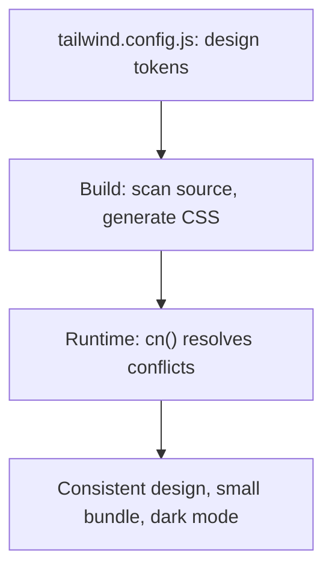

## The Problem That Hooks You

CSS at scale is hard. Every component invents its own spacing, colors, and type scale. The button blue on settings is `#3b82f6` but on the dashboard it's `#3b83f7`. Design consistency breaks because there's no constraint system.

## The One Insight

**Tailwind is a design token system expressed as atomic CSS classes.** Every utility is a single CSS property-value pair. Instead of writing custom CSS that varies per component, you compose utilities from a constrained set of design tokens. This enforces consistency by limiting the design space. You can't invent an arbitrary margin — you pick from `m-1` through `m-96`.

Think of it like Lego bricks. Each brick is a specific size and color. You can't make a custom-sized brick. The constraint is the feature — every creation looks consistent because the building blocks are consistent.



## How It Works

When you write `className="bg-brand-500 text-white p-4 rounded-lg"`:

1. **Build time**: Tailwind scans your source file. Finds `bg-brand-500`. Maps it to `#3b82f6` from config.
2. **CSS generation**: Only used classes are generated. Unused are purged.
3. **Conflict resolution**: If you pass `className="bg-red-500"` from outside, `tailwind-merge` removes `bg-brand-500` and keeps `bg-red-500`.

```jsx
<button className="bg-brand-500 text-white px-4 py-2 rounded-lg">Save</button>
// CSS: .bg-brand-500 { background-color: #3b82f6; }
//      .text-white { color: #ffffff; }
//      .px-4 { padding-left: 1rem; padding-right: 1rem; }
```

## Configuration

`tailwind.config.js` is the single source of truth:

```js
module.exports = {
  content: ['./src/**/*.{js,jsx,ts,tsx}'],
  darkMode: 'class',
  theme: {
    extend: {
      colors: {
        brand: { 500: '#3b82f6', 600: '#2563eb', 700: '#1d4ed8' },
        surface: { primary: 'var(--color-surface-primary)' },
      },
      fontFamily: { sans: ['Inter', 'system-ui', 'sans-serif'] },
    },
  },
};
```

Change the config value and every reference across the app updates.

### Dark Mode

```js
darkMode: 'class' // toggle via JS: document.documentElement.classList.toggle('dark')
```

```jsx
<div className="bg-white dark:bg-gray-900 text-gray-900 dark:text-gray-100">
```

`darkMode: 'media'` respects `prefers-color-scheme`. `darkMode: 'class'` gives manual control.

### Responsive (mobile-first)

| Prefix | Min width |
|--------|-----------|
| `sm:` | 640px |
| `md:` | 768px |
| `lg:` | 1024px |
| `xl:` | 1280px |
| `2xl:` | 1536px |

```jsx
<div className="flex flex-col md:flex-row gap-4">
  <div className="w-full md:w-1/3">Sidebar</div>
  <div className="w-full md:w-2/3">Content</div>
</div>
```

The mobile layout (`flex-col`, `w-full`) is the base. `md:flex-row` only applies at 768px+.

### cn() for Class Composition

```js
import { clsx } from 'clsx';
import { twMerge } from 'tailwind-merge';
export function cn(...inputs) { return twMerge(clsx(inputs)); }
```

`clsx` handles conditional joining. `tailwind-merge` resolves conflicting utilities — the last one wins. Without `twMerge`, passing `className="bg-red-500"` to a component with `bg-blue-600` results in both classes.

```jsx
<Button variant="ghost" className="bg-red-500" />
// cn() resolves: "bg-transparent border bg-red-500"
// twMerge removes bg-transparent, keeps bg-red-500
```

### shadcn/ui

shadcn/ui is NOT a component library you install. It's components you COPY into your project. Every line is yours to modify. Each component owns default styles via `cn()`. Consumer `className` always comes last, so overrides win. Uses Radix UI primitives for accessibility.

## Real World: White-Label Theming

```css
[data-theme="acme"] { --color-primary: #2563eb; }
[data-theme="mega"] { --color-primary: #dc2626; }
```

```js
colors: { primary: { DEFAULT: 'var(--color-primary)' } }
```

```jsx
<button className="bg-primary text-white">Save</button>
```

The CSS custom property resolves at runtime. Tailwind generates `bg-primary` as `background-color: var(--color-primary)`. No rebuild for new clients.

## Tradeoffs

| Decision | Gain | Cost |
|----------|------|------|
| Utility-first | No naming, consistent spacing | Ugly JSX for complex components |
| Build-time CSS generation | Zero runtime cost | Cannot use dynamic class strings |
| Design token config | Single source of truth | Learning curve |
| Copy-paste components (shadcn) | Full ownership | Manual updates |

## Common Mistakes

- Using `@apply` everywhere — recreates the naming problem. Extract a React component instead.
- Dynamic class strings (`text-${color}-500`) — broken because Tailwind scans for complete strings.
- Not using `cn()` for component props — consumer overrides don't work correctly.
- Abusing arbitrary values (`w-[calc(100%-2rem)]`) — bypasses the token system. Add to config if used >2 times.
- No Prettier plugin — class order is arbitrary, causes diff noise.

## Follow-up Questions

**Q1: How would you add a breakpoint for ultra-wide screens (1920px+) without breaking existing styles?**
Add under `theme.extend.screens`. Use a custom prefix like `uw`. Since Tailwind is mobile-first, your new breakpoint is additive — existing `md:`, `lg:`, `xl:` styles are unaffected.

**Q2: A component needs to override a parent's utility class. How does cn() handle this?**
`className` always comes last in the `cn()` call. `tailwind-merge` recognizes that `bg-blue-500` and `bg-red-500` conflict (both background color) and keeps the last one. Without `twMerge`, both classes exist and CSS cascade determines the winner.

**Q3: What happens to Tailwind classes in SSR?**
Classes work fine — they're just CSS class names. Your build process must generate the CSS before or during SSR. With Next.js or Vite SSR, Tailwind scans at build time, generates CSS, injects it as a `<style>` tag. Two gotchas: dynamic classes break (can't be scanned), and CSS-in-JS frameworks need extra config.

**Q4: Your CSS bundle is too large with 30+ colors. How do you reduce it?**
Tailwind's JIT only generates classes you use. The real bloat comes from `@apply` usage (generates rules even if unused), content scanning too broadly (including `node_modules`), or incorrect `content` paths. Narrow the content paths and remove `@apply`.

## Mental Trigger

Design tokens as classes. The config is the source of truth.

## One Page Revision

- Tailwind = design token system as atomic CSS. Config is source of truth.
- Utility-first: compose small classes instead of writing custom CSS.
- Build-time scanning generates only used CSS. Zero runtime cost.
- `cn()` = `clsx` + `tailwind-merge`. Use it in every component.
- Dark mode via `class` strategy for manual toggle control.
- Responsive via prefix: `md:flex`, `lg:w-1/2`. Mobile-first.
- shadcn/ui copies components into your repo. You own every line.
- White-label theming: CSS custom properties in config.
- Common mistakes: `@apply`, dynamic class strings, no `cn()`, arbitrary values.
