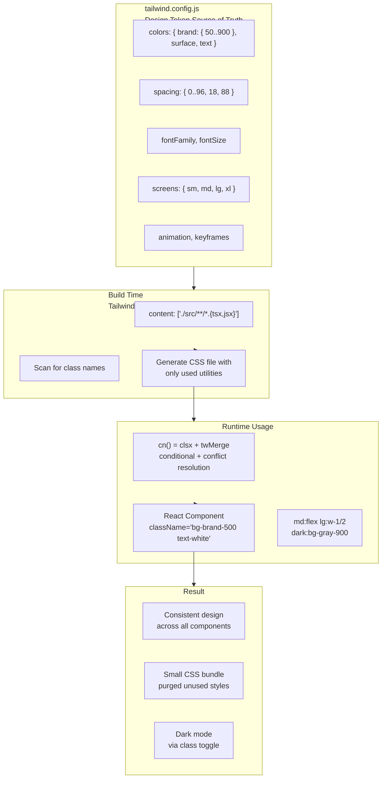

## Problem

CSS at scale is hard. Naming things is hard. Every component can invent its own spacing, colors, and type scale. Over time the UI drifts. The button blue on the settings page is `#3b82f6` but the button blue on the dashboard is `#3b83f7`. Design consistency breaks because there is no constraint system.

## Why Existing Solution Failed

BEM (Block Element Modifier) requires naming discipline that degrades as teams grow. CSS Modules scope styles but do not limit values. Styled-components gives infinite CSS power per component, which means every component invents its own design tokens. None of these solutions enforce a design system at the build level. They trust developers to stay consistent. Trust is not a design tool.

## Mental Model

Tailwind is a DESIGN TOKEN SYSTEM expressed as atomic CSS classes. Every utility is a single CSS property-value pair. Instead of writing custom CSS that varies per component, you compose utilities from a constrained set of design tokens (colors, spacing, type scale). This enforces consistency by limiting the design space. You cannot invent an arbitrary margin. You pick from `m-1` through `m-96`.

## Visualization



## Engine Simulation

When you write `className="bg-brand-500 text-white p-4 rounded-lg"`, here is what happens:

1. **Build time**: Tailwind's scanner reads your source file. It finds the complete string `bg-brand-500`. It checks `tailwind.config.js` for the `brand.500` color value.
2. **CSS generation**: Tailwind generates only the CSS classes found in your scanned files. Unused classes are purged.
3. **Class resolution**: The browser receives `bg-brand-500` and applies the corresponding CSS rule. Each utility maps to exactly one CSS declaration.
4. **Conflict resolution**: If you also pass `className="bg-red-500"` from outside, `tailwind-merge` removes `bg-brand-500` and keeps only `bg-red-500`. Without twMerge, both classes apply and CSS cascade order determines the winner.

```jsx
// What you write
<button className="bg-brand-500 text-white px-4 py-2 rounded-lg">
  Save
</button>

// What the browser renders
<button class="bg-brand-500 text-white px-4 py-2 rounded-lg">
  Save
</button>

// What CSS applies
.bg-brand-500 { background-color: #3b82f6; }
.text-white { color: #ffffff; }
.px-4 { padding-left: 1rem; padding-right: 1rem; }
.py-2 { padding-top: 0.5rem; padding-bottom: 0.5rem; }
.rounded-lg { border-radius: 0.5rem; }
```

Each utility is independent. None conflict because CSS shorthand properties (padding) only apply when their specific utility is present. The design token system ensures every `bg-brand-500` references the same color everywhere.

## Internal Implementation

### Configuration: The Design Token Hub

`tailwind.config.js` is the single source of truth for design tokens. Colors, spacing, typography, breakpoints all live here.

```js
module.exports = {
  content: ['./src/**/*.{js,jsx,ts,tsx}'],
  darkMode: 'class',
  theme: {
    extend: {
      colors: {
        brand: {
          50: '#eff6ff',
          500: '#3b82f6',
          600: '#2563eb',
          700: '#1d4ed8',
        },
        surface: {
          primary: 'var(--color-surface-primary)',
          secondary: 'var(--color-surface-secondary)',
        },
      },
      spacing: { '18': '4.5rem', '88': '22rem' },
      fontFamily: { sans: ['Inter', 'system-ui', 'sans-serif'] },
    },
  },
};
```

What happens internally: When you reference `bg-brand-500` in JSX, Tailwind maps it to the color `#3b82f6` from the config. Change the config value and every `bg-brand-500` across the app updates. This is the power of design tokens. The `content` array tells Tailwind which files to scan. Only classes found in these files survive in the production build.

### Dark Mode

```js
// tailwind.config.js
darkMode: 'class', // toggle via JS
```

```jsx
// Usage
<div className="bg-white dark:bg-gray-900 text-gray-900 dark:text-gray-100">

// Toggle
document.documentElement.classList.toggle('dark');
```

Two strategies: `darkMode: 'media'` respects `prefers-color-scheme: dark` with no manual toggle. `darkMode: 'class'` gives you full control. Persist the user's preference in localStorage.

### Responsive Design

Tailwind breakpoints are mobile-first:

| Prefix | Min width |
|--------|-----------|
| `sm:` | 640px |
| `md:` | 768px |
| `lg:` | 1024px |
| `xl:` | 1280px |
| `2xl:` | 1536px |

```jsx
// Mobile: stack, Desktop: row
<div className="flex flex-col md:flex-row gap-4">
  <div className="w-full md:w-1/3">Sidebar</div>
  <div className="w-full md:w-2/3">Content</div>
</div>
```

What happens internally: The mobile layout (`flex-col`, `w-full`) is the base. The `md:flex-row` only applies when the viewport is 768px or wider. This matches the browser's natural behavior. Mobile styles are the default. Desktop is the enhancement.

### cn() for Class Composition

```js
import { clsx } from 'clsx';
import { twMerge } from 'tailwind-merge';

export function cn(...inputs) {
  return twMerge(clsx(inputs));
}
```

What happens internally: `clsx` handles conditional class joining (arrays, objects, ternaries). `tailwind-merge` resolves conflicting Tailwind utilities so the last one wins. Without `twMerge`, passing `className="bg-red-500"` to a component that already has `bg-blue-600` results in both classes being applied. The stylesheet cascade order decides the winner, which is unpredictable.

```jsx
// Why cn() matters
function Button({ variant = 'primary', className }) {
  return (
    <button className={cn(
      'bg-blue-500 text-white',      // default
      variant === 'ghost' && 'bg-transparent border',
      className                       // consumer override
    )}>
      {children}
    </button>
  );
}

// Consumer usage
<Button variant="ghost" className="bg-red-500" />
// cn() resolves to: "bg-transparent border bg-red-500"
// twMerge removes bg-transparent, keeps bg-red-500
```

### shadcn/ui Architecture

shadcn/ui is NOT a component library you install from npm. It is a collection of components you COPY into your project. Every line is yours to modify.

```
components/ui/
  button.tsx          ← copied by `npx shadcn add button`
  dialog.tsx
  table.tsx
lib/
  utils.ts            ← cn() helper
```

```tsx
const Button = forwardRef(({ className, variant = 'default', size = 'default', ...props }, ref) => {
  return (
    <button
      className={cn(
        'inline-flex items-center justify-center rounded-md text-sm font-medium',
        'focus-visible:outline-none focus-visible:ring-2 focus-visible:ring-ring',
        'disabled:pointer-events-none disabled:opacity-50',
        buttonVariants.variant[variant],
        buttonVariants.size[size],
        className
      )}
      ref={ref}
      {...props}
    />
  );
});
```

What happens internally: Each shadcn/ui component owns its default styles via the `cn()` call. Consumer `className` always comes last inside `cn()`, so consumer overrides win. The component uses Radix UI primitives for accessibility (roles, keyboard nav, focus management). Tailwind provides styling. You own every line because you copied the source. Version updates are manual diffs, not breaking npm upgrades.

## Real World Example

### White-Label Theming

A SaaS product needs different brand colors per client. All components stay the same. Only colors change.

```css
/* Each client loads their own theme */
[data-theme="acme-corp"] {
  --color-primary: #2563eb;
  --color-primary-hover: #1d4ed8;
}
[data-theme="megacorp"] {
  --color-primary: #dc2626;
  --color-primary-hover: #b91c1c;
}
```

```js
// tailwind.config.js
colors: {
  primary: {
    DEFAULT: 'var(--color-primary)',
    hover: 'var(--color-primary-hover)',
  },
}
```

```jsx
// Components stay the same across clients
<button className="bg-primary text-white">Save</button>
```

What happens internally: The CSS custom property `--color-primary` resolves at runtime based on the `data-theme` attribute on a parent element. Tailwind generates `bg-primary` as `background-color: var(--color-primary)`. No rebuild needed for new clients. The same `<button>` component renders different colors per client without any code changes.

## Tradeoffs

| Decision | Gain | Cost |
|----------|------|------|
| Utility-first | No naming, consistent spacing | Ugly JSX for complex components |
| Build-time CSS generation | Zero runtime cost | Cannot use dynamic class strings |
| Design token config | Single source of truth | Learning curve for custom values |
| Copy-paste components (shadcn) | Full ownership | Manual updates |
| JIT engine | Small CSS bundles | Slower initial build |

The constraint system prevents design drift but requires learning the token names. The tradeoff is worth it for teams of 3 or more developers.

## Common Mistakes

- **Using `@apply` everywhere**: Recreates the naming and abstraction problem Tailwind solves. Extract a React component instead.
- **Dynamic class strings** (`text-${color}-500`): Broken in production because Tailwind scans for complete strings, not fragments. Use full class names.
- **Not using `cn()` for component props**: Consumer `className` overrides do not work correctly without twMerge.
- **Abusing arbitrary values** (`w-[calc(100%-2rem)]`): Bypasses the design token system and causes visual drift. If you use a value more than twice, add it to the config.
- **Mixing BEM and Tailwind**: Two mental models conflict. Pick one system.
- **No Prettier plugin**: Class order is arbitrary. Causes diff noise in PRs.

## SDE-2 Interview Answer

### Mid-level

"Tailwind is a design token system as CSS classes. The config is the single source of truth. I compose utilities in JSX instead of writing custom CSS. I use cn() for conditional classes and tailwind-merge for conflict resolution. I avoid @apply because it recreates the naming problem. I use dark mode with the class strategy for manual control."

### Senior

"I configure Tailwind as the design system foundation. Colors, spacing, and typography tokens in the config propagate to every component. I use CSS custom properties for runtime-switchable themes, so white-label clients get different colors without a rebuild. I enforce a rule: no arbitrary values that appear more than twice. Those become config tokens. I review PRs for dynamic class strings that will break after purging."

### Engineering Lead

"Tailwind solves the design consistency problem at the tooling level. Instead of teaching every developer to follow design rules, the tool enforces the rules. I set up the config with the design team's tokens. I establish conventions: cn() for all components, extract React components instead of CSS classes, use the Prettier plugin for class ordering. The team moves faster because they spend zero time on CSS naming."

## Follow-up Questions

1. How would you add a new breakpoint for ultra-wide screens (1920px+) without breaking existing responsive styles?
2. A component needs to override a parent component's utility class (e.g., parent sets `bg-red-500`, child needs `bg-blue-500`). How does cn() handle this?
3. How would you implement print stylesheets with Tailwind? Print is a media query, not a class prefix.
4. What happens to Tailwind classes in a server-side rendered app? How does the CSS get loaded on the server?
5. Your design system has 30+ colors, each with 10 shades. The CSS bundle is too large. How do you reduce it without losing tokens?

## Mental Trigger

"Design tokens as classes."

## One Page Revision

- Tailwind = design token system as atomic CSS. Config is source of truth.
- Utility-first: compose small CSS classes instead of writing custom CSS.
- No naming problems. No CSS files per component.
- Build-time scanning generates only used CSS. Zero runtime cost.
- cn() = clsx + tailwind-merge. Use it in every component.
- Dark mode via class strategy for manual toggle control.
- Responsive via prefix: `md:flex`, `lg:w-1/2`. Mobile-first.
- shadcn/ui copies components into your repo. You own every line.
- White-label theming: CSS custom properties in config.
- Common mistakes: @apply, dynamic class strings, no cn(), arbitrary values.
- Prettier plugin required for class ordering.
- Interview variants: Mid-level uses utilities. Senior enforces tokens. Lead designs the system.
- Trigger: "Design tokens as classes."
