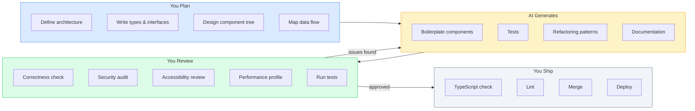

## Problem

AI coding tools generate code fast. They also generate wrong code, insecure code, and code that does not match your patterns. Without a structured workflow, AI output creates more bugs than it fixes. You waste time reviewing bad output. Worse, you ship bad output to production.

## Why Existing Solution Failed

Developers treat AI as a replacement for thinking. They give vague prompts ("Create a table component"), accept the output without review, and commit it. AI does not understand your codebase conventions, security requirements, or edge cases. It writes code that works for the happy path but breaks on error states, accessibility, and race conditions. The industry learned this the hard way: AI-generated code introduced security vulnerabilities, infinite re-render loops, and inaccessible UIs into production apps.

## Mental Model

AI is a force multiplier for IMPLEMENTATION, not a replacement for THINKING. The architectural decisions, tradeoff analysis, edge-case reasoning, and quality review must come from you. AI writes boilerplate, generates variations, finds patterns, and speeds up iteration. But you own the correctness, performance, accessibility, and security of every line it produces.

## Visualization



## Engine Simulation

When you give AI a prompt like "Create a ContactTable component with TanStack Query, sort, select, and loading/empty/error states", here is what happens internally:

1. **Token processing**: The prompt is tokenized and fed into the LLM.
2. **Pattern matching**: The AI matches tokens against its training data. It recognizes "ContactTable" as a React component pattern, "TanStack Query" as a data fetching library, "sort" and "select" as table interaction patterns, and "loading/empty/error states" as React state patterns.
3. **Code generation**: The AI generates code token by token, predicting the most likely next token based on its training. It creates the component structure, imports, hooks, and JSX.
4. **Context window**: The AI uses your prompt plus its training as context. It does not know your specific codebase unless you provide types, import paths, and conventions in the prompt.
5. **Hallucination risk**: If the AI does not have enough context, it invents conventions, imports, or APIs that do not exist in your codebase.

## Internal Implementation

### Prompt Anatomy

A good prompt has five parts:

```text
Role: "You are a senior React engineer..."
Context: "We use React 19, shadcn/ui, TanStack Query, Tailwind, Zustand"
Task: "Create a SearchableSelect component that supports keyboard nav, controlled/uncontrolled, async search"
Constraints: "Must be accessible, support keyboard nav, handle loading/empty/error states"
Output format: "Return the component + usage example + edge cases handled"
```

### Good Prompt Example

```text
Create a React component <ContactTable> that:
- Takes contacts: Contact[], onSelect: (id: string) => void, loading: boolean
- Uses TanStack Query for server state
- Renders columns: Name, Email, Phone, Status, Actions
- Supports sort by column (client-side)
- Each row is selectable with checkbox
- Shows loading skeleton, empty state, error state
- Keyboard navigable (ArrowUp/Down, Space to select)
- Uses shadcn/ui Table + cn() utility
- Columns defined as a config array (not hardcoded JSX)

Types:
interface Contact { id: string; name: string; email: string; phone: string; status: string; }

Convention: use @/components/ui/table, @/lib/utils
```

What happens internally: The AI receives the types, expected states, design system, import paths, keyboard behavior, and column config pattern. Every piece of context reduces hallucination risk. Without types, the AI invents them. Without states, the AI generates only the happy path. Without import paths, the AI guesses wrong.

### Bad Prompt Example

```text
// Too vague
"Create a table component"

// No types
"Make a contact list with search"

// No constraints
"Add sorting to the table"
```

What happens internally: The AI has no context about the project. It invents types, guesses the design system, assumes the happy path only, and uses random import paths. The output needs major rework.

### CLAUDE.md Pattern

A CLAUDE.md file gives the AI project context every time it runs.

```markdown
# CLAUDE.md - Project context for Claude Code

## Stack
- React 19, Vite, TypeScript strict mode
- TailwindCSS, shadcn/ui components in @/components/ui/
- TanStack Query v5 for server state
- Zustand for global client state
- React Router v7 for routing

## Conventions
- Feature folders: features/feature-name/components/
- Shared components: components/ui/ (from shadcn)
- Hooks: hooks/useThing.ts
- Types: types/thing.ts
- Always export named functions, not default
- Use cn() from @/lib/utils for className merging
- Every data component needs: loading, empty, error, success states
- Tests: vitest + @testing-library/react
```

What happens internally: The AI reads this file at startup. Every subsequent prompt uses these conventions as context. Outputs match your codebase patterns on the first try instead of inventing conventions.

### Cursor Specific

Cursor's tab completion works best for completing well-known patterns, generating repetitive code, and writing test cases based on existing patterns. The `@` references let you scope the AI to specific files, docs, or terminal output.

```text
@docs react-query Add optimistic update to the useDeleteContact mutation.
@codebase Find all usages of useToast and convert them to the new API.
@terminal Fix the TypeScript error in ContactTable.tsx
```

## Real World Example

### Building a Feature with AI

```text
Step 1 (YOU):    Define component tree, data flow, types
Step 2 (AI):     Generate component boilerplate
Step 3 (YOU):    Review and adjust for patterns
Step 4 (AI):     Generate TanStack Query hooks
Step 5 (YOU):    Verify query keys, caching, invalidation
Step 6 (AI):     Generate unit tests
Step 7 (YOU):    Review test coverage, add missed cases
Step 8 (YOU):    Run TypeScript, lint, tests, manual QA
```

What happens internally: You own the architecture (steps 1, 3, 5, 7, 8). AI generates the implementation (steps 2, 4, 6). The division of labor is clear: AI handles mechanical work, you handle decisions and verification.

### Debugging with AI

```text
YOU: "Component keeps re-rendering. Here is the profiler flamegraph."
AI:  "The ContactRow inside Table re-renders because columns array is
      recreated every render. Use useMemo or hoist it outside."
YOU: "Good catch. Verifying the fix with profiler now."
```

What happened internally: AI identified the issue. YOU confirmed with the profiler. This is the correct division of labor. AI suggests patterns. You verify with tools.

### Refactoring with AI

```text
YOU: "Convert this component from useState to useReducer. Extract the
      autocomplete logic into a useAutocomplete hook. Preserve all edge
      cases: debounce, abort, keyboard nav, click-outside."
AI:  [generates refactored code]
YOU: [reviews: all edge cases preserved? types correct? patterns match?]
YOU: [runs existing tests - green]
YOU: [runs manual test - works]
YOU: COMMIT
```

What happened internally: You defined the refactoring target and the edge cases to preserve. AI performed the mechanical transformation. You verified correctness with tests and manual testing.

## Tradeoffs

| Decision | Gain | Cost |
|----------|------|------|
| AI for boilerplate | 2-5x faster implementation | Must review every line |
| AI for tests | Covers standard cases | Misses edge cases |
| AI for refactoring | Mechanical work automated | Must verify logic preserved |
| AI for auth/payments | Not worth risk | Manual only |
| Specific prompts | Accurate output | More time writing prompts |

The tradeoff is clear: AI saves time on mechanical work but requires senior-level review. The more specific your prompt, the less time you spend fixing bad output.

## Common Mistakes

- **No review**: Shipping AI code without review. AI does not understand your codebase context.
- **Vague prompts**: "Create a form" produces generic output that misses validation, error states, accessibility.
- **AI for auth and security**: AI does not understand authentication, authorization, or XSS prevention. It generates `dangerouslySetInnerHTML` without thinking.
- **No verification checklist**: Missing states, performance issues, accessibility bugs slip through.
- **Accepting AI conventions**: AI invents patterns that do not match your codebase. You must enforce conventions via CLAUDE.md.
- **Not providing types**: AI invents types that do not match your data model.

## SDE-2 Interview Answer

### Mid-level

"My AI workflow is: I make architecture decisions first. File structure, component tree, data flow, state ownership. Then I write types, interfaces, and function signatures. Then I use AI to generate the code body. I review every line before committing. I check: does this match our patterns, does it handle edge cases, is it accessible, does it have loading and error states. I never use AI for security decisions, auth logic, or data mutation logic."

### Senior

"I use AI as a pair programmer. I write the types and interfaces. AI fills in the body. I review for correctness, security, accessibility, and performance. I maintain a CLAUDE.md file that defines stack, conventions, and patterns so AI output matches our codebase. I enforce a verification checklist: TypeScript strict mode, lint, tests, manual QA. AI writes the first draft. I review and approve."

### Engineering Lead

"I set AI coding standards for the team. I maintain the CLAUDE.md, review prompts for junior engineers, and enforce the verification workflow. I classify tasks into three buckets: AI-suitable (boilerplate, tests, refactoring), AI-assisted (component generation with review), and AI-excluded (auth, payments, security, complex business logic). I measure AI impact by velocity improvement, not by output volume."

## Follow-up Questions

1. What specific edge cases does AI typically miss in generated React components? How do you catch them?
2. A junior engineer on your team ships AI-generated code that causes a production bug. How do you prevent this from happening again?
3. You need to migrate a large codebase from class components to hooks. AI offers to do it. What do you check before approving the migration?
4. Design a verification workflow for AI-generated code. What are the minimum checks before merge?
5. How do you handle AI context limits when generating a large feature with multiple files?

## Mental Trigger

"You own every line."

## One Page Revision

- AI is force multiplier for implementation, not replacement for thinking.
- You own correctness, performance, accessibility, security of every line.
- Good prompt = Role + Context + Task + Constraints + Output format.
- Bad prompt = vague, no types, no constraints.
- CLAUDE.md gives AI project context. Conventions, stack, patterns.
- Workflow: You plan types/architecture. AI generates. You review. Test. Ship.
- Never use AI for: auth, payments, security, complex business logic.
- Always verify: TypeScript strict, lint, tests, manual review, accessibility.
- Three modes: Boilerplate generation, Refactoring, Test generation.
- Common mistakes: no review, vague prompts, AI for auth, no CLAUDE.md.
- Interview: Mid-level uses AI with review. Senior maintains context files. Lead sets team standards.
- Trigger: "You own every line."
