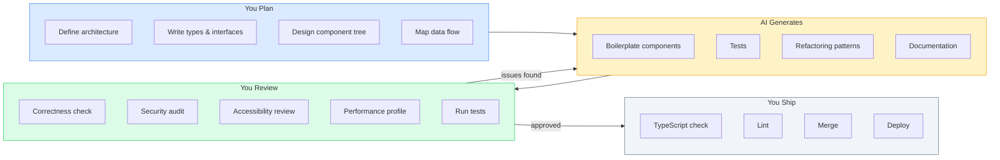

## The Problem That Hooks You

AI coding tools generate code fast. They also generate wrong code, insecure code, and code that doesn't match your patterns. Without a structured workflow, AI output creates more bugs than it fixes. You waste time reviewing bad output. Worse, you ship bad output to production.

## Why It Happens

Developers treat AI as a replacement for thinking. They give vague prompts ("Create a table component"), accept the output without review, and commit it. AI doesn't understand your codebase conventions, security requirements, or edge cases. It writes code that works for the happy path but breaks on error states, accessibility, and race conditions.

The industry learned this the hard way: AI-generated code introduced security vulnerabilities, infinite re-render loops, and inaccessible UIs into production apps.

## The One Insight

**AI is a force multiplier for implementation, not a replacement for thinking.** The architectural decisions, tradeoff analysis, edge-case reasoning, and quality review must come from you. AI writes boilerplate, generates variations, finds patterns, and speeds up iteration. But you own the correctness, performance, accessibility, and security of every line it produces.

Think of AI like a power drill. It makes you faster at drilling holes. But you still need to decide where to drill, what size, and whether the wall can handle it. The drill doesn't make those decisions — it just executes faster.

## Visualization



## What Actually Happens Under the Hood

When you give AI a prompt like "Create a ContactTable component with TanStack Query, sort, select, and loading/empty/error states":

1. **Token processing**: The prompt is tokenized and fed into the LLM.
2. **Pattern matching**: The AI matches tokens against its training data. It recognizes "ContactTable" as a React component pattern, "TanStack Query" as a data fetching library.
3. **Code generation**: The AI generates code token by token, predicting the most likely next token based on its training.
4. **Context window**: The AI uses your prompt plus its training as context. It doesn't know your specific codebase unless you provide types, import paths, and conventions in the prompt.
5. **Hallucination risk**: If the AI doesn't have enough context, it invents conventions, imports, or APIs that don't exist in your codebase.

## Prompt Anatomy

A good prompt has five parts:

```text
Role: "You are a senior React engineer..."
Context: "We use React 19, shadcn/ui, TanStack Query, Tailwind, Zustand"
Task: "Create a SearchableSelect component that supports keyboard nav, controlled/uncontrolled, async search"
Constraints: "Must be accessible, support keyboard nav, handle loading/empty/error states"
Output format: "Return the component + usage example + edge cases handled"
```

### Good Prompt Example

```text
Create a React component <ContactTable> that:
- Takes contacts: Contact[], onSelect: (id: string) => void, loading: boolean
- Uses TanStack Query for server state
- Renders columns: Name, Email, Phone, Status, Actions
- Supports sort by column (client-side)
- Each row is selectable with checkbox
- Shows loading skeleton, empty state, error state
- Keyboard navigable (ArrowUp/Down, Space to select)
- Uses shadcn/ui Table + cn() utility
- Columns defined as a config array (not hardcoded JSX)

Types:
interface Contact { id: string; name: string; email: string; phone: string; status: string; }

Convention: use @/components/ui/table, @/lib/utils
```

Every piece of context reduces hallucination risk. Without types, the AI invents them. Without states, the AI generates only the happy path. Without import paths, the AI guesses wrong.

### Bad Prompt Example

```text
// Too vague
"Create a table component"

// No types
"Make a contact list with search"

// No constraints
"Add sorting to the table"
```

The AI has no context. It invents types, guesses the design system, assumes the happy path only. The output needs major rework.

## CLAUDE.md Pattern

A CLAUDE.md file gives the AI project context every time it runs.

```markdown
# CLAUDE.md - Project context for Claude Code

## Stack
- React 19, Vite, TypeScript strict mode
- TailwindCSS, shadcn/ui components in @/components/ui/
- TanStack Query v5 for server state
- Zustand for global client state
- React Router v7 for routing

## Conventions
- Feature folders: features/feature-name/components/
- Shared components: components/ui/ (from shadcn)
- Hooks: hooks/useThing.ts
- Types: types/thing.ts
- Always export named functions, not default
- Use cn() from @/lib/utils for className merging
- Every data component needs: loading, empty, error, success states
- Tests: vitest + @testing-library/react
```

The AI reads this file at startup. Every subsequent prompt uses these conventions as context. Outputs match your codebase patterns on the first try.

### Cursor Specific

Cursor's tab completion works best for completing well-known patterns, generating repetitive code, and writing test cases based on existing patterns. The `@` references let you scope the AI to specific files, docs, or terminal output.

```text
@docs react-query Add optimistic update to the useDeleteContact mutation.
@codebase Find all usages of useToast and convert them to the new API.
@terminal Fix the TypeScript error in ContactTable.tsx
```

## Real World: Building a Feature

```text
Step 1 (YOU):    Define component tree, data flow, types
Step 2 (AI):     Generate component boilerplate
Step 3 (YOU):    Review and adjust for patterns
Step 4 (AI):     Generate TanStack Query hooks
Step 5 (YOU):    Verify query keys, caching, invalidation
Step 6 (AI):     Generate unit tests
Step 7 (YOU):    Review test coverage, add missed cases
Step 8 (YOU):    Run TypeScript, lint, tests, manual QA
```

You own the architecture (steps 1, 3, 5, 7, 8). AI generates the implementation (steps 2, 4, 6). The division of labor is clear.

### Debugging with AI

```text
YOU: "Component keeps re-rendering. Here is the profiler flamegraph."
AI:  "The ContactRow inside Table re-renders because columns array is
       recreated every render. Use useMemo or hoist it outside."
YOU: "Good catch. Verifying the fix with profiler now."
```

AI identified the issue. YOU confirmed with the profiler. AI suggests patterns. You verify with tools.

### Refactoring with AI

```text
YOU: "Convert this component from useState to useReducer. Extract the
       autocomplete logic into a useAutocomplete hook. Preserve all edge
       cases: debounce, abort, keyboard nav, click-outside."
AI:  [generates refactored code]
YOU: [reviews: all edge cases preserved? types correct? patterns match?]
YOU: [runs existing tests - green]
YOU: [runs manual test - works]
YOU: COMMIT
```

You defined the refactoring target and edge cases to preserve. AI performed the mechanical transformation. You verified correctness.

## Tradeoffs

| Decision | Gain | Cost |
|----------|------|------|
| AI for boilerplate | 2-5x faster implementation | Must review every line |
| AI for tests | Covers standard cases | Misses edge cases |
| AI for refactoring | Mechanical work automated | Must verify logic preserved |
| AI for auth/payments | Not worth risk | Manual only |
| Specific prompts | Accurate output | More time writing prompts |

The tradeoff is clear: AI saves time on mechanical work but requires senior-level review.

## Common Mistakes

- **No review**: Shipping AI code without review. AI doesn't understand your codebase context.
- **Vague prompts**: "Create a form" produces generic output that misses validation, error states, accessibility.
- **AI for auth and security**: AI doesn't understand authentication, authorization, or XSS prevention.
- **No verification checklist**: Missing states, performance issues, accessibility bugs slip through.
- **Accepting AI conventions**: AI invents patterns that don't match your codebase. Enforce conventions via CLAUDE.md.
- **Not providing types**: AI invents types that don't match your data model.

## SDE-2 Interview Answer

### Mid-level

"My AI workflow is: I make architecture decisions first. File structure, component tree, data flow, state ownership. Then I write types, interfaces, and function signatures. Then I use AI to generate the code body. I review every line before committing. I check: does this match our patterns, does it handle edge cases, is it accessible, does it have loading and error states. I never use AI for security decisions, auth logic, or data mutation logic."

### Senior

"I use AI as a pair programmer. I write the types and interfaces. AI fills in the body. I review for correctness, security, accessibility, and performance. I maintain a CLAUDE.md file that defines stack, conventions, and patterns so AI output matches our codebase. I enforce a verification checklist: TypeScript strict mode, lint, tests, manual QA. AI writes the first draft. I review and approve."

### Engineering Lead

"I set AI coding standards for the team. I maintain the CLAUDE.md, review prompts for junior engineers, and enforce the verification workflow. I classify tasks into three buckets: AI-suitable (boilerplate, tests, refactoring), AI-assisted (component generation with review), and AI-excluded (auth, payments, security, complex business logic). I measure AI impact by velocity improvement, not by output volume."

## Follow-up Questions

**Q1: What specific edge cases does AI typically miss in generated React components?**
AI misses: (1) **Race conditions** — it generates fetch calls without `AbortController` or cleanup, causing stale responses to overwrite fresh data. (2) **Unmount state updates** — async callbacks that call `setState` after the component unmounts. (3) **Empty and error states** — it generates the happy path (data renders) but skips loading skeletons, empty state messages, and error boundaries. (4) **Accessibility** — missing `aria-label`, `aria-live` regions, keyboard focus management in modals, and `role` attributes. (5) **Memory leaks** — event listeners added in `useEffect` without cleanup functions, `setInterval` without `clearInterval`. (6) **Edge inputs** — empty strings, `null`/`undefined` props, very long strings that overflow, special characters in user input (XSS vectors). (7) **Concurrent updates** — `useState` batching issues, stale closures in `useEffect` dependencies. (8) **TypeScript strictness** — using `any`, missing discriminated unions for state machines, incorrect generic types.

**Q2: A junior engineer ships AI-generated code that causes a production bug. How do you prevent this again?**
Implement a **verification checklist** in the team's PR template that every PR must pass before merge: (1) TypeScript strict mode passes (`tsc --noEmit`). (2) Lint passes with zero warnings. (3) All tests pass (unit + integration). (4) Manual QA on the affected flow. (5) Accessibility check (keyboard navigation, screen reader). (6) No `console.log` in production code. (7) Loading, empty, and error states handled. Add a **code review policy** requiring senior review for any AI-generated code — the reviewer checks for the specific edge cases AI misses. Create a **CLAUDE.md** file with project conventions so AI output matches patterns. Finally, add the bug's scenario as a **regression test** so it can never happen again.

**Q3: You need to migrate from class components to hooks. What do you check before approving AI's migration?**
Verify these specific things: (1) **State mapping** — `this.state` fields are correctly mapped to `useState` calls. Check that the initial state values match. (2) **Lifecycle mapping** — `componentDidMount` → `useEffect(() => {}, [])`, `componentDidUpdate` → `useEffect` with correct deps, `componentWillUnmount` → cleanup function. (3) **`this` binding** — class methods using `this.handleClick` must be wrapped in `useCallback` if passed as props, or converted to regular functions. (4) **Ref handling** — `this.myRef = React.createRef()` → `useRef(null)`. (5) **Context** — `static contextType` → `useContext`. (6) **Error boundaries** — these can't be converted to hooks (no hook equivalent for `componentDidCatch`). Leave them as classes. (7) **Edge cases preserved** — run existing tests. If the AI removed any edge case handling during conversion, the tests will catch it.

**Q4: Design a verification workflow for AI-generated code. What are the minimum checks before merge?**
The workflow has five gates: (1) **TypeScript** — `tsc --noEmit` with strict mode. Catches type errors, missing null checks, incorrect generics. (2) **Lint + Format** — `eslint` + `prettier --check`. Catches unused imports, consistent style, forbidden patterns. (3) **Tests** — `vitest run` for unit tests, `playwright test` for critical paths. AI generates tests too, but you must verify coverage of edge cases. (4) **Manual review** — a human checks: does this match our conventions? Are loading/empty/error states handled? Is it accessible? Are there security concerns? (5) **Smoke test** — run the app locally, exercise the changed flow, verify it works end-to-end.

```yaml
# CI pipeline minimum checks
- tsc --noEmit          # type safety
- eslint . && prettier --check .  # code quality
- vitest run --coverage  # test coverage ≥ 80%
- playwright test        # critical path E2E
```

**Q5: How do you handle AI context limits when generating a large feature with multiple files?**
Break the feature into **independent units** that fit within the context window. (1) **Define types first** — write all TypeScript interfaces and share them in the prompt. Types are compact and give the AI precise contracts. (2) **Generate file-by-file** — don't ask for the entire feature at once. Generate the API layer, then the hooks, then each component separately. (3) **Use CLAUDE.md** for project conventions — this gives context without consuming prompt tokens on every request. (4) **Pass file references** — use `@file` or paste the specific files the AI needs to see (types, existing components, utils). (5) **Iterate in stages** — generate types → verify → generate hooks → verify → generate components → verify. Each stage builds on verified output, preventing compounding errors.

## Mental Trigger

"You own every line."

## One Page Revision

- AI is force multiplier for implementation, not replacement for thinking.
- You own correctness, performance, accessibility, security of every line.
- Good prompt = Role + Context + Task + Constraints + Output format.
- Bad prompt = vague, no types, no constraints.
- CLAUDE.md gives AI project context. Conventions, stack, patterns.
- Workflow: You plan types/architecture. AI generates. You review. Test. Ship.
- Never use AI for: auth, payments, security, complex business logic.
- Always verify: TypeScript strict, lint, tests, manual review, accessibility.
- Three modes: Boilerplate generation, Refactoring, Test generation.
- Common mistakes: no review, vague prompts, AI for auth, no CLAUDE.md.
- Interview: Mid-level uses AI with review. Senior maintains context files. Lead sets team standards.
- Trigger: "You own every line."
