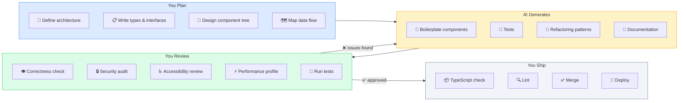

> Prerequisites: React component architecture (types, props, hooks, state patterns), testing practices (unit tests, integration tests, coverage analysis), and web security awareness (XSS, CSRF, authentication, authorization, injection). These are the areas where AI output most often introduces subtle bugs that reviewers must catch.
> The JD explicitly mentions "extensive use of AI coding agents
> (Claude Code, Cursor) to accelerate development while maintaining quality." Interviewer will
> ask how you use AI and how you verify its output.

---

## The one mental model

> **AI is a force multiplier for IMPLEMENTATION, not a replacement for THINKING. The**
> **architectural decisions, tradeoff analysis, edge-case reasoning, and quality review**
> **must come from you. AI writes the boilerplate, generates variations, finds patterns,**
> **and speeds up iteration. But you own the correctness, performance, accessibility,**
> **and security of every line it produces.**

From "you own every line" you learn: never accept AI output without review. Always test
AI-generated code the same way you test hand-written code. Use AI for what it is good at
(tedious patterns, test generation, documentation, boilerplate). Avoid using it for what
it is bad at (novel architecture, security-sensitive code, precise business logic).



---

## Learning Objectives

1. Explain your AI coding workflow interview-ready
2. Write effective prompts for Claude Code, Cursor, and Copilot
3. Define verification patterns: when to trust AI and when to verify
4. Handle AI limitations: hallucinations, stale knowledge, context limits
5. Integrate AI into your development loop without losing ownership

---

## Key Mental Models

- **AI generates the first draft.** You review, refactor, test, and approve. Never ship
  unverified AI output to production.
- **Good prompts are specific, structured, and include context.** The quality of output is
  bounded by the quality of input.
- **AI knows APIs but not your codebase.** You must provide the relevant types, conventions,
  and existing patterns. Otherwise AI will invent them.
- **Verification is non-negotiable for:** auth, payments, data mutations, security, a11y,
  and anything involving user data.

---

## 1. Interview Answer: "How do you use AI coding tools?"

### SDE-2 answer (30 seconds)

"My workflow is: I make the architecture decision first: file structure, component tree,
data flow, state ownership. Then I write the types, interfaces, and function signatures.
Only then do I use AI to generate the code body. I review every line AI produces
before committing. I check: does this match our patterns, does it handle
special cases, is it accessible, does it have the right loading and error states. I never use AI for
security decisions, auth logic, or data mutation logic. I write and review those myself."

### SDE-2 answer, expanded (2 minutes)

"AI coding tools are the most impactful productivity gain since the linter. I use them in
three modes:

**Mode 1: Boilerplate generation.** When I need a TanStack Query hook, a React component with
loading, error, and data states, or a form with validation, I write the type signature and let AI
fill in the code. For example: 'Generate a useQuery hook for fetching contacts with
search, pagination, and error handling.' I review the output, adjust for our conventions,
and move fast.

**Mode 2: Refactoring and patterns.** When I need to convert a useState pattern to useReducer,
add memoization, or extract a custom hook, AI does the mechanical work. I verify
the logic is preserved.

**Mode 3: Test generation.** AI is excellent at writing unit tests once the component exists.
Given a component's props and expected behavior, it generates the test cases. I review for
coverage gaps.

I have strict rules: AI never writes auth logic, never writes data mutation without review,
never writes security-sensitive code. I always verify the output with TypeScript strict mode,
linting, and the React DevTools profiler before committing."

---

## 2. Prompt Engineering Patterns

### Good prompts: specific and structured

```text
Create a React component `<ContactTable>` that:
- Takes `contacts: Contact[]`, `onSelect: (id: string) => void`, `loading: boolean`
- Uses TanStack Query for server state
- Renders columns: Name, Email, Phone, Status, Actions
- Supports sort by column (client-side)
- Each row is selectable with checkbox
- Shows loading skeleton, empty state, error state
- Keyboard navigable (ArrowUp/Down, Space to select)
- Uses shadcn/ui Table + cn() utility
- Columns defined as a config array (not hardcoded JSX)

Types:
interface Contact { id: string; name: string; email: string; phone: string; status: string; }

Convention: use `@/components/ui/table`, `@/lib/utils`
```

Why this works: AI knows:
- The exact interface
- The expected states (loading, empty, error)
- The design system (shadcn/ui)
- The import paths
- The keyboard behavior
- The column config pattern

### Bad prompts

```text
// Too vague
"Create a table component"

// No types
"Make a contact list with search"

// No constraints
"Add sorting to the table"
```

### Prompt anatomy

```
Role: "You are a senior React engineer..."
Context: "We use React 19, shadcn/ui, TanStack Query, Tailwind, Zustand"
Task: "Create a SearchableSelect component that..."
Constraints: "Must be accessible, support keyboard nav, controlled + uncontrolled, async search"
Examples: "Here's how we write Button: [code snippet]"
Output format: "Return the component + usage example + edge cases handled"
```

---

## 3. Claude Code Specific

### Workflow

```bash
# 1. Load project context
claude # in project root — auto-reads CLAUDE.md, tsconfig, package.json

# 2. Describe the task
# "Add a NotificationBell component that polls /api/notifications every 30s,
#  shows unread count badge, and opens a dropdown with the last 10 notifications"

# 3. Review the output
# Claude generates: component, types, hook, stories, tests

# 4. Iterate
# "Add click-outside-close to the dropdown"
# "Add aria-label and role attributes"
# "Extract the polling logic into usePolling hook"

# 5. Commit
git add -A && git commit
# Claude writes the commit message
```

### CLAUDE.md pattern

```markdown
# CLAUDE.md — Project context for Claude Code

## Stack
- React 19, Vite, TypeScript strict mode
- TailwindCSS, shadcn/ui components in @/components/ui/
- TanStack Query v5 for server state
- Zustand for global client state
- React Router v7 for routing

## Conventions
- Feature folders: features/feature-name/components/
- Shared components: components/ui/ (from shadcn)
- Hooks: hooks/useThing.ts
- Types: types/thing.ts
- Always export named functions, not default
- Use cn() from @/lib/utils for className merging
- Every data component needs: loading, empty, error, success states
- Tests: vitest + @testing-library/react

## Patterns
- Controlled + uncontrolled via useControllableState hook
- TanStack Query: useQuery with enabled option, staleTime 30s
- Forms: react-hook-form + zod resolver
- Error boundaries at route level
```

---

## 4. Cursor Specific

### Tab completion

Cursor's tab completes inline. It works best for:
- Completing the next few tokens of a well-known pattern
- Generating repetitive code (for example, mapping over an array with a consistent structure)
- Writing test cases based on the test file's existing pattern

### Chat + Composer

```text
@docs react-query Add optimistic update to the useDeleteContact mutation.
@codebase Find all usages of useToast and convert them to the new API.
@terminal Fix the TypeScript error in ContactTable.tsx
```

Key feature: `@` references let you scope the AI to specific files, docs, or terminal output.

### Cursor rules (similar to CLAUDE.md)

`.cursorrules` in project root. Same content pattern as CLAUDE.md.

---

## 5. Verification Patterns

### Always verify

| Category | Verify |
|---|---|
| Auth/permissions | Never use AI output. Write manually |
| Data mutations | Review for correctness, rollback, error handling |
| Financial calculations | Unit test every path |
| Accessibility | Run axe DevTools, keyboard test manually |
| Security (XSS, CSRF) | Review for sanitization, proper headers |
| Race conditions | Review async flows, AbortController usage |
| Bundle impact | Check imports don't accidentally include large deps |

### Verification workflow

```text
AI generates → TypeScript checks → Lint → Review (you) → Test → Ship
     |              |             |         |        |       |
     v              v             v         v        v       v
  output      tsc --noEmit    eslint    manual    vitest    merged
                                      review
```

### Review checklist for AI code

1. **Does it match our patterns?** Or did AI invent a new convention?
2. **Are all states handled?** Loading, empty, error, success, special cases.
3. **Are there unused imports or variables?** AI often generates speculative code.
4. **Is the component accessible?** Check roles, aria attributes, keyboard nav.
5. **Are there performance issues?** Unnecessary re-renders, missing keys, large deps.
6. **Does it handle errors well?** Error boundaries, retry, user feedback.
7. **Are there security issues?** XSS in dangerouslySetInnerHTML, injection in URLs.

---

## 6. When NOT to use AI

### Scenarios where AI is dangerous

```text
❌ Writing authentication logic
❌ Writing permission/authorization checks
❌ Writing SQL queries with user input (SQL injection risk)
❌ Writing payment/ billing logic
❌ Writing data sanitization (XSS, CSRF)
❌ Writing crypto/token handling
❌ Writing complex business rules you don't fully understand
❌ Writing API routes without reviewing the security implications
```

### Scenarios where AI is wasteful

```text
❌ Designing system architecture
❌ Making framework/library choices
❌ Debugging a race condition you haven't isolated manually
❌ Refactoring when you don't have tests to verify correctness
❌ Writing code in a language/framework you can't review
```

---

## 7. Real-World Workflow Examples

### Example 1: Building a feature with AI

```text
Step 1 (YOU):          Define component tree, data flow, types
Step 2 (AI):           Generate component boilerplate
Step 3 (YOU):          Review and adjust for patterns
Step 4 (AI):           Generate TanStack Query hooks
Step 5 (YOU):          Verify query keys, caching, invalidation
Step 6 (AI):           Generate unit tests
Step 7 (YOU):          Review test coverage, add missed cases
Step 8 (YOU):          Run TypeScript, lint, tests, manual QA
```

### Example 2: Debugging with AI

```text
YOU: "Component keeps re-rendering. Here's the profiler flamegraph [attach]."
AI:  "The `<ContactRow>` inside `<Table>` is re-rendering because
      `columns` array is recreated every render. Use `useMemo` or
      hoist it outside the component."
YOU: "Good catch. Verifying the fix with profiler now."
```

Note: THE AI IDENTIFIED THE ISSUE. YOU CONFIRMED WITH THE PROFILER. This is the right
division of labor.

### Example 3: Refactoring with AI

```text
YOU: "Convert this component from useState to useReducer. Refactor the
      autocomplete logic into a custom useAutocomplete hook. Preserve all
      edge cases: debounce, abort, keyboard nav, click-outside. Here's the
      existing code: [paste]"
AI:  [generates refactored code]
YOU: [reviews: all edge cases preserved? types correct? patterns match?]
YOU: [runs existing tests — green]
YOU: [runs manual test — works]
YOU: COMMIT
```

---

## 8. Interview Questions: SDE-2 Answers

### Q: How do you ensure AI-generated code is correct?

"I never ship AI code unreviewed. My review covers: does it match our patterns, are all
states handled (loading, empty, error, data), are there security issues (XSS, injection), is
it accessible (keyboard, screen reader), and does it pass TypeScript strict mode. I also
write tests for any non-trivial AI-generated logic. The AI is my pair programmer who writes
the first draft. I am the senior who reviews and approves."

### Q: What's a time AI helped you a lot?

"When I needed to migrate a component from class-based to hooks-based React. The AI
understood the lifecycle mapping and generated the equivalent useEffect/useState pattern
for every lifecycle method. I saved hours of mechanical conversion work. But I still
reviewed every hook for correctness and added cleanup functions the AI missed."

### Q: What's a time AI gave you wrong code?

"AI generated a `dangerouslySetInnerHTML` usage for rendering user-generated content.
It was a security risk. I caught it in review and replaced it with proper React rendering.
This is why I never trust AI output. It does not understand the security impact of
what it generates."

### Q: How do you prompt AI effectively?

"I give AI the same context I'd give a junior engineer: the types, the design system
components to use, the edge cases to handle, the patterns to follow. I say: 'Create a
SearchableSelect that uses shadcn/ui Popover + Command, supports keyboard nav, debounced
async search with abort, and shows loading/empty/error states.' The more specific I am,
the less AI hallucinates."

---

## Summary

> **AI generates. You decide. You own every line. The best AI workflow is: define architecture**
> **and types first → AI implements → you review for correctness, a11y, perf, security →**
> **test → ship. Never use AI for decisions you can't verify.**

---

## Homework

1. Write a CLAUDE.md for this repo with stack, conventions, and patterns
2. Practice writing a detailed prompt for: "Add virtual scrolling to a ContactList component"
3. Review an AI-generated component for: missing states, a11y issues, perf problems
4. Create a `.cursorrules` file for a React + Vite + Tailwind project
5. Practice the interview answer: "Walk me through your AI coding workflow"
