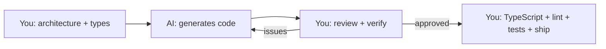

## The Problem That Hooks You

AI coding tools generate code fast. They also generate wrong code, insecure code, and code that doesn't match your patterns. Without a structured workflow, AI output creates more bugs than it fixes. You waste time reviewing bad output. Worse, you ship it to production.

## The One Insight

**AI is a force multiplier for implementation, not a replacement for thinking.** Architectural decisions, tradeoff analysis, edge-case reasoning, and quality review must come from you. AI writes boilerplate, generates variations, and speeds up iteration. You own correctness, performance, accessibility, and security of every line.

Think of AI like a power drill. It makes you faster at drilling holes. But you still decide where to drill, what size, and whether the wall can handle it.



## Prompt Anatomy

A good prompt has five parts:

```text
Role: "You are a senior React engineer..."
Context: "We use React 19, shadcn/ui, TanStack Query, Tailwind, Zustand"
Task: "Create a SearchableSelect with keyboard nav, controlled/uncontrolled, async search"
Constraints: "Must be accessible, handle loading/empty/error states"
Output format: "Return component + usage example + edge cases handled"
```

### Good Prompt

```text
Create a React component <ContactTable> that:
- Takes contacts: Contact[], onSelect: (id: string) => void, loading: boolean
- Uses TanStack Query for server state
- Renders columns: Name, Email, Phone, Status, Actions
- Supports sort by column (client-side)
- Shows loading skeleton, empty state, error state
- Keyboard navigable (ArrowUp/Down, Space to select)
- Uses shadcn/ui Table + cn() utility
- Columns defined as a config array (not hardcoded JSX)

Types:
interface Contact { id: string; name: string; email: string; phone: string; status: string; }

Convention: use @/components/ui/table, @/lib/utils
```

Every piece of context reduces hallucination risk. Without types, the AI invents them. Without states, it generates only the happy path.

### Bad Prompt

```text
"Create a table component"    // Too vague
"Make a contact list"         // No types
"Add sorting"                 // No constraints
```

## CLAUDE.md Pattern

A file that gives AI project context every time it runs:

```markdown
# Stack
- React 19, Vite, TypeScript strict mode
- TailwindCSS, shadcn/ui in @/components/ui/
- TanStack Query v5, Zustand, React Router v7

# Conventions
- Feature folders: features/feature-name/components/
- Always export named functions, not default
- Use cn() from @/lib/utils
- Every data component needs: loading, empty, error, success states
- Tests: vitest + @testing-library/react
```

The AI reads this at startup. Outputs match your codebase patterns on the first try.

## Real World: Building a Feature

```text
Step 1 (YOU):    Define component tree, data flow, types
Step 2 (AI):     Generate component boilerplate
Step 3 (YOU):    Review and adjust for patterns
Step 4 (AI):     Generate TanStack Query hooks
Step 5 (YOU):    Verify query keys, caching, invalidation
Step 6 (AI):     Generate unit tests
Step 7 (YOU):    Review test coverage, add missed cases
Step 8 (YOU):    TypeScript, lint, tests, manual QA
```

You own architecture (steps 1, 3, 5, 7, 8). AI generates implementation (steps 2, 4, 6).

### Debugging with AI

```text
YOU: "Component keeps re-rendering. Here is the profiler flamegraph."
AI:  "ContactRow re-renders because columns array is recreated every render.
      Use useMemo or hoist it outside."
YOU: "Good catch. Verifying with profiler now."
```

AI identifies the issue. YOU confirm with tools.

### Refactoring with AI

```text
YOU: "Convert from useState to useReducer. Extract autocomplete into
      useAutocomplete hook. Preserve all edge cases: debounce, abort,
      keyboard nav, click-outside."
AI:  [generates refactored code]
YOU: [reviews edge cases, types, patterns] [runs tests] [runs manual test] COMMIT
```

## Tradeoffs

| Decision | Gain | Cost |
|----------|------|------|
| AI for boilerplate | 2-5x faster | Must review every line |
| AI for tests | Covers standard cases | Misses edge cases |
| AI for refactoring | Mechanical work automated | Must verify logic preserved |
| AI for auth/payments | Not worth risk | Manual only |
| Specific prompts | Accurate output | More time writing prompts |

## What AI Typically Misses

- **Race conditions** — no `AbortController` or cleanup, stale responses overwrite fresh data.
- **Unmount state updates** — `setState` after component unmounts.
- **Empty and error states** — generates happy path only.
- **Accessibility** — missing `aria-label`, `aria-live`, keyboard focus management.
- **Memory leaks** — event listeners without cleanup, `setInterval` without `clearInterval`.
- **Edge inputs** — empty strings, `null`/`undefined`, special characters (XSS vectors).

## Common Mistakes

- Shipping AI code without review — AI doesn't understand your codebase context.
- Vague prompts — "Create a form" misses validation, error states, accessibility.
- AI for auth and security — AI doesn't understand authentication or XSS prevention.
- No verification checklist — missing states, performance issues slip through.
- Not providing types — AI invents types that don't match your data model.

## Follow-up Questions

**Q1: What edge cases does AI typically miss in React components?**
Race conditions (no AbortController), unmount state updates, empty/error states, accessibility (aria, keyboard), memory leaks (uncleaned listeners), edge inputs (null, empty strings, XSS).

**Q2: A junior engineer ships AI code that causes a production bug. How do you prevent this?**
Implement a PR template verification checklist: TypeScript strict, lint, tests, manual QA, accessibility check. Require senior review for AI-generated code. Create CLAUDE.md for conventions. Add the bug scenario as a regression test.

**Q3: You need to migrate class components to hooks. What do you check before approving AI's migration?**
State mapping (this.state → useState), lifecycle mapping (componentDidMount → useEffect with deps), this binding (useCallback for passed methods), ref handling (createRef → useRef), error boundaries (can't convert to hooks).

**Q4: Design a verification workflow for AI-generated code.**
Five gates: TypeScript (`tsc --noEmit`), lint + format, tests (unit + E2E), manual review (conventions, edge cases, accessibility), smoke test (run the app locally).

## Mental Trigger

You own every line. AI writes the first draft. You review and approve.

## One Page Revision

- AI is force multiplier for implementation, not replacement for thinking.
- You own correctness, performance, accessibility, security of every line.
- Good prompt = Role + Context + Task + Constraints + Output format.
- CLAUDE.md gives AI project context. Conventions, stack, patterns.
- Workflow: You plan types/architecture → AI generates → You review → Test → Ship.
- Never use AI for: auth, payments, security, complex business logic.
- Always verify: TypeScript strict, lint, tests, manual review, accessibility.
