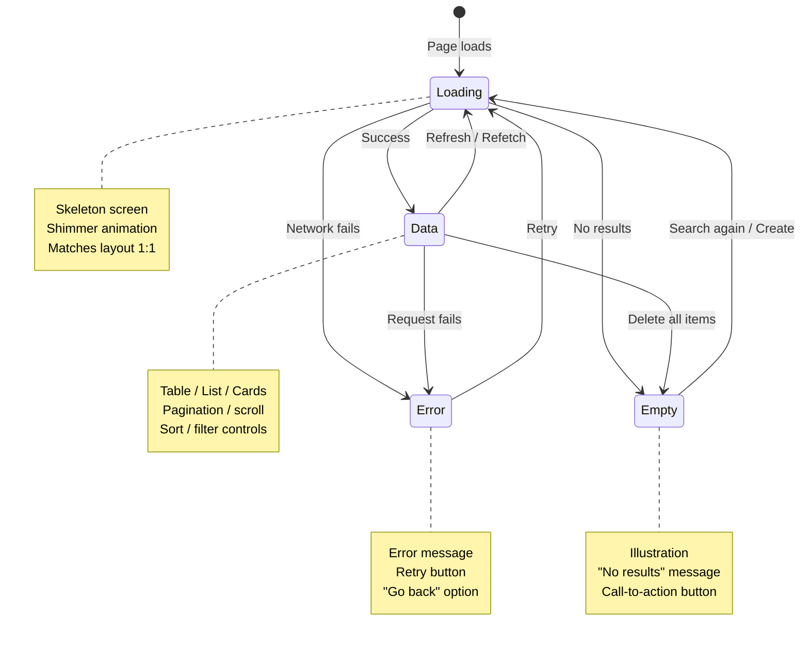

## The Problem That Hooks You

Users do unexpected things. They double-click buttons, submit forms while offline, type search queries faster than the network can respond, and navigate away before the page loads. Most UIs only handle the happy path. When users deviate, they see blank screens, frozen buttons, or duplicate records. These bugs erode trust.

## Why It Happens

Developers code the success path first. They test with fast networks, single clicks, and perfect data. Then they ship. The edge cases surface in production. Users report bugs. The team scrambles to add loading states, error handling, and retry logic after the fact. Edge-case thinking is treated as polish, not a core requirement.

## The One Insight

**Every user action has a lifecycle: INTENT, FLIGHT, RESULT.** Intent is what the user sees before acting (skeleton, placeholder). Flight is what happens during the action (loading, optimistic UI, progress). Result is what the user sees after: success, error, or empty. Design for all three phases, not just the happy path.

Think of it like ordering food at a restaurant. Intent: you see the menu, pick your dish. Flight: the kitchen is cooking, you see a "preparing" indicator. Result: food arrives, or "sorry, we're out of that." A restaurant that only handles "food arrives" fails half the time.

## Visualization



## Tracing a Search Query

Let's trace a user typing a search query through all phases:

1. **INTENT**: User sees an empty search bar with placeholder text. They start typing.
2. **INTENT to FLIGHT**: Each keystroke triggers a debounced API call. The UI shows a loading shimmer below the search bar.
3. **FLIGHT**: Request 1 goes out for "A". User types "AB". Request 2 goes out for "AB". AbortController cancels request 1.
4. **FLIGHT to RESULT**: Request 2 returns successfully. The UI shows results.
5. **RESULT (empty)**: Zero matches → "No contacts match your search" with a clear-filter button.
6. **RESULT (error)**: Network fails → error message with retry button.
7. **RESULT (data)**: Results render with a subtle indicator that results are fresh.

```text
Input: "A"     → Request 1 sent
Input: "AB"    → Request 2 sent, Request 1 cancelled
Network:       → Request 2 returns first (correct)
               → Request 1 never returns (aborted)
UI:            → Shows results for "AB"
```

The AbortController cancels the stale request at the network level. The browser never processes the response for request 1. This prevents the race condition where request 1 returns after request 2 and overwrites correct data with stale data.

## The Building Blocks

### Double-Submit Protection

Three layers, each handling a different failure mode:

```jsx
// Layer 1: Button disable during submission
function SaveButton({ onClick }) {
  const [submitting, setSubmitting] = useState(false);
  const handleClick = async () => {
    setSubmitting(true);
    try {
      await onClick();
    } finally {
      setSubmitting(false);
    }
  };
  return (
    <Button onClick={handleClick} loading={submitting} disabled={submitting}>
      Save
    </Button>
  );
}
```

The button disables synchronously on the first click. The native `disabled` attribute prevents multiple submissions even before React re-renders.

```js
// Layer 2: Debounce
const handleSave = debounce(onSave, 300, { leading: true, trailing: false });
```

The debounce with `leading: true` executes the first call immediately. All subsequent calls within 300ms are ignored.

```js
// Layer 3: Idempotency key (API-side)
fetch('/api/contacts', {
  method: 'POST',
  headers: { 'Idempotency-Key': generateUUID() },
});
```

The server checks if it has already processed a request with this idempotency key. If yes, it returns the cached response instead of creating a duplicate.

### Race Condition Handling

```jsx
// AbortController cancels stale requests
useEffect(() => {
  const controller = new AbortController();
  search(query, controller.signal).then(setResults).catch(ignoreAbort);
  return () => controller.abort();
}, [query]);

// TanStack Query does this automatically
useQuery({
  queryKey: ['search', query],
  queryFn: ({ signal }) => search(query, signal),
  enabled: !!query,
});
```

When `query` changes, the cleanup function runs and calls `controller.abort()`. TanStack Query builds this into its query key system: when the key changes, the old query is cancelled and the new one begins.

### Optimistic Updates

```jsx
const mutation = useMutation({
  mutationFn: (id) => fetch(`/api/contacts/${id}/star`, { method: 'POST' }),
  onMutate: async (id) => {
    await queryClient.cancelQueries({ queryKey: ['contacts'] });
    const previous = queryClient.getQueryData(['contacts']);
    queryClient.setQueryData(['contacts'], old =>
      old.map(c => c.id === id ? { ...c, starred: !c.starred } : c)
    );
    return { previous };
  },
  onError: (err, id, context) => {
    queryClient.setQueryData(['contacts'], context.previous);
    toast.error('Failed to update star');
  },
  onSettled: () => {
    queryClient.invalidateQueries({ queryKey: ['contacts'] });
  },
});
```

On mutate, the cache is updated immediately (optimistic). The UI shows the starred state instantly. When the server errors, `onError` restores the snapshot. The UI reverts and shows an error toast. `onSettled` always runs to ensure eventual consistency.

### Undo Pattern

Undo replaces confirmation dialogs. Instead of "Are you sure?", perform the action immediately and give the user 5 seconds to undo.

```jsx
function useUndo(action) {
  const execute = useCallback(async (...args) => {
    await action(...args);
    const undo = toast('Deleted', {
      action: {
        label: 'Undo',
        onClick: async () => {
          await undoAction(...args);
          toast.dismiss(undo);
        },
      },
      duration: 5000,
    });
  }, [action]);
  return execute;
}
```

The undo action must be idempotent: clicking Undo twice does nothing on the second click.

### Retry with Exponential Backoff

```js
async function fetchWithRetry(url, options = {}, retries = 3) {
  for (let i = 0; i < retries; i++) {
    try {
      return await fetch(url, options);
    } catch (error) {
      if (i === retries - 1) throw error;
      if (error.status >= 400 && error.status < 500) throw error;
      await new Promise(r => setTimeout(r, Math.pow(2, i) * 1000));
    }
  }
}
```

The retry loop waits 1s, then 2s, then 4s between attempts (exponential backoff). Client errors (4xx) are not retried because they're the client's fault. Network errors and server errors (5xx) are retried because they may be transient.

```js
// TanStack Query built-in
useQuery({
  queryKey: ['contacts'],
  queryFn: fetchContacts,
  retry: 3,
  retryDelay: (attempt) => Math.min(1000 * 2 ** attempt, 10000),
});
```

### Offline & Network Resilience

```jsx
const [isOnline, setIsOnline] = useState(navigator.onLine);
useEffect(() => {
  const goOffline = () => setIsOnline(false);
  const goOnline = () => setIsOnline(true);
  window.addEventListener('offline', goOffline);
  window.addEventListener('online', goOnline);
  return () => {
    window.removeEventListener('offline', goOffline);
    window.removeEventListener('online', goOnline);
  };
}, []);

{!isOnline && (
  <Banner variant="warning">
    You are offline. Changes will sync when you reconnect.
  </Banner>
)}
```

When offline, cached data displays with an offline banner. Mutations are queued locally. When the `online` event fires, the queue flushes and data syncs.

## Real World: Contacts Page

A production contacts listing page with search, filter, sort, pagination, and bulk actions.

```text
User intent:
  "I want to find customer X and send them an email."

INTENT:
  User sees search bar with placeholder, filter pills, table with skeleton rows.

FLIGHT:
  - User types query. Debounce fires. Loading shimmer appears below search bar.
  - Results update. User checks a checkbox. UI shows selection count.
  - User clicks "Delete Selected". Button shows spinner. Toast appears:
    "Deleted 3 contacts - Undo (5s)"
  - If network fails mid-delete, button re-enables and error banner appears.
  - If user goes offline, cached data displays with "You are offline" banner.
    Mutations queue locally. They flush when connection returns.

RESULT:
  Success: Table updates with new data. Toast shows success.
  Error: Error banner with retry button. Data reverts to pre-mutation state.
  Empty after filter: "No contacts match your search" with clear-filter button.
  Offline: Cached data with offline banner. Queue indicator: "2 changes pending".
```

### Loading Sequences and Perceived Performance

```text
0-100ms    → Instant. No feedback needed.
100-300ms  → Noticeable. Show subtle indicator (skeleton, not spinner)
300-1000ms → Feel the delay. Show skeleton + progress indicator
1s+        → User may leave. Show skeleton + estimated time + meaningful action
3s+        → User is likely to leave. Show progress + ability to cancel

Instant:     Optimistic UI (update cache immediately)
Fast (100ms): Skeleton screen (layout-shape placeholders)
Slow (1s+):   Spinner + progress + "This may take a moment"
Failed:       Error message + retry + undo
```

### Data Freshness and Staleness

TanStack Query stale-while-revalidate pattern (see Ch 10 for full cache lifecycle):

```js
const query = useQuery({
  queryKey: ['contacts'],
  queryFn: fetchContacts,
  staleTime: 30_000,
  gcTime: 5 * 60_000,
  refetchOnWindowFocus: true,
  refetchInterval: 60_000,
});
```

```jsx
<div>
  <ContactTable contacts={contacts} />
  {isRefetching && (
    <div className="text-xs text-gray-400 flex items-center gap-1">
      <Spinner className="w-3 h-3" /> Refreshing...
    </div>
  )}
</div>
```

## Tradeoffs

| Decision | Gain | Cost |
|----------|------|------|
| Optimistic update | Instant UI feel | Rollback complexity |
| Undo instead of confirm | Faster UX | Must support idempotent undo |
| Skeleton over spinner | Less layout jump | More code per component |
| AbortController | No stale data | Requires cleanup in effects |
| Exponential backoff | Resilient to spikes | Delays under heavy load |

The optimistic vs pessimistic tradeoff is the most important. Optimistic makes the UI feel fast but requires careful rollback logic. Pessimistic is safer but feels slower. Choose based on action criticality: toggle a star (optimistic) vs submit a payment (pessimistic).

## Common Mistakes

- **Only coding the data state**: No loading, empty, or error states. Blank space when there's no data.
- **No double-submit protection**: User clicks Save twice, creates duplicate records.
- **No race condition handling**: Old search results overwrite new results.
- **No offline handling**: App shows error instead of cached data.
- **Confirmation dialogs instead of undo**: Slows users down and trains them to click through.
- **No retry for transient failures**: Network blip results in permanent error state.
- **No idempotency**: Re-submitting creates duplicates.
- **Full-page spinner instead of skeleton**: Content jumps when data loads, causing layout shift.

## SDE-2 Interview Answer

### Mid-level

"I design every data component for four states: loading, empty, error, and data. Loading uses skeletons that match the data layout. Empty shows a message with a call to action. Error shows the error message with a retry button. Data renders the actual content. I also handle double-submit by disabling buttons during submission, and I use AbortController to prevent race conditions in search."

### Senior

"I use the INTENT, FLIGHT, RESULT framework for every user action. Intent: what does the user see before acting? Flight: what happens during the action? Result: what does the user see after? I implement optimistic updates for instant UI feel, with rollback and error toasts for failures. I use undo instead of confirmation dialogs. I set up TanStack Query with stale time, retry, and background refetching. I review every feature for edge cases using a checklist before shipping."

### Engineering Lead

"I enforce a product thinking standard on the team. Every feature must pass the edge case checklist before shipping: input edge cases, network edge cases, data edge cases, interaction edge cases, and accessibility edge cases. I define the state machine pattern for data components (loading, empty, error, data) and require it in code review. I measure edge case handling by monitoring production errors: if an error state was not designed, it means our checklist failed."

## Follow-up Questions

**Q1: Design a file upload component with drag-and-drop. Walk through all edge cases: network failure, file too large, wrong file type, duplicate filename, upload cancellation.**
Build a state machine with states: `idle`, `dragging`, `validating`, `uploading`, `success`, `error`. Handle each edge case: (1) **File too large** — validate in `onDrop` using `file.size > maxSize` before any network call. Show inline error per file. (2) **Wrong file type** — check `file.type` against an allowlist (`image/png`, `application/pdf`). Reject with a clear message. (3) **Duplicate filename** — check by file name + size + last modified. Offer "replace" or "keep both" options. (4) **Network failure** — wrap `fetch` in try/catch. Show error state per file with a retry button. (5) **Upload cancellation** — create an `AbortController` per file. Store it in a Map keyed by file ID. On cancel button click, call `controller.abort()`. The cleanup removes the file from the uploading state.

```jsx
const [files, setFiles] = useState([]);
const controllersRef = useRef(new Map());

const handleDrop = (e) => {
  e.preventDefault();
  const dropped = [...e.dataTransfer.files];
  const valid = dropped.filter(f => {
    if (f.size > MAX_SIZE) { addError(f, 'File too large'); return false; }
    if (!ALLOWED_TYPES.includes(f.type)) { addError(f, 'Invalid type'); return false; }
    return true;
  });
  uploadFiles(valid);
};

const uploadFiles = async (files) => {
  for (const file of files) {
    const controller = new AbortController();
    controllersRef.current.set(file.name, controller);
    try {
      await uploadToServer(file, controller.signal);
      markSuccess(file);
    } catch (err) {
      if (err.name === 'AbortError') markCancelled(file);
      else markError(file, err.message);
    } finally {
      controllersRef.current.delete(file.name);
    }
  }
};
```

**Q2: Your app shows stale data after a user reconnects from offline. How do you ensure the UI reflects the latest server state?**
When the browser's `online` event fires, trigger a **refetch of all active queries**. TanStack Query does this automatically with `refetchOnReconnect: true` (the default). The flow: (1) While offline, the app displays cached data with an offline banner. Mutations are queued locally or fail gracefully. (2) When `navigator.onLine` becomes true, the `online` event fires. (3) TanStack Query detects the reconnect and invalidates all active queries, causing them to refetch from the server. (4) The UI updates with fresh data. For custom state management, listen to the `online` event and dispatch a refetch action.

```jsx
// TanStack Query handles this automatically
const queryClient = new QueryClient({
  defaultOptions: {
    queries: {
      refetchOnReconnect: true, // refetch when back online
      refetchOnWindowFocus: true,
    },
  },
});

// Manual approach if not using TanStack Query
useEffect(() => {
  const handleOnline = () => {
    refetchContacts(); // re-fetch critical data
    flushMutationQueue(); // retry queued mutations
  };
  window.addEventListener('online', handleOnline);
  return () => window.removeEventListener('online', handleOnline);
}, []);
```

Additionally, use `staleTime` to control freshness — a `staleTime` of 30 seconds means cached data is considered fresh for 30 seconds, reducing unnecessary refetches while still eventually syncing.

**Q3: A notification bell polls every 30 seconds. The user is on a slow connection and requests start queuing. How do you prevent the queue from growing?**
Implement three controls: (1) **Dedup concurrent requests** — use a flag or `AbortController` to cancel the previous poll if it hasn't resolved before the next one fires. (2) **Skip if offline** — check `navigator.onLine` before firing. (3) **Back off under load** — if a request takes longer than the poll interval, extend the next interval.

```jsx
useEffect(() => {
  const controller = new AbortController();
  let timeoutId;

  const poll = async () => {
    if (!navigator.onLine) {
      timeoutId = setTimeout(poll, 30000);
      return;
    }
    try {
      const res = await fetch('/api/notifications', { signal: controller.signal });
      const data = await res.json();
      setNotifications(data);
      timeoutId = setTimeout(poll, 30000); // schedule next
    } catch (err) {
      if (err.name !== 'AbortError') {
        // Back off: double the interval on failure, up to 5 minutes
        const backoff = Math.min(pollInterval * 2, 300000);
        timeoutId = setTimeout(poll, backoff);
      }
    }
  };

  poll();
  return () => { controller.abort(); clearTimeout(timeoutId); };
}, []);
```

The key insight: `setTimeout` instead of `setInterval` ensures the next poll only starts *after* the current one completes. `setInterval` would stack requests if the response is slower than 30 seconds.

**Q4: Design an undo system for a drag-and-drop reorderable list. What state do you capture for rollback?**
Capture the **full list order** before the drag operation starts. Store it as a snapshot in a ref. On drop, apply the new order optimistically. If the user clicks "Undo" within the timeout window (5 seconds), restore the snapshot. The undo action must be idempotent — clicking undo twice does nothing on the second click.

```jsx
const [items, setItems] = useState(initialItems);
const snapshotRef = useRef(null);
const undoTimerRef = useRef(null);

const handleDragStart = (startIndex) => {
  snapshotRef.current = [...items]; // capture before drag
};

const handleDrop = (startIndex, endIndex) => {
  const newItems = [...items];
  const [moved] = newItems.splice(startIndex, 1);
  newItems.splice(endIndex, 0, moved);
  setItems(newItems);

  // Show undo toast
  const toastId = toast('Item moved', {
    action: {
      label: 'Undo',
      onClick: () => {
        setItems(snapshotRef.current); // restore snapshot
        snapshotRef.current = null;
      },
    },
    duration: 5000,
  });
};
```

What to capture: the **minimum state needed to reverse the operation**. For a reorder, it's the array order. For a delete, it's the deleted item and its index. For an edit, it's the previous field values. Don't capture the entire app state — just the delta. Store snapshots in a ref (not state) to avoid re-renders.

**Q5: Your team ships a feature that works in testing but gets error reports in production with no context. How do you improve error handling?**
Three improvements: (1) **Structured error reporting** — wrap all error boundaries and catch blocks with context. Include the component name, user action, feature flag state, and relevant data in the error report. Use Sentry's `setContext` to attach user info, page URL, and feature flags to every error.

```jsx
// Error boundary with context
class FeatureErrorBoundary extends React.Component {
  componentDidCatch(error, info) {
    Sentry.setContext('feature', { name: 'checkout', flag: featureFlags.getState() });
    Sentry.setContext('user', { id: userId, plan: userPlan });
    Sentry.captureException(error);
  }
}
```

(2) **Synthetic monitoring** — add real-user monitoring (RUM) that tracks error rates per page, per browser, per feature flag. This catches errors that users don't report. (3) **Session replay** — integrate LogRocket or Sentry Session Replay so you can watch the exact user session that caused the error. This eliminates "no context" problems because you see the full interaction timeline.

## Mental Trigger

"Four states."

## One Page Revision

- Every user action: INTENT (before), FLIGHT (during), RESULT (after).
- Every data component: loading (skeleton), empty (message + action), error (message + retry), data (content).
- Double-submit: disable button, debounce click, idempotency key.
- Race conditions: AbortController cancels stale requests.
- Optimistic updates: update cache immediately, rollback on error.
- Offline: show cached data + offline banner + queue mutations.
- Undo replaces confirmation dialogs. 5-second window to revert.
- Retry transient failures with exponential backoff. Don't retry 4xx errors.
- Perceived performance: instant (optimistic), fast (skeleton), slow (spinner + progress), failed (error + retry).
- TanStack Query: staleTime for freshness, gcTime for cache, retry for resilience, refetchOnWindowFocus for consistency.
- Edge cases: input (empty, long, special chars), network (offline, slow, timeout, race), data (empty, single, many, large, missing), interaction (double-click, rapid scroll, tab away), accessibility (screen reader, keyboard, zoom, reduced motion).
- Interview: Mid-level handles four states. Senior uses INTENT/FLIGHT/RESULT framework. Lead enforces team standards and edge case checklist.
- Trigger: "Four states."
