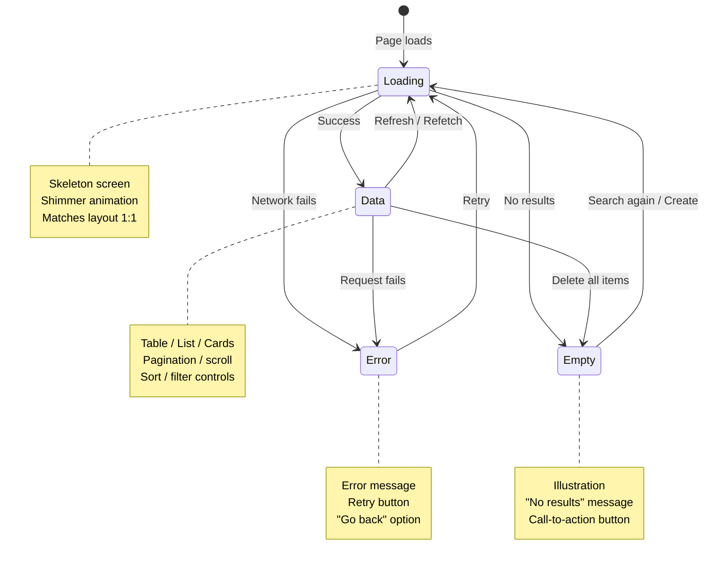

## Problem

Users do unexpected things. They double-click buttons, submit forms while offline, type search queries faster than the network can respond, and navigate away before the page loads. Most UIs only handle the happy path. When users deviate, they see blank screens, frozen buttons, or duplicate records. These bugs erode trust.

## Why Existing Solution Failed

Developers code the success path first. They test with fast networks, single clicks, and perfect data. Then they ship. The edge cases surface in production. Users report bugs. The team scrambles to add loading states, error handling, and retry logic after the fact. Edge-case thinking is treated as polish, not a core requirement.

## Mental Model

Every user action has a lifecycle: INTENT, FLIGHT, RESULT. Intent is what the user sees before acting (skeleton, placeholder). Flight is what happens during the action (loading, optimistic UI, progress). Result is what the user sees after: success, error, or empty. Design for all three phases, not just the happy path.

## Visualization



## Engine Simulation

Trace a user typing a search query through all phases:

1. **INTENT**: User sees an empty search bar with placeholder text. They start typing.
2. **INTENT to FLIGHT**: Each keystroke triggers a debounced API call. The UI shows a loading shimmer below the search bar.
3. **FLIGHT**: Request 1 goes out for "A". User types "AB". Request 2 goes out for "AB". A new AbortController cancels request 1.
4. **FLIGHT to RESULT**: Request 2 returns successfully. The UI shows results.
5. **RESULT (empty)**: If the query matches zero contacts, the UI shows an empty state: "No contacts match your search" with a clear-filter button.
6. **RESULT (error)**: If the network fails, the UI shows an error message with a retry button.
7. **RESULT (data)**: If results come back, the UI renders the list with a subtle indicator that results are fresh.

```text
Input: "A"     → Request 1 sent
Input: "AB"    → Request 2 sent, Request 1 cancelled
Network:       → Request 2 returns first (correct)
               → Request 1 never returns (aborted)
UI:            → Shows results for "AB"
```

What happens internally: The AbortController cancels the stale request at the network level. The browser never processes the response for request 1. Only request 2 can update UI state. This prevents the race condition where request 1 returns after request 2 and overwrites correct data with stale data.

## Internal Implementation

### Double-Submit Protection

Three layers of protection, each handling a different failure mode:

```jsx
// Layer 1: Button disable during submission
function SaveButton({ onClick }) {
  const [submitting, setSubmitting] = useState(false);
  const handleClick = async () => {
    setSubmitting(true);
    try {
      await onClick();
    } finally {
      setSubmitting(false);
    }
  };
  return (
    <Button onClick={handleClick} loading={submitting} disabled={submitting}>
      Save
    </Button>
  );
}
```

What happens internally: The button disables itself synchronously on the first click. The `disabled` attribute prevents the browser from firing additional click events. Even if the user clicks 10 times before React re-renders, the native `disabled` attribute prevents multiple submissions.

```js
// Layer 2: Debounce
const handleSave = debounce(onSave, 300, { leading: true, trailing: false });
```

What happens internally: The debounce with `leading: true` executes the first call immediately. All subsequent calls within 300ms are ignored. This prevents accidental double-clicks within a short window.

```js
// Layer 3: Idempotency key (API-side)
fetch('/api/contacts', {
  method: 'POST',
  headers: { 'Idempotency-Key': generateUUID() },
});
```

What happens internally: The server checks if it has already processed a request with this idempotency key. If yes, it returns the cached response instead of creating a duplicate record. This protects against network-level retries that the client cannot control.

### Race Condition Handling

```jsx
// AbortController cancels stale requests
useEffect(() => {
  const controller = new AbortController();
  search(query, controller.signal).then(setResults).catch(ignoreAbort);
  return () => controller.abort();
}, [query]);

// TanStack Query does this automatically
useQuery({
  queryKey: ['search', query],
  queryFn: ({ signal }) => search(query, signal),
  enabled: !!query,
});
```

What happens internally: When `query` changes, the cleanup function runs and calls `controller.abort()`. This cancels the in-flight fetch request. The browser discards the response. Only the new query's request can update state. TanStack Query builds this into its query key system: when the key changes, the old query is cancelled and the new one begins.

### Optimistic Updates

```jsx
const mutation = useMutation({
  mutationFn: (id) => fetch(`/api/contacts/${id}/star`, { method: 'POST' }),
  onMutate: async (id) => {
    await queryClient.cancelQueries({ queryKey: ['contacts'] });
    const previous = queryClient.getQueryData(['contacts']);
    queryClient.setQueryData(['contacts'], old =>
      old.map(c => c.id === id ? { ...c, starred: !c.starred } : c)
    );
    return { previous };
  },
  onError: (err, id, context) => {
    queryClient.setQueryData(['contacts'], context.previous);
    toast.error('Failed to update star');
  },
  onSettled: () => {
    queryClient.invalidateQueries({ queryKey: ['contacts'] });
  },
});
```

What happens internally: On mutate, the cache is updated immediately (optimistic). The UI shows the starred state instantly. When the server responds with success, nothing changes (cache is already correct). When the server errors, `onError` restores the snapshot taken in `onMutate`. The UI reverts to the unstarred state and shows an error toast. The `onSettled` always runs and invalidates the query to ensure eventual consistency with the server.

### Undo Pattern

Undo replaces confirmation dialogs for destructive actions. Instead of "Are you sure?", perform the action immediately and give the user 5 seconds to undo.

```jsx
function useUndo(action) {
  const execute = useCallback(async (...args) => {
    await action(...args);
    const undo = toast('Deleted', {
      action: {
        label: 'Undo',
        onClick: async () => {
          await undoAction(...args);
          toast.dismiss(undo);
        },
      },
      duration: 5000,
    });
  }, [action]);
  return execute;
}
```

What happens internally: The action executes immediately (e.g., delete contact). The UI shows the result with a toast containing an Undo button. If the user clicks Undo within 5 seconds, the reverse action runs (e.g., restore contact). After 5 seconds, the toast auto-dismisses and the action is permanent. The undo action must be idempotent: clicking Undo twice does nothing on the second click.

### Retry with Exponential Backoff

```js
async function fetchWithRetry(url, options = {}, retries = 3) {
  for (let i = 0; i < retries; i++) {
    try {
      return await fetch(url, options);
    } catch (error) {
      if (i === retries - 1) throw error;
      if (error.status >= 400 && error.status < 500) throw error;
      await new Promise(r => setTimeout(r, Math.pow(2, i) * 1000));
    }
  }
}
```

What happens internally: The retry loop waits 1s, then 2s, then 4s between attempts (exponential backoff). Client errors (4xx) are not retried because they are the client's fault and retrying will produce the same result. Network errors and server errors (5xx) are retried because they may be transient. TanStack Query has this built in with `retry` and `retryDelay` options.

```js
// TanStack Query built-in
useQuery({
  queryKey: ['contacts'],
  queryFn: fetchContacts,
  retry: 3,
  retryDelay: (attempt) => Math.min(1000 * 2 ** attempt, 10000),
});
```

### Offline & Network Resilience

```jsx
const [isOnline, setIsOnline] = useState(navigator.onLine);
useEffect(() => {
  const goOffline = () => setIsOnline(false);
  const goOnline = () => setIsOnline(true);
  window.addEventListener('offline', goOffline);
  window.addEventListener('online', goOnline);
  return () => {
    window.removeEventListener('offline', goOffline);
    window.removeEventListener('online', goOnline);
  };
}, []);

// Show offline indicator
{!isOnline && (
  <Banner variant="warning">
    You are offline. Changes will sync when you reconnect.
  </Banner>
)}
```

What happens internally: The `navigator.onLine` property reflects the browser's connectivity state. The `offline` and `online` events fire when the network status changes. When offline, cached data displays with an offline banner. Mutations are queued locally. When the `online` event fires, the queue flushes and data syncs.

## Real World Example

### Contacts Page with All Edge Cases

A production contacts listing page with search, filter, sort, pagination, and bulk actions.

```text
User intent:
  "I want to find customer X and send them an email."

INTENT:
  User sees search bar with placeholder, filter pills, table with skeleton rows.

FLIGHT:
  - User types query. Debounce fires. Loading shimmer appears below search bar.
  - Results update. User checks a checkbox. UI shows selection count.
  - User clicks "Delete Selected". Button shows spinner. Toast appears:
    "Deleted 3 contacts - Undo (5s)"
  - If network fails mid-delete, button re-enables and error banner appears.
  - If user goes offline, cached data displays with "You are offline" banner.
    Mutations queue locally. They flush when connection returns.

RESULT:
  Success: Table updates with new data. Toast shows success.
  Error: Error banner with retry button. Data reverts to pre-mutation state.
  Empty after filter: "No contacts match your search" with clear-filter button.
  Offline: Cached data with offline banner. Queue indicator: "2 changes pending".

Edge cases handled:
  - User searches while on page 3: results reset to page 1
  - User selects contacts across pages: selection persists by ID, not index
  - User deletes a contact someone else already deleted: 404 handled gracefully
  - User has 500K contacts: server-side pagination + virtual scroll
  - User double-clicks "Delete" on a row: button disables after first click
  - User tabs away and back: stale data refetches in background
  - User opens in two tabs: TanStack Query deduplicates requests
```

### Loading Sequences and Perceived Performance

How users perceive time and what feedback to give:

```text
0-100ms    → Instant. No feedback needed.
100-300ms  → Noticeable. Show subtle indicator (skeleton, not spinner)
300-1000ms → Feel the delay. Show skeleton + progress indicator
1s+        → User may leave. Show skeleton + estimated time + meaningful action
3s+        → User is likely to leave. Show progress + ability to cancel

Instant:     Optimistic UI (update cache immediately)
Fast (100ms): Skeleton screen (layout-shape placeholders)
Slow (1s+):   Spinner + progress + "This may take a moment"
Failed:       Error message + retry + undo
```

### Data Freshness and Staleness

TanStack Query stale-while-revalidate pattern:

```js
const query = useQuery({
  queryKey: ['contacts'],
  queryFn: fetchContacts,
  staleTime: 30_000,         // Data is fresh for 30s - no refetch
  gcTime: 5 * 60_000,       // Keep in cache for 5 min after unmount
  refetchOnWindowFocus: true, // Refetch on tab switch
  refetchInterval: 60_000,    // Poll every 60s for real-time feel
});
```

```jsx
// Show user that data is being refreshed
<div>
  <ContactTable contacts={contacts} />
  {isRefetching && (
    <div className="text-xs text-gray-400 flex items-center gap-1">
      <Spinner className="w-3 h-3" /> Refreshing...
    </div>
  )}
</div>
```

## Tradeoffs

| Decision | Gain | Cost |
|----------|------|------|
| Optimistic update | Instant UI feel | Rollback complexity |
| Undo instead of confirm | Faster UX | Must support idempotent undo |
| Skeleton over spinner | Less layout jump | More code per component |
| AbortController | No stale data | Requires cleanup in effects |
| Exponential backoff | Resilient to spikes | Delays under heavy load |

The optimistic vs pessimistic tradeoff is the most important. Optimistic makes the UI feel fast but requires careful rollback logic. Pessimistic is safer but feels slower. Choose based on action criticality: toggle a star (optimistic) vs submit a payment (pessimistic).

## Common Mistakes

- **Only coding the data state**: No loading, empty, or error states. Component shows blank space when there is no data.
- **No double-submit protection**: User clicks Save twice, creates duplicate records.
- **No race condition handling**: Old search results overwrite new results.
- **No offline handling**: App shows error instead of cached data when offline.
- **Confirmation dialogs instead of undo**: "Are you sure?" slows users down and trains them to click through without reading.
- **No retry for transient failures**: Network blip results in permanent error state.
- **No idempotency**: Re-submitting the same action creates duplicates.
- **Full-page spinner instead of skeleton**: Content jumps when data loads, causing layout shift.

## SDE-2 Interview Answer

### Mid-level

"I design every data component for four states: loading, empty, error, and data. Loading uses skeletons that match the data layout. Empty shows a message with a call to action. Error shows the error message with a retry button. Data renders the actual content. I also handle double-submit by disabling buttons during submission, and I use AbortController to prevent race conditions in search."

### Senior

"I use the INTENT, FLIGHT, RESULT framework for every user action. Intent: what does the user see before acting? Flight: what happens during the action? Result: what does the user see after? I implement optimistic updates for instant UI feel, with rollback and error toasts for failures. I use undo instead of confirmation dialogs. I set up TanStack Query with stale time, retry, and background refetching. I review every feature for edge cases using a checklist before shipping."

### Engineering Lead

"I enforce a product thinking standard on the team. Every feature must pass the edge case checklist before shipping: input edge cases, network edge cases, data edge cases, interaction edge cases, and accessibility edge cases. I define the state machine pattern for data components (loading, empty, error, data) and require it in code review. I measure edge case handling by monitoring production errors: if an error state was not designed, it means our checklist failed."

## Follow-up Questions

1. Design a file upload component with drag-and-drop. Walk through all edge cases: network failure during upload, file too large, wrong file type, duplicate filename, upload cancellation.
2. Your app shows stale data after a user reconnects from offline. How do you ensure the UI reflects the latest server state without losing local changes?
3. A notification bell polls every 30 seconds. The user is on a slow connection and requests start queuing. How do you prevent the queue from growing indefinitely?
4. Design an undo system for a drag-and-drop reorderable list. What state do you capture for rollback? How long does undo stay available?
5. Your team ships a feature that works perfectly in testing but gets error reports in production. The errors are all "Something went wrong" with no context. How do you improve error handling to capture useful information?

## Mental Trigger

"Four states."

## One Page Revision

- Every user action: INTENT (before), FLIGHT (during), RESULT (after).
- Every data component: loading (skeleton), empty (message + action), error (message + retry), data (content).
- Double-submit: disable button, debounce click, idempotency key.
- Race conditions: AbortController cancels stale requests.
- Optimistic updates: update cache immediately, rollback on error.
- Offline: show cached data + offline banner + queue mutations.
- Undo replaces confirmation dialogs. 5-second window to revert.
- Retry transient failures with exponential backoff. Do not retry 4xx errors.
- Perceived performance: instant (optimistic), fast (skeleton), slow (spinner + progress), failed (error + retry).
- TanStack Query: staleTime for freshness, gcTime for cache, retry for resilience, refetchOnWindowFocus for consistency.
- Edge cases: input (empty, long, special chars), network (offline, slow, timeout, race), data (empty, single, many, large, missing), interaction (double-click, rapid scroll, tab away), accessibility (screen reader, keyboard, zoom, reduced motion).
- Interview: Mid-level handles four states. Senior uses INTENT/FLIGHT/RESULT framework. Lead enforces team standards and edge case checklist.
- Trigger: "Four states."
