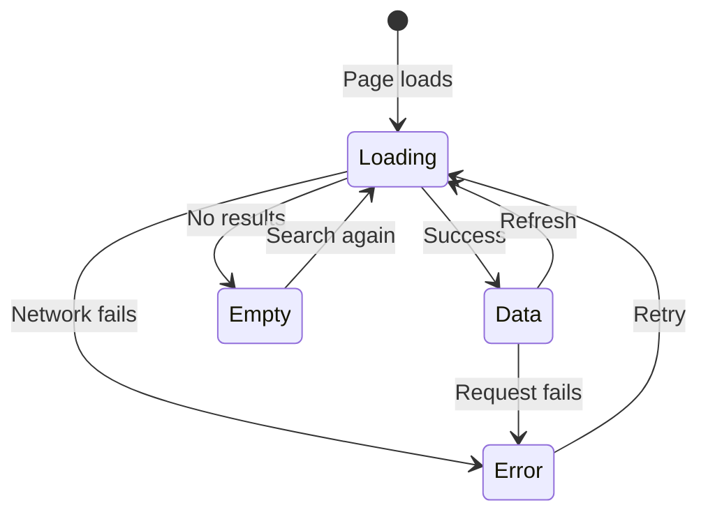

## The Problem That Hooks You

Users do unexpected things. They double-click buttons, submit forms offline, type faster than the network responds, and navigate away mid-load. Most UIs only handle the happy path. When users deviate, they see blank screens, frozen buttons, or duplicate records.

## The One Insight

**Every user action has a lifecycle: INTENT, FLIGHT, RESULT.** Intent is what the user sees before acting (skeleton, placeholder). Flight is what happens during the action (loading, optimistic UI). Result is what the user see after: success, error, or empty. Design for all three phases.

Think of it like ordering food. Intent: you see the menu, pick your dish. Flight: kitchen is cooking, you see a "preparing" indicator. Result: food arrives, or "sorry, we're out." A restaurant that only handles "food arrives" fails half the time.



## Tracing a Search Query

1. **INTENT**: Empty search bar with placeholder. User starts typing.
2. **FLIGHT**: Each keystroke triggers a debounced API call. Loading shimmer appears.
3. **FLIGHT**: Request 1 for "A". User types "AB". Request 2 for "AB". AbortController cancels request 1.
4. **RESULT**: Request 2 returns. UI shows results.
5. **RESULT (empty)**: "No contacts match" with clear-filter button.
6. **RESULT (error)**: Error message with retry button.

The AbortController cancels the stale request at the network level. The browser never processes the response for request 1.

## The Building Blocks

### Double-Submit Protection

Three layers:
```jsx
// Layer 1: Button disable during submission
const [submitting, setSubmitting] = useState(false);
const handleClick = async () => {
  setSubmitting(true);
  try { await onClick(); } finally { setSubmitting(false); }
};
// Native disabled prevents multiple submissions before React re-renders
```

```js
// Layer 2: Debounce
const handleSave = debounce(onSave, 300, { leading: true, trailing: false });
```

```js
// Layer 3: Idempotency key (server-side)
fetch('/api/contacts', {
  method: 'POST',
  headers: { 'Idempotency-Key': generateUUID() },
});
```

### Race Condition Handling

```jsx
// AbortController cancels stale requests
useEffect(() => {
  const controller = new AbortController();
  search(query, controller.signal).then(setResults).catch(ignoreAbort);
  return () => controller.abort();
}, [query]);

// TanStack Query does this automatically
useQuery({
  queryKey: ['search', query],
  queryFn: ({ signal }) => search(query, signal),
  enabled: !!query,
});
```

### Optimistic Updates

```jsx
const mutation = useMutation({
  mutationFn: (id) => fetch(`/api/contacts/${id}/star`, { method: 'POST' }),
  onMutate: async (id) => {
    await queryClient.cancelQueries({ queryKey: ['contacts'] });
    const previous = queryClient.getQueryData(['contacts']);
    queryClient.setQueryData(['contacts'], old =>
      old.map(c => c.id === id ? { ...c, starred: !c.starred } : c)
    );
    return { previous };
  },
  onError: (err, id, context) => {
    queryClient.setQueryData(['contacts'], context.previous);
    toast.error('Failed to update star');
  },
  onSettled: () => queryClient.invalidateQueries({ queryKey: ['contacts'] }),
});
```

Update cache immediately (optimistic). On error, restore snapshot. `onSettled` ensures eventual consistency.

### Undo Pattern

Replace confirmation dialogs. Perform the action immediately, give 5 seconds to undo:

```jsx
function useUndo(action) {
  return useCallback(async (...args) => {
    await action(...args);
    toast('Deleted', {
      action: { label: 'Undo', onClick: () => undoAction(...args) },
      duration: 5000,
    });
  }, [action]);
}
```

### Retry with Exponential Backoff

```js
async function fetchWithRetry(url, options = {}, retries = 3) {
  for (let i = 0; i < retries; i++) {
    try { return await fetch(url, options); }
    catch (error) {
      if (i === retries - 1) throw error;
      if (error.status >= 400 && error.status < 500) throw error; // don't retry client errors
      await new Promise(r => setTimeout(r, Math.pow(2, i) * 1000));
    }
  }
}
```

### Offline Handling

```jsx
const [isOnline, setIsOnline] = useState(navigator.onLine);
useEffect(() => {
  const goOffline = () => setIsOnline(false);
  const goOnline = () => setIsOnline(true);
  window.addEventListener('offline', goOffline);
  window.addEventListener('online', goOnline);
  return () => { window.removeEventListener('offline', goOffline); window.removeEventListener('online', goOnline); };
}, []);

{!isOnline && <Banner variant="warning">You are offline. Changes will sync when you reconnect.</Banner>}
```

When offline, display cached data. Mutations queue locally. Flush when `online` event fires.

## Perceived Performance

```text
0-100ms    → Instant. No feedback needed.
100-300ms  → Noticeable. Show skeleton (not spinner).
300-1000ms → Feel the delay. Skeleton + progress indicator.
1s+        → User may leave. Skeleton + estimated time + cancel.
3s+        → Progress + ability to cancel.
```

## Tradeoffs

| Decision | Gain | Cost |
|----------|------|------|
| Optimistic update | Instant UI feel | Rollback complexity |
| Undo instead of confirm | Faster UX | Must support idempotent undo |
| Skeleton over spinner | Less layout jump | More code per component |
| AbortController | No stale data | Requires cleanup in effects |
| Exponential backoff | Resilient to spikes | Delays under heavy load |

Choose based on action criticality: toggle a star (optimistic) vs submit a payment (pessimistic).

## Common Mistakes

- Only coding the data state — no loading, empty, or error states.
- No double-submit protection — user clicks Save twice, creates duplicates.
- No race condition handling — old search results overwrite new.
- Confirmation dialogs instead of undo — slows users down.
- Full-page spinner instead of skeleton — content jumps on load.
- No retry for transient failures — network blip becomes permanent error.

## Follow-up Questions

**Q1: Design a file upload with drag-and-drop. Handle: network failure, file too large, wrong type, duplicates, cancellation.**
State machine: idle → dragging → validating → uploading → success/error. Validate in `onDrop` before network. Check `file.type` against allowlist. Duplicate by name+size+lastModified. `AbortController` per file for cancellation.

**Q2: Your app shows stale data after reconnecting from offline. How do you ensure freshness?**
TanStack Query does this automatically with `refetchOnReconnect: true` (default). On `online` event, all active queries invalidate and refetch. Use `staleTime` to control freshness — 30s means cached data is fresh for 30 seconds.

**Q3: A notification bell polls every 30s. On slow connections, requests queue. How do you prevent stacking?**
Use `setTimeout` instead of `setInterval` — next poll starts only after current completes. Check `navigator.onLine` before firing. Back off on failure: double the interval up to 5 minutes.

**Q4: Design an undo for drag-and-drop reorder. What state do you capture?**
Capture the full list order before drag starts. Store as snapshot in a ref. On drop, apply new order optimistically. On undo (5s window), restore snapshot. Capture minimum state needed to reverse — don't capture entire app state.

## Mental Trigger

Four states: loading, empty, error, data. INTENT, FLIGHT, RESULT.

## One Page Revision

- Every action: INTENT (before), FLIGHT (during), RESULT (after).
- Every data component: loading (skeleton), empty (message + CTA), error (message + retry), data.
- Double-submit: disable button + debounce + idempotency key.
- Race conditions: AbortController cancels stale requests.
- Optimistic updates: update cache immediately, rollback on error.
- Offline: cached data + offline banner + queue mutations.
- Undo replaces confirmation dialogs. 5s window to revert.
- Retry transient failures with exponential backoff. Don't retry 4xx.
- Perceived performance: instant (optimistic), fast (skeleton), slow (spinner + progress).
